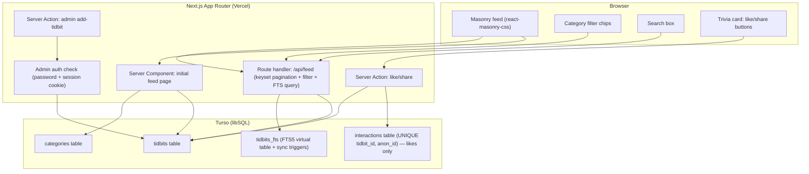
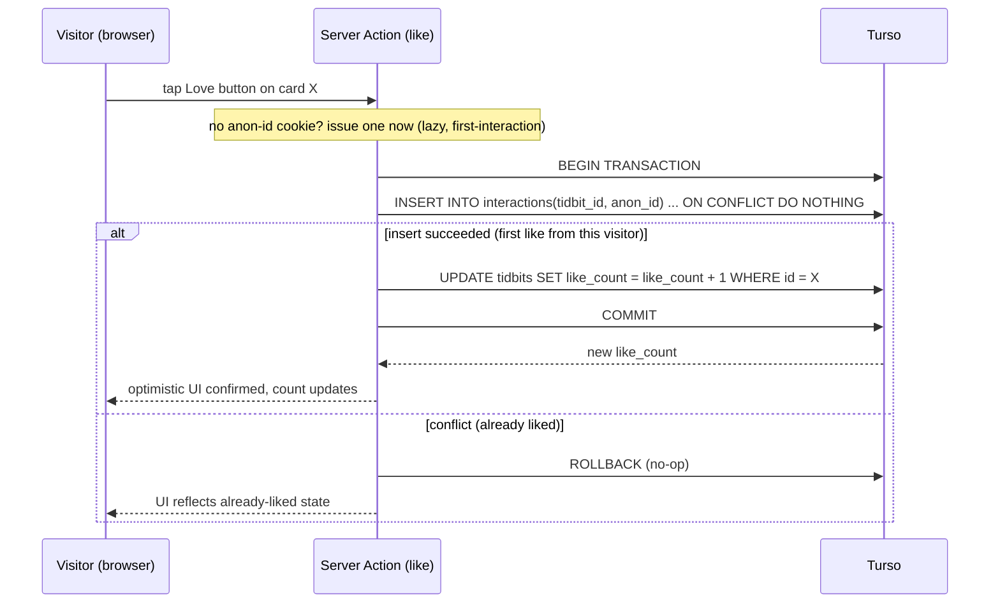

# Tidbits Trivia Website - Plan

## Goal Capsule

- **Objective:** Ship "Tidbits" — a Next.js + Turso-backed website that displays a colorful, cartoonish, responsive masonry grid of bite-sized trivia cards, with persisted anonymous likes/shares, category filter chips, full-text search, and a password-protected admin form for continuous authoring — architected to scale cleanly from ~100 to 5000+ tidbits.
- **Authority hierarchy:** this plan's Key Technical Decisions (Planning Contract) outrank implementer judgment on unstated details, which in turn outranks default framework conventions.
- **Stop conditions:** a change to persisted-likes semantics, the anonymous abuse-guard approach, or the database choice is a blocker requiring a return to this plan — never silent reinterpretation.
- **Execution profile:** code.
- **Tail ownership:** the implementer runs the Verification Contract and reports against the Definition of Done; no separate sign-off step is defined here.

---

## Product Contract

### Summary

Tidbits is a personal trivia-sharing website. A visitor lands on a single feed page showing a Pinterest-style masonry grid of trivia cards — each with a short header, the trivia text, a like button with count, and a share button with count. Visitors filter by category, search across all tidbits, and scroll to load more. The site owner adds new tidbits continuously over time through a private admin form; the initial ~100 tidbits (currently scattered across the owner's notes) are bulk-imported once at launch.

### Problem Frame

The owner has collected 100+ trivia facts over the years with no home for them, and expects to keep adding more indefinitely (target: 5000+). A static site (one JSON file, no database) would work at 100 items but breaks down for continuous authoring, full-text search, and real engagement counters at scale. The core technical problem this plan solves is picking and wiring a data layer, rendering strategy, and layout system that stay fast and simple all the way from 100 to 5000+ items, without over-building for scale that isn't needed yet.

### Requirements

**Feed & layout**

- R1. The homepage renders all published tidbits in a masonry grid: 3 columns on desktop, 2 on tablet, 1 on mobile, cards of varying height that pack without gaps.
- R2. Each card shows a short header, the trivia body text, a share icon/button, a love/like button, a persisted like count, and a persisted share count, styled in a light-toned, colorful, cartoonish ("claymorphism") visual language.
- R3. Visitors load more tidbits past the first batch via infinite scroll, with a visible "Load more" button as a manual fallback/anchor.
- R4. DOM/reading order stays sane for keyboard and screen-reader navigation even though the masonry layout visually reflows cards. Given `react-masonry-css` (KTD4) buckets cards into separate per-column DOM containers, "sane" means column-major order (chronological within each column, columns traversed left to right) — not a single global chronological order across all cards, which this library cannot deliver without a bespoke reordering layer this plan does not build.

**Content & categories**

- R5. Every tidbit belongs to exactly one category; each category has a name and an accent color used on cards in that category.
- R6. Visitors filter the feed by category using filter chips.

**Search**

- R7. Visitors search across tidbit headers and bodies via a search box; results render in the same masonry grid.

**Engagement (likes/shares)**

- R8. Liking a card increments a persisted, server-side like count visible to all visitors — not a per-browser or decorative number.
- R9. Sharing a card (via the native share sheet where available, a copy-link/toast fallback otherwise) increments a persisted, server-side share count every time — shares are not deduplicated per visitor the way likes are (R10), since a visitor sharing the same card twice to two different people is a legitimate repeat action.
- R10. A given anonymous visitor cannot repeatedly inflate the like count on the same card from the same browser; no login is required.

**Authoring / admin**

- R11. The owner adds a new tidbit (header, body, category) through a password-protected admin form that writes directly to the database — no file editing or redeploy required.
- R12. The owner's existing ~100 tidbits (currently in free-form notes/docs) are imported into the database as a one-time step before launch, without hand-typing each one through the admin form.

**Performance / scale**

- R13. The feed stays fast to load and browse as the dataset grows from ~100 to 5000+ tidbits — pagination, search, and category filtering all use indexed, non-degrading queries.

### Scope Boundaries

**Deferred to Follow-Up Work**

- Per-tidbit static/shareable pages for SEO indexability (flagged as a genuine gap by architecture review — infinite-scroll-only content is largely invisible to search engines — but not requested by the owner and not required for launch; cheap to add later, so it is deferred rather than built speculatively).
- Image/illustration attachments per tidbit (today's scope is text-only cards).
- A complementary server-side rate-limit layer beyond the cookie + unique-constraint guard (R10), if abuse is observed in practice.
- Custom domain attachment (launches on a Vercel-provided subdomain).
- Any admin analytics/dashboard beyond the plain add-tidbit form.

**Outside this product's identity**

- User accounts, login, or social-network features (profiles, follows, comments).
- Multi-author or multi-tenant support — this is a single-owner content site.

### Dependencies

- A Turso database and auth token (free tier).
- A Vercel project connected to this repository for deployment.
- The owner's existing tidbit notes/docs, made available for the one-time bulk import (U3).

---

## Planning Contract

### Key Technical Decisions

- **KTD1. Database: Turso (libSQL) with SQLite FTS5 for search**, not Neon Postgres or another Vercel Marketplace provider *(session-settled: user-directed — chosen over Neon Postgres: the owner explicitly asked for "very less setup but really great search"; Turso/libSQL needs only an SDK + two env vars with no serverless connection-pooling step, and FTS5 is proven at this row count. A cross-model architecture review (Opus + Sonnet) initially split on this — Opus favored Neon, citing Turso's Rust-rewrite transition as a stability risk — but verification showed that risk applies to "Turso Database" (codename Limbo), a separate, still-beta future engine, not to Turso Cloud/libSQL, the stable product actually used here.)*
- **KTD2. Framework: Next.js App Router deployed on Vercel** *(session-settled: user-directed)*.
- **KTD3. Anonymous like guard: an httpOnly signed cookie carrying an anonymous ID, enforced via a database `UNIQUE(tidbit_id, anon_id)` constraint on likes only**, rather than client-side `localStorage` alone *(session-settled: user-approved — the owner directed "anonymous, localStorage/cookie guard, no login"; the cookie + DB-unique-constraint form is the strictly stronger implementation of that same instruction — it can't be cleared by a client-side script the way `localStorage` can, and it gives clean toggle/un-like semantics — surfaced during POV review and adopted as the concrete mechanism)*. Shares are explicitly **not** deduplicated by this guard — repeat shares from the same visitor each increment `share_count` directly, with no interactions-table involvement — a decision made during document review because R9's plain "increments a persisted count" framing and a visitor's legitimate repeat-share behavior don't fit the like-style one-time cap.
- **KTD4. Masonry grid: `react-masonry-css`**, CSS-column-based, no built-in virtualization *(session-settled: user-approved from research — native CSS masonry (`grid-template-rows: masonry`) is not reliably supported across browsers yet)*. Because it keeps every rendered card in the DOM, the feed caps the render window (see U5) rather than growing the DOM unbounded as more tidbits load.
- **KTD5. Rendering: dynamic Server Components per request for the feed** (no ISR/cache layer), with **Server Actions** for likes/shares and optimistic client-side UI. Chosen over an ISR-plus-cached-content-with-a-separate-counts-endpoint split: at Turso's read latency for ~5000 short rows, a cache layer buys negligible speed and adds real complexity (a second batched counts fetch, cache invalidation) that isn't justified yet. This bet assumes low read latency, which holds only if the Vercel deployment region and the Turso database's primary/replica region are reasonably close — **verify this region pairing before starting U2** (choose the Turso database region to match the Vercel project's deployment region, or measure actual round-trip latency directly) rather than assuming it. Revisit the no-cache decision if traffic growth, or this region check, makes per-request DB reads measurably slow.
- **KTD6. Pagination: keyset (cursor-based)**, not `OFFSET`/`LIMIT` — offset pagination degrades and can duplicate/skip rows as new tidbits are added continuously.
- **KTD7. One category per tidbit** (a foreign key, not a many-to-many tag table) — matches the "filter chips" requirement (R6) directly and keeps the schema and queries simple; revisit only if multi-category tagging is explicitly requested later.
- **KTD8. Search: a SQLite FTS5 virtual table** (external-content, synced to the `tidbits` table via insert/update/delete triggers), not an external search service (Algolia/Typesense/etc.) — both architecture reviewers independently judged an external service as overkill at 5000 short text rows.
- **KTD9. Content pipeline is two separate paths**: a one-time bulk-import script (U3) for the existing ~100 notes-based tidbits, and an ongoing single-entry admin form (U3) for everything added after launch *(session-settled: user-directed — the admin form is for the owner's ongoing additions; treating it as the only ingestion path would mean hand-typing 100 existing entries, which both architecture reviewers flagged independently as a real gap in the settled admin-form-only framing)*.
- **KTD10. Admin auth: a single shared admin password**, checked server-side and backed by a signed session cookie — not a full user/account system *(session-settled: user-directed — "simple password-protected admin form")*.

### Assumptions

- The owner's existing tidbits, once gathered from notes/docs into a single text file or spreadsheet, are clean enough (readable header + body text) that the bulk-import script needs light parsing, not a content-cleanup tool.
- Traffic stays at personal/hobby-project scale for the plan's horizon; the Turso free tier and Vercel hobby tier cover it.
- "Cartoonish" visual language is realized as a claymorphism-inspired system (rounded ~20px corners, soft colored shadows, one pastel accent per category, playful rounded typography, emoji/icon per category) per research; exact palette and font choices are implementer discretion within that direction.

### High-Level Technical Design





---

## Implementation Units

### U1. Project scaffold and cartoonish design system

- **Goal:** Stand up the Next.js App Router project on Vercel with the base visual language (colors, typography, card shell, category accent-color tokens) that every later unit builds on.
- **Requirements:** R2
- **Dependencies:** none
- **Files:** `app/layout.tsx`, `app/globals.css`, `app/page.tsx`, `tailwind.config.ts` (or equivalent styling config), `package.json`, `vercel.ts`
- **Approach:** Initialize Next.js (App Router, TypeScript). Set up a light pastel base palette, a rounded/friendly display font pairing, and shared card shell primitives (rounded ~20px corners, soft colored shadow) as reusable style tokens/utility classes rather than one-off inline styles, so every card and category shares the same visual grammar. Wire the project to Vercel for preview deploys.
- **Execution note:** This is mostly scaffolding/styling; prefer a build + visual smoke check over unit tests.
- **Patterns to follow:** Claymorphism reference from research — chunky rounded corners, dual soft shadows, one pastel accent per category, emoji/icon as a small topic marker.
- **Test scenarios:**
  - Test expectation: none — pure scaffolding/config, no behavior to test yet.
- **Verification:** `npm run build` succeeds; a deployed preview shows the base layout and design tokens render correctly across mobile/tablet/desktop widths.

### U2. Database schema, Turso setup, and full-text search

- **Goal:** Stand up the Turso database with the schema needed for tidbits, categories, engagement counters, and full-text search.
- **Requirements:** R5, R7, R8, R9, R13
- **Dependencies:** U1
- **Files:** `lib/db/client.ts`, `lib/db/schema.sql` (or migration files under `lib/db/migrations/`), `.env.local.example`
- **Approach:** Create the Turso database and wire `@libsql/client` with the connection URL and auth token as env vars. Define:
  - `categories(id, slug, name, accent_color)`
  - `tidbits(id, header, body, category_id REFERENCES categories(id), created_at, like_count INTEGER DEFAULT 0, share_count INTEGER DEFAULT 0, is_published)` — no per-tidbit `slug`: nothing in this plan's scope reads one (only `categories.slug` is used, by filter chips); add it back if the deferred per-tidbit share pages (Scope Boundaries) are picked up later.
  - `tidbits_fts` — an FTS5 virtual table (external-content over `tidbits(header, body)`) kept in sync via `AFTER INSERT/UPDATE/DELETE` triggers on `tidbits`.
  - `interactions(tidbit_id REFERENCES tidbits(id), anon_id, created_at, UNIQUE(tidbit_id, anon_id))` — the source of truth for KTD3's like guard only. Shares are not deduplicated (KTD3, R9) and do not use this table — a share always directly increments `tidbits.share_count`.
  - Indexes: `(category_id, created_at DESC, id DESC)` on `tidbits` for keyset-paginated, category-filtered queries (KTD6, KTD7).
- **Technical design:** *(directional, not implementation-specification)*
  ```
  -- keyset page query shape (non-search browsing)
  SELECT * FROM tidbits
  WHERE is_published = 1
    AND (category_id = :cat OR :cat IS NULL)
    AND (created_at, id) < (:cursor_created_at, :cursor_id)
  ORDER BY created_at DESC, id DESC
  LIMIT :page_size;

  -- keyset page query shape (search, ranked by FTS5 bm25 relevance)
  SELECT tidbits.* FROM tidbits
  JOIN tidbits_fts ON tidbits_fts.rowid = tidbits.id
  WHERE tidbits_fts MATCH :escaped_term
    AND is_published = 1
    AND (bm25(tidbits_fts), tidbits.id) > (:cursor_rank, :cursor_id)
  ORDER BY bm25(tidbits_fts) ASC, tidbits.id ASC
  LIMIT :page_size;
  -- bm25() is deterministic for a fixed MATCH term, so paging on (rank, id) stays
  -- stable across pages of the same search query, satisfying KTD6 for the search path too.
  ```
- **Patterns to follow:** KTD1, KTD6, KTD7, KTD8.
- **Test scenarios:**
  - Happy path: inserting a tidbit populates `tidbits_fts` via trigger and a matching FTS query returns it.
  - Happy path: keyset query with a category filter returns only that category's rows in `created_at DESC` order with no duplicates across two sequential pages.
  - Edge case: deleting/unpublishing a tidbit removes it from `tidbits_fts` (trigger fires on delete/update, not just insert).
  - Edge case: a category with zero tidbits returns an empty page, not an error.
  - Integration: an `interactions` insert that violates the `UNIQUE` constraint is caught and treated as "already liked," not surfaced as a server error.
- **Verification:** A migration/setup script runs cleanly against a fresh Turso database; the five scenarios above are covered by data-layer tests (e.g., Vitest against a local libSQL file for speed).

### U3. Bulk import and admin authoring form

- **Goal:** Get the owner's ~100 existing tidbits into the database once, and give the owner a simple, password-protected way to add new tidbits going forward.
- **Requirements:** R11, R12
- **Dependencies:** U2
- **Files:** `scripts/import-tidbits.ts`, `app/admin/page.tsx`, `app/admin/actions.ts`, `middleware.ts` (or an admin-scoped auth check)
- **Approach:** Write a one-time import script that reads the owner's compiled tidbits (a text/CSV file the owner provides, per KTD9) and inserts each as a `tidbits` row with a best-guess or owner-assigned category, run manually once before launch. Separately, build `/admin` as a two-step, password-gated flow (KTD10): a login screen takes only the admin password and, on success, sets an httpOnly, Secure, `SameSite=Lax` signed session cookie with a short expiry (e.g., a few hours); only once that cookie is valid does `/admin` show the add-tidbit form (header + body + category via a Server Action), so the owner doesn't re-enter the password per tidbit within a session. Provide a logout action that clears the session cookie.
- **Execution note:** Add characterization coverage for the import script's parsing before trusting it against the real notes file — malformed or ambiguous entries should be reported, not silently dropped or malformed into the database.
- **Test scenarios:**
  - Happy path: a well-formed input file produces one `tidbits` row per entry with the correct header/body/category.
  - Edge case: an entry missing a category is flagged for manual review rather than silently defaulting.
  - Happy path: a correct password sets the session cookie and reveals the add-tidbit form; revisiting `/admin` with a valid session skips the login screen.
  - Error path: the login screen rejects an incorrect password and does not create a session cookie.
  - Error path: an unauthenticated request to the admin Server Action is rejected before it touches the database.
  - Edge case: the session cookie expires after its set lifetime, requiring re-login; logout clears it immediately.
  - Happy path: a successful admin form submission appears in the public feed on next load.
- **Verification:** Import script run once against the real (or a representative sample) input produces the expected row count with no silently-dropped entries; admin login/session/logout scenarios above pass.

### U4. Public feed data layer

- **Goal:** Serve paginated, filterable, searchable tidbit data to the frontend.
- **Requirements:** R1, R6, R7, R13
- **Dependencies:** U2
- **Files:** `app/page.tsx`, `app/api/feed/route.ts`, `lib/db/queries.ts`
- **Approach:** The initial feed page loads its first batch as a Server Component query directly against `tidbits` (KTD5). Subsequent pages (scroll/"Load more", category filter changes, search queries) go through `GET /api/feed` — a route handler taking a keyset cursor, an optional category slug, and an optional search term; a search term routes the query through `tidbits_fts` (KTD8) instead of the plain table, keyset-paginated on `(bm25 rank, id)` per U2's search query shape rather than the date-based cursor used for plain browsing. Escape/quote the raw search term before building the FTS5 `MATCH` expression (wrap it as a phrase and strip embedded quotes) so operator characters (`"`, `-`, `AND`/`OR`/`NOT`) in visitor input never throw a SQLite syntax error — malformed input degrades to an empty result set, never a 500. Filter, search, and pagination state live in URL `searchParams` so results are bookmarkable/shareable and survive back-navigation. When a page has no further results (plain browsing or search), the response signals end-of-list explicitly (e.g., a page shorter than the requested size, or an empty `nextCursor`) so U5/U6 can render the end-of-feed and zero-results states without guessing from an empty array alone.
- **Patterns to follow:** KTD5, KTD6, KTD8.
- **Test scenarios:**
  - Happy path: requesting the feed with no filter/search returns the newest page of published tidbits.
  - Happy path: a category filter narrows results to that category only.
  - Happy path: a search term returns tidbits whose header or body match, ranked by relevance, keyset-paginated on `(rank, id)` with no duplicates across pages of the same query.
  - Edge case: a search term matching zero tidbits returns an empty result set, not an error.
  - Edge case: a search term containing raw FTS5 operator characters (e.g., a lone `"` or a leading `-`) returns a result (possibly empty), never a server error.
  - Edge case: combining a category filter and a search term applies both constraints together.
  - Integration: paging forward twice with the returned cursor (either the date-based or the rank-based shape) yields no duplicate and no skipped tidbits, and the last page signals end-of-list.
- **Verification:** Route handler tests cover the seven scenarios above against a seeded test database.

### U5. Masonry grid UI and trivia card

- **Goal:** Render the feed as a responsive, cartoonish masonry grid of cards, capped to a sane render window.
- **Requirements:** R1, R2, R3, R4
- **Dependencies:** U1, U4
- **Files:** `components/MasonryFeed.tsx`, `components/TidbitCard.tsx`, `package.json` (add `react-masonry-css`)
- **Approach:** Use `react-masonry-css` (KTD4) with responsive breakpoints (1 column mobile, 2 tablet, 3 desktop). Each `TidbitCard` renders header, body, category accent color, and slots for the like/share controls built in U7. Cap the number of simultaneously rendered cards (e.g., ~500-600) — once the visitor scrolls past the cap, surface a non-blocking sticky prompt (replacing the "Load more" button, not a modal) inviting them to narrow via search/category rather than growing the DOM further (mitigates the DOM-size risk both architecture reviewers flagged). Accept column-major DOM order (per R4) as the reading order rather than attempting to force a global-chronological order the library can't deliver. When `/api/feed` signals end-of-list (U4), hide the "Load more" button and show a short "You've seen every tidbit" message instead of leaving a dead button or stopping silently.
- **Execution note:** Implement new layout/interaction behavior test-first where feasible (component tests for column count at each breakpoint, the render cap, and the end-of-feed state), since masonry reflow bugs are easy to introduce silently.
- **Test scenarios:**
  - Happy path: at desktop width the grid renders 3 columns; at tablet width 2; at mobile width 1.
  - Happy path: cards of varying content length pack without visible overlap or excessive gaps.
  - Happy path: reaching the end of the list hides "Load more" and shows the "You've seen every tidbit" message.
  - Edge case: reaching the render cap shows the narrow-your-results prompt instead of continuing to mount more cards.
  - Integration: tabbing through the page visits cards in column-major order (down column 1, then column 2, then column 3), matching R4's redefined reading order.
- **Verification:** Component/visual tests cover the five scenarios above at each breakpoint; a manual pass confirms the "relaxing to browse" visual goal.

### U6. Category filters and search bar

- **Goal:** Let visitors narrow the feed by category and by search term.
- **Requirements:** R6, R7
- **Dependencies:** U4, U5
- **Files:** `components/CategoryChips.tsx`, `components/SearchBar.tsx`, `app/page.tsx`
- **Approach:** Filter chips (one per category, colored by that category's accent) update the URL `searchParams` and re-fetch via U4's `/api/feed`, plus a permanent "All" chip that clears the category filter and returns to the unfiltered feed. The search box debounces input before firing a search request, also through `/api/feed`, and can be combined with an active category filter. When a search/filter request returns zero results, show an explicit "No tidbits match '<term>'" empty state with an action to clear the search/filter. When a `/api/feed` request fails (network error, timeout), show a small retry affordance and keep the previously-loaded results visible rather than clearing the grid.
- **Test scenarios:**
  - Happy path: selecting a category chip narrows the visible cards to that category and highlights the active chip.
  - Happy path: selecting "All" after a category filter was active returns to the unfiltered feed.
  - Happy path: typing a search term updates results after the debounce window without firing a request per keystroke.
  - Edge case: clearing the search term while a category filter is active returns to the category-only view.
  - Edge case: a zero-result search or filter shows the "No tidbits match" empty state with a working clear action, not a blank grid.
  - Edge case: a failed `/api/feed` request shows the retry affordance and keeps the prior results visible instead of clearing them.
  - Integration: the resulting URL reflects the active filter/search so reloading the page preserves the same view.
- **Verification:** The seven scenarios above pass in a component/integration test against U4's route handler.

### U7. Like/share engagement

- **Goal:** Let visitors like and share a card, with real persisted counts and an anonymous per-card abuse guard.
- **Requirements:** R8, R9, R10
- **Dependencies:** U2, U5
- **Files:** `components/TidbitCard.tsx`, `app/actions/engagement.ts`, `lib/anon-id.ts`
- **Approach:** The love button calls a Server Action guarded by the anonymous-ID cookie (KTD3): if no anon-ID cookie exists yet, the action issues one lazily (httpOnly, signed) on this first interaction — not eagerly on page load — the feed's initial render is a Server Component, which cannot set cookies (only Server Actions, Route Handlers, and middleware can), and this plan does not add middleware solely for anon-ID issuance, so the like Server Action sets it lazily on first use instead. The action then attempts an `interactions` insert (`tidbit_id`, `anon_id`) and, within the **same transaction**, increments `tidbits.like_count` only if that insert succeeded; a unique-constraint conflict rolls back the transaction as a no-op, treated as "already liked" in the UI without incrementing again. The share button always directly increments `tidbits.share_count` (single statement, no transaction needed since there's no companion insert to keep atomic with it) — no anon-ID check, no interactions row, since repeat shares are legitimate (R9). Both like and share show an optimistic heart-burst/count-increment animation (per research) that reverts on failure. Share uses the Web Share API where available, falling back to a copy-link modal with a toast confirmation; both paths call the same share Server Action. Counts render with compact formatting (e.g., `Intl.NumberFormat(..., {notation: "compact"})`).
- **Execution note:** The like path is a money-adjacent-style integrity path (counts must not be double-countable, and the insert+increment must not partially apply) — cover the transactional conflict/toggle behavior with integration tests before relying on optimistic UI alone.
- **Test scenarios:**
  - Happy path: liking a card for the first time inserts the interaction and increments the persisted like count atomically, updating the UI.
  - Happy path: sharing a card (native share sheet or fallback modal) increments the persisted share count.
  - Happy path: sharing the same card a second time from the same browser increments the share count again (not deduplicated).
  - Edge case: liking the same card twice from the same browser does not double-increment the count, and the failed insert does not leave a partial counter update.
  - Edge case: a visitor with no existing anon-ID cookie gets one issued transparently on their first like (not on page load).
  - Error path: if the Server Action fails, the optimistic UI reverts to the prior count rather than showing a stale "liked" state.
  - Integration: the like count shown after a page reload matches the persisted server-side value, not a locally cached one.
- **Verification:** The seven scenarios above pass; a manual check confirms the heart-burst animation and share-sheet/fallback behavior feel smooth.

---

## Risks & Dependencies

- **Turso is mid-transition as a product.** The underlying SQLite engine is being rewritten in Rust ("Turso Database," beta) alongside the stable, production libSQL engine this plan actually uses (Turso Cloud). Verified as of this plan's writing, but re-check before U2 if there is any gap between planning and implementation — a provider migrating its primary engine can change pricing, defaults, or client libraries with limited notice. Mitigation: pin the `@libsql/client` version explicitly and re-verify compatibility before upgrading it.
- **Single shared admin password (KTD10) is a real, accepted security tradeoff**, not an oversight — appropriate for a single-owner hobby site, but it means anyone who obtains the password has full write access with no audit trail of who made a change (moot with one owner) and no lockout/rate-limit on login attempts. Mitigation: rate-limit the login Server Action (e.g., a short delay or attempt cap) and store the password only as an env var, never in the repo.
- **Like/share counters are an integrity-sensitive path** (KTD3, U7): a bug in the `UNIQUE` conflict handling could double-count or silently drop likes. Mitigation: U7's test scenarios explicitly cover the conflict path; treat any change to that logic post-launch as requiring the same test coverage, not just a manual check.
- **Bulk import (U3, KTD9) depends on the owner's notes being compiled into one parseable file** before the script can run — this plan does not include a step for the owner to do that compilation, since it is content work, not engineering work. If the notes turn out too unstructured for light parsing, the import script's scope may grow; flag this back to the plan rather than quietly expanding U3 if it happens.
- **`react-masonry-css` has no built-in virtualization** (KTD4) — the render cap in U5 is the mitigation for DOM growth at 5000+ items; if the cap value chosen at implementation time still causes jank, that is a signal to lower it further rather than revisit the library choice.

---

## Verification Contract

| Check | Command / Method | Applies to |
|---|---|---|
| Build | `npm run build` | All units |
| Data-layer tests | `npm test` (Vitest) against a local libSQL file | U2, U3, U4, U7 |
| Component/integration tests | `npm test` (Vitest + Testing Library, or Playwright for the feed/search/like flows) | U5, U6, U7 |
| Manual visual/UX pass | Preview deploy reviewed at mobile/tablet/desktop widths | U1, U5, U6, U7 |
| Import dry run | `npm run import:tidbits -- --dry-run` (or equivalent) against the owner's real notes file | U3 |

No repo-specific test commands exist yet since this is a greenfield project; the commands above are the target shape to scaffold in U1.

---

## Definition of Done

- All Implementation Units (U1-U7) meet their own Verification criteria.
- `npm run build` succeeds and the site deploys to a Vercel preview.
- The owner's existing tidbits are fully imported (U3) with zero silently-dropped entries.
- The feed loads, filters by category, searches, paginates, and records likes/shares correctly at the ~100-tidbit launch dataset, with the schema and query patterns (keyset pagination, FTS5, render cap) verified to not require rework at 5000+ rows.
- Any experimental or abandoned code from approaches that didn't pan out during implementation is removed before calling the work done.

---

## Sources / Research

- Native CSS masonry (`grid-template-rows: masonry`) is not yet reliably supported across browsers; `react-masonry-css` is the recommended production choice today (informs KTD4).
- Claymorphism/pastel visual patterns and Duolingo's rounded-typography model inform U1's design tokens.
- Web Share API with a copy-link fallback is the standard share pattern (informs U7); compact number formatting via `Intl.NumberFormat` for counts.
- "Load more" plus auto-triggered infinite scroll outperforms either pattern alone for return engagement (informs R3/U5).
- Masonry's visual order diverges from DOM order, which breaks naive screen-reader/tab navigation unless DOM order is kept intentional (informs R4/U5).
- Vercel Postgres and Vercel KV are discontinued; databases are now offered through Vercel's Marketplace (Neon, and others). Neon has a first-party Vercel Marketplace integration with automatic `DATABASE_URL` injection; this was weighed against Turso in KTD1 and Turso was chosen primarily for the near-zero setup and FTS5 fit the owner asked for.
- Two-agent architecture review (Opus + Sonnet) independently converged on: FTS5/external search being overkill at 5000 rows, keyset over offset pagination, and the need for a one-time bulk-import path distinct from the ongoing admin form. The one point of dissent (database choice) was resolved via targeted verification (KTD1).
