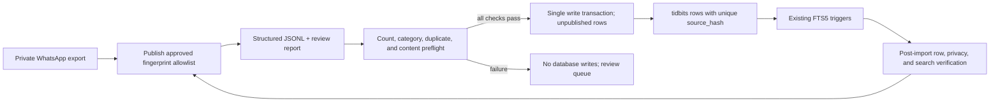

# Tidbits WhatsApp Trivia Content Import - Plan

## Goal Capsule

- **Objective:** Prepare the user's WhatsApp trivia export as a reviewed, verbatim dataset and load the resulting 120 unique tidbits into the existing Tidbits libSQL/Turso database without losing content, importing non-trivia messages, or creating duplicates on rerun.
- **Authority hierarchy:** The user's requirement to preserve the original content without summarization outranks implementation convenience; this plan's Key Technical Decisions govern the preparation and import mechanism; the existing Tidbits website plan remains authoritative for the database schema and public feed behavior.
- **Stop conditions:** Stop before writing when the source count, content-preservation check, category resolution, privacy check, or duplicate review does not reconcile; never silently drop, rewrite, default-category, or partially import a record.
- **Execution profile:** code.
- **Tail ownership:** The implementer runs the preparation, dry-run, database verification, and repository quality gates described here.

---

## Product Contract

### Summary

The Tidbits website needs its actual trivia content, currently stored inside a WhatsApp text export, instead of placeholder or hand-entered rows. The content pipeline must turn selected WhatsApp message blocks into database records with a header, the complete original body, and exactly one existing Tidbits category.

### Problem Frame

The export contains 170 WhatsApp messages mixing trivia, ordinary chat, links, media placeholders, travel research, and repeated stories. The current importer accepts a simpler blank-line text format, trims every line, joins body lines with spaces, inserts rows one at a time, and has no rerun guard, so using it unchanged would lose paragraph structure and risk duplicate or partial database state.

### Requirements

**Content preservation**

- R1. Every retained record preserves the selected source text across its `header` and `body` fields without summarization, fact-checking, grammar correction, or content rewriting.
- R2. WhatsApp export metadata, sender/date prefixes, trivia hashtags, media placeholders, link-only messages, ordinary chat, and the Meghalaya travel-recommendation block do not become Tidbits records.
- R3. The preparation report makes every excluded message and every duplicate decision auditable by source reference and reason.

**Count and deduplication**

- R4. The current source reconciles as `170 messages -> 125 substantive long-form candidates -> 1 Meghalaya exclusion -> 124 trivia blocks -> 4 duplicate copies removed -> 120 unique retained tidbits`.
- R5. Exact duplicates and the four known repeated-story groups produce one canonical record each; when repeated versions differ, the fullest source version is selected without merging or rewriting text.

**Database contract**

- R6. Every prepared record resolves to exactly one existing category by slug or name; missing, ambiguous, and unknown categories are review failures rather than candidates for a `random` fallback.
- R7. A dry run validates the complete batch before any write and reports ready, skipped-existing, duplicate, conflict, excluded, and review-failure counts.
- R8. The database load is atomic for the new batch, safe to rerun, and verified after insertion through row counts, content checks, and FTS5 visibility.

**Privacy and repository hygiene**

- R9. The raw WhatsApp export and intermediate artifacts remain outside the public repository unless the user explicitly approves a separate sanitized-content commit; the public repository must not receive unrelated chat, personal documents, links, or media metadata.
- R10. Retained records undergo a fail-closed privacy review for phone numbers, email addresses, credentials, invite links, personal URLs, and other likely private identifiers; flagged records are quarantined without rewriting until explicitly approved.

### Acceptance Examples

- AE1. **Given** a WhatsApp message with a date prefix, `#tr33via`, a title, and multiple paragraphs, **when** preparation runs, **then** the prefix and marker are removed while the title/body text, punctuation, emoji, and paragraph boundaries remain represented exactly across `header` and `body`.
- AE2. **Given** the current export, **when** preparation completes, **then** the report records 170 messages inspected, 125 substantive candidates, one Meghalaya exclusion, 124 trivia blocks, four duplicate copies removed, and 120 unique retained records.
- AE3. **Given** a retained record with no category or an unknown category, **when** import preflight runs, **then** the complete write is blocked and the record is listed for review.
- AE4. **Given** an already imported record with the same canonical header/body, **when** the same prepared artifact is imported again, **then** no duplicate row is created and the report marks it as already present.
- AE5. **Given** a batch where one insert fails validation or database execution, **when** the load runs, **then** the transaction rolls back the new batch and the report does not claim a successful import.
- AE6. **Given** a successfully inserted record, **when** the database is queried through FTS5 using a distinctive header or body term, **then** that record is searchable through the existing feed data layer.
- AE7. **Given** a retained record containing a likely private identifier, **when** preparation or import runs, **then** the record is quarantined and no public row is created until explicit approval.
- AE8. **Given** two imports run concurrently with the same prepared record, **when** both reach the database, **then** the unique import fingerprint allows only one row to exist.

### Scope Boundaries

**In scope**

- Parsing the supplied WhatsApp text export into message blocks.
- Selecting trivia blocks, preserving their text, extracting headers, assigning existing categories, recording exclusions, and reviewing duplicates.
- Producing a structured staging artifact and audit report for the 120 retained records.
- Extending the importer and tests for structured input, lossless multiline content, validation, transaction safety, exact-content reruns, and post-import verification.
- Loading the prepared records into the existing local or Turso database.

### Deferred to Follow-Up Work

- Durable source-provenance columns in the public `tidbits` table if future imports need to track source message IDs beyond exact-content idempotency.
- A broader category taxonomy if the owner later wants more specific technology, business, culture, or travel categories.
- Fact verification, editorial corrections, and source citations for the trivia itself.

**Outside this product's identity**

- Importing resumes, invoices, employment documents, personal contact details, group links, or media attachments from the export.
- Summarizing, rewriting, or “improving” the historical trivia text.
- Changing the public feed, card design, engagement behavior, or admin UX as part of this content load.

### Dependencies

- The supplied WhatsApp export must be available to the implementation environment and staged privately as `data/raw/_chat.txt` or passed directly as an input path.
- The existing Tidbits schema and seeded categories must be available through `scripts/setup-db.ts`.
- A local libSQL database is sufficient for preparation and verification; a real Turso URL/token is required for the final remote load.

---

## Planning Contract

### Key Technical Decisions

- KTD1. **Use a separate WhatsApp preparation stage:** `scripts/prepare-whatsapp-trivia.ts` produces structured JSONL plus a review report, and `scripts/import-tidbits.ts` consumes only the prepared artifact. This isolates source-specific parsing from the database loader and prevents the current lossy plain-text parser from handling the export.
- KTD2. **Preserve content by structural normalization only:** remove WhatsApp envelope metadata and leading content markers, normalize CRLF to LF, and preserve visible words, punctuation, emoji, and paragraph breaks. Do not correct spelling, validate claims, summarize, or combine separate messages.
- KTD3. **Split header from body without summarization:** use the first non-empty content line as the header and the remaining content as the body; preserve the complete selected message across those two fields. Records with no body after the split are review failures instead of being padded with invented text.
- KTD4. **Deduplicate before import:** use a canonical header/body fingerprint for exact duplicates and an explicit reviewed duplicate-group manifest for the four known repeated stories. Canonicalization converts CRLF to LF and removes only outer envelope whitespace; it preserves internal whitespace and blank lines, and hashes the length-delimited persisted `(header, body)` pair so the stored values recompute to the same digest. When versions differ, retain the fullest single source version rather than synthesizing a new one.
- KTD5. **Use existing categories only:** resolve one of `science`, `history`, `animals`, `food`, `space`, or `random` by slug/name. Topic assignment is a reviewable data decision; no category is created or silently defaulted during import.
- KTD6. **Use a database-backed import fingerprint:** compute a canonical header/body hash, store it in a nullable unique `source_hash` column on `tidbits`, and use preflight comparison for friendly skip/conflict reporting. The unique constraint closes the race that a preflight-only check would leave between concurrent imports; existing admin-created rows remain compatible because their nullable hash is empty.
- KTD7. **Commit unpublished rows transactionally:** complete validation before opening the write transaction, insert new rows with `is_published = 0`, and roll back on any failure. Existing `tidbits` FTS triggers remain the source of search-index updates, while publication happens only after verification against the approved fingerprint allowlist.
- KTD8. **Keep source artifacts private by default:** raw, staging, and report files are ignored or stored outside the checkout; logs contain counts and opaque record IDs rather than headers, bodies, URLs, or source text. A repository check must prove that private artifacts are not tracked.
- KTD9. **Recompute and verify the staging artifact:** the importer recomputes fingerprints, source-reference uniqueness, category tokens, review status, and the expected retained set from the actual header/body fields. It rejects malformed JSONL, unknown fields, supplied-hash mismatches, and tampered records rather than trusting metadata supplied by the artifact.

### High-Level Technical Design

### Assumptions

- The current WhatsApp export is the authoritative content source for this import.
- “As it is” means no editorial rewriting; removing the export envelope and moving the first content line into `header` is structural preparation required by the existing database contract.
- The 120-record count is the expected baseline for this exact source and must be treated as a reconciliation invariant, not as permission to silently accept a changed count.
- The six existing categories are adequate for this first load, with `random` reserved for stories whose dominant subject does not fit the other five categories.

### Sequencing

1. Prepare and review the structured artifact before changing database state.
2. Extend importer validation and tests against isolated file-backed libSQL databases.
3. Run a dry run against the reviewed artifact and resolve every report item.
4. Load the complete batch transactionally into the target database.
5. Verify row counts, exact text, categories, rerun behavior, and FTS search visibility.

---

## Implementation Units

### U1. Prepare and review WhatsApp trivia content

- **Goal:** Convert the WhatsApp export into a lossless, reviewable staging artifact containing only the selected trivia records.
- **Requirements:** R1, R2, R3, R4, R5, R9, R10, AE1, AE2, AE7.
- **Dependencies:** None.
- **Files:** `scripts/prepare-whatsapp-trivia.ts`, `scripts/prepare-whatsapp-trivia.test.ts`, `.gitignore`, `data/README.md`.
- **Approach:**
  1. Parse WhatsApp message starts with their hidden formatting characters and append continuation lines without flattening them.
  2. Remove only the export prefix and leading trivia markers such as `#tr33via` or `#evening_shots`.
  3. Classify media placeholders, link-only messages, ordinary chat, the Meghalaya travel block, and ambiguous records into an explicit exclusion/review report.
  4. Split each retained message into the first non-empty header line and the remaining body while retaining the full visible source text.
  5. Generate canonical fingerprints and apply the four reviewed duplicate groups without merging different versions.
  6. Scan retained header/body text for likely private identifiers and quarantine flagged records without logging their content.
  7. Assign one existing category token per retained record and emit JSONL fields for source reference, header, body, category, fingerprint, and review status, plus a schema version, artifact digest, fingerprint-set digest, and complete message-disposition ledger in the report.
- **Execution note:** Use characterization tests against representative lines from the real export before trusting the output. The preparation stage should fail loudly on count drift or content loss rather than producing a plausible but incomplete file.
- **Patterns to follow:** WhatsApp message-boundary handling must be isolated here; do not reuse the whitespace-flattening behavior in `scripts/import-tidbits.ts`. Add explicit ignore coverage for `data/raw/`, `data/staging/`, and `data/reports/`, and keep logs limited to counts and opaque record IDs.
- **Test scenarios:**
  - A message with a hidden left-to-right marker, WhatsApp prefix, `#tr33via`, title, blank lines, and emoji produces the same visible header/body content with paragraph boundaries preserved.
  - An untagged long-form trivia message is retained when its content is substantive, while its non-trivia metadata is not included.
  - Media placeholders, link-only messages, ordinary chat, and the Meghalaya travel block are excluded with a reason and source reference.
  - All 170 source messages receive exactly one disposition: retained, canonical duplicate, duplicate discard, explicit exclusion, or review failure; no message remains unclassified.
  - A message without a body after header extraction is routed to review instead of receiving invented filler text.
  - The Calm, FIFA, Khosrowshahi, and Citroën repeated-story groups resolve to one canonical record each, with the discarded source references recorded.
  - The prepared output preserves the expected 120 unique records and fails the report when the count or retained-content fingerprint set changes unexpectedly.
  - A retained record containing a phone number, email address, invite link, or credential-like token is quarantined and represented only by an opaque review ID in logs.
  - Editing a JSONL field after review causes the recomputed artifact or fingerprint-set digest to disagree with the approved report and blocks import.
- **Verification:** A reviewer can inspect the JSONL and report, trace each retained/excluded source block, and confirm that the retained record count is 120 with no silent drops.

### U2. Refactor the structured importer for validation and atomic reruns

- **Goal:** Load the reviewed JSONL artifact into the existing Tidbits database without content loss, category fallback, duplicate rows, or partial batches.
- **Requirements:** R6, R7, R8, R10, AE3, AE4, AE5, AE6, AE7, AE8.
- **Dependencies:** U1.
- **Files:** `scripts/import-tidbits.ts`, `scripts/import-tidbits.test.ts`, `lib/db/schema.sql`, `lib/db/schema.test.ts`, `lib/db/client.ts`, `scripts/setup-db.ts`, `lib/db/test-helpers.ts` only if a test helper needs extension.
- **Approach:**
  1. Add a structured-input path that reads JSONL fields without joining body lines or trimming meaningful internal whitespace.
  2. Resolve categories against the seeded database and reject missing, ambiguous, duplicate-normalized, or unknown tokens before opening a write transaction.
  3. Recompute fingerprints and validate non-empty headers/bodies, allowed JSONL fields, source-reference uniqueness, the 120-record count invariant, privacy review status, and exact-content conflicts against existing rows.
  4. Add the nullable unique `source_hash` schema field and idempotent compatibility path in `scripts/setup-db.ts` needed to make concurrent reruns safe; preserve compatibility with existing rows and admin inserts.
  5. Report ready, already-present, duplicate, conflict, excluded, privacy-review, and validation-failure counts using opaque record IDs rather than content.
  6. Insert only new rows with `is_published = 0` inside the existing `db.transaction("write")` commit/rollback pattern and let `tidbits` triggers update FTS5.
  7. Treat an existing exact row with `is_published = 0` as publishable only when its `source_hash` is on the approved allowlist; otherwise stop with a conflict so expected content cannot be left hidden accidentally.
  8. Keep the old plain-text parser only as an explicitly separate legacy path if existing callers require it; never route the WhatsApp artifact through that parser.
- **Execution note:** Complete all preflight checks before the first insert. A nonzero review/conflict count must prevent writes unless the operator explicitly supplies a reviewed artifact with those records removed or corrected.
- **Patterns to follow:** Use `scripts/import-tidbits.test.ts` for parser/import coverage, `lib/db/test-helpers.ts` for isolated file-backed databases, and the transaction pattern in `lib/db/queries.ts:likeTidbit`.
- **Test scenarios:**
  - A valid JSONL record with preserved newlines and a known category inserts the exact header/body/category values.
  - Missing, unknown, or ambiguous categories block the entire batch without assigning `random`.
  - Duplicate fingerprints within the prepared file are reported and do not insert twice.
  - An exact record already present with the same category is skipped on rerun, leaving the row count unchanged.
  - An exact record already present but unpublished is reconciled only when its fingerprint is on the approved publication allowlist; otherwise it is reported as a conflict rather than silently remaining unpublished.
  - An exact header/body already present under a different category is reported as a hard conflict and blocks the batch.
  - A prepared record whose supplied fingerprint differs from the importer-recomputed fingerprint is rejected even when the reported count is unchanged.
  - Two concurrent imports of the same record produce exactly one row because the database uniqueness constraint rejects the second insert as an already-present record.
  - Duplicate normalized category names or aliases that resolve to multiple IDs block preflight instead of silently overwriting the category map.
  - A target connection with foreign-key enforcement disabled is rejected before writes, and post-import verification finds no orphaned category IDs.
  - `--dry-run` performs all validation and reports counts without changing row or FTS counts.
  - A simulated insert failure rolls back every new row in the batch.
  - Every imported row has exactly one FTS row, FTS integrity checks pass, and a simulated trigger failure rolls back both `tidbits` and `tidbits_fts`.
  - A successful insert makes a distinctive header/body term searchable through `tidbits_fts`.
  - Every imported row has exactly one FTS row, FTS integrity checks pass, and a simulated trigger failure rolls back both `tidbits` and `tidbits_fts`.
- **Verification:** The importer can be run twice against an isolated database with the second run inserting zero rows, concurrent attempts leave one row per source hash, and a failed batch leaves both `tidbits` and `tidbits_fts` unchanged.

### U3. Execute the reviewed load and prove the live database state

- **Goal:** Move the approved 120-record artifact into the target database and produce a final audit report that proves the import is complete.
- **Requirements:** R3, R4, R6, R7, R8, R9, R10, AE2, AE4, AE6, AE7, AE8.
- **Dependencies:** U1, U2, and a configured target database.
- **Files:** `data/staging/tidbits.jsonl` (private generated artifact), `data/reports/tidbits-import-report.json` (private generated report), `scripts/import-tidbits.test.ts`.
- **Approach:**
  1. Review the preparation report and resolve every exclusion, duplicate, category, and ambiguity item before the write run.
  2. Run the importer in dry-run mode and require the expected 120 retained records, zero unresolved review/conflict/privacy items, a matching artifact/fingerprint-set digest, and an explicitly approved target database identity.
  3. Import into the local or configured Turso database using the validated artifact, with all new rows unpublished.
  4. Query the database after the write to verify the inserted/previously-present totals, exact header/body samples, category distribution, unpublished state, source hashes, and FTS matches.
  5. Publish only the approved fingerprint allowlist in a separate step after verification, then verify the published count.
  6. Run the same import again and record zero new inserts as the rerun proof.
  7. If the remote response is lost or verification fails after commit, reconcile the source-hash set before retrying and use the recorded newly inserted IDs/hashes for a bounded rollback; never blindly rerun or delete unrelated rows.
  8. Keep the report and source artifacts outside the public repository unless a separate privacy review approves publication.
- **Test scenarios:**
  - A clean run reports 120 unique retained tidbits, zero unresolved reviews, and a database row count equal to the pre-import count plus the new records.
  - A clean write creates no newly published rows before the post-import privacy/content verification completes.
  - The post-import verification finds every retained fingerprint exactly once and no excluded source reference in the database.
  - Verification checks the imported fingerprint/ID set as the authoritative result, reports unrelated concurrent row changes separately, and confirms exactly one FTS row per imported tidbit plus FTS integrity.
  - A distinctive search term from each major category returns at least one expected record through FTS5.
  - A second run reports zero new inserts and no row-count increase.
  - A count mismatch or missing source artifact prevents the final write and leaves the target database unchanged.
  - An unapproved Turso URL or missing target identity confirmation prevents writes without exposing credentials in logs or reports.
  - A lost commit response triggers source-hash reconciliation and does not create a second batch or delete pre-existing rows.
- **Verification:** The final report is sufficient for the owner to reconcile source messages, retained records, excluded records, duplicate decisions, database rows, publication state, and FTS visibility without reading raw chat data into the public repository.

---

## System-Wide Impact

- The change affects the content lifecycle from private source export to public database rows, so privacy and provenance checks sit before the existing feed and FTS layers.
- The nullable `source_hash` addition is an import-integrity field only; feed, admin, and engagement queries continue to use their existing columns.
- Importing records through the existing schema automatically exercises the FTS5 insert trigger, so post-import search verification is part of the data contract rather than an optional smoke check.
- Existing admin-created rows remain valid because the new import hash is nullable and only populated for prepared content.

---

## Risks & Dependencies

- **Source-format drift:** WhatsApp export prefixes or hidden formatting characters may vary between exports. Mitigation: characterization tests cover the observed forms and unknown message starts are reported rather than swallowed.
- **Content loss during cleanup:** Trimming or flattening body lines would violate R1. Mitigation: compare canonical source fingerprints before and after preparation and preserve paragraph boundaries.
- **Semantic duplicate ambiguity:** Two versions may describe the same story with different wording. Mitigation: maintain an explicit duplicate-group manifest and choose one complete source version without merging text.
- **Category subjectivity:** Some business, technology, culture, and human-interest stories do not fit the existing categories cleanly. Mitigation: require a reviewed category token and use `random` only as an explicit editorial decision.
- **Privacy leakage:** The export contains non-trivia documents, links, and personal material. Mitigation: keep raw and staging artifacts private, exclude by class and source reference, and review the final public record set before remote import.
- **Sensitive trivia text:** A retained story may still contain a phone number, personal URL, invite link, email address, or secret-like token. Mitigation: fail closed on the privacy scan, quarantine the source text, and expose only opaque IDs in reports and logs.
- **Concurrent imports:** Two operators could pass a preflight check at the same time. Mitigation: enforce the nullable unique `source_hash` at the database layer and test concurrent attempts.
- **Unintended publication:** `tidbits.is_published` defaults to `1`. Mitigation: explicitly insert new rows unpublished, verify them, and publish only an approved fingerprint allowlist.
- **Tampered staging artifact:** A report could claim a valid fingerprint while its header/body changed. Mitigation: recompute all hashes and source references from actual fields and reject unknown or mismatched metadata.
- **Foreign-key drift:** SQLite foreign-key enforcement is connection-specific. Mitigation: verify foreign-key enforcement before writing, check for orphaned category IDs after import, and fail closed when the target connection is not enforcing the constraint.
- **Post-commit uncertainty:** A lost remote response can leave the final state unknown after commit. Mitigation: reconcile by source-hash set and use a bounded rollback procedure that deletes only rows proven to belong to this import; do not blindly rerun.
- **Wrong remote target:** A valid import could be sent to the wrong Turso database. Mitigation: require an approved target identity before writes and redact secrets from all output.
- **Production database availability:** The real Turso database and credentials were deferred by the original website plan. Mitigation: make local file-backed verification complete first and treat remote credentials as the final execution prerequisite, not as a reason to weaken validation.

---

## Verification Contract

| Gate | Evidence | Applies to |
|---|---|---|
| Preparation tests | Message boundaries, marker stripping, multiline preservation, exclusions, duplicate groups, and count reconciliation pass | U1 |
| Import tests | Structured parsing, category preflight, dry-run, exact rerun, conflict detection, rollback, and FTS visibility pass against isolated file-backed databases | U2 |
| Source reconciliation | 170 messages inspected, 125 substantive candidates, one Meghalaya exclusion, 124 trivia blocks, four duplicate copies removed, and 120 unique retained records are accounted for | U1, U3 |
| Dry-run gate | Zero unresolved review/conflict/privacy items, the expected 120-record retained set, a matching artifact/fingerprint-set digest, and an approved target identity before writes | U2, U3 |
| Database verification | Exact-content fingerprints, category assignments, row totals, unpublished-then-published state, privacy allowlist, source-hash set, foreign-key integrity, and representative FTS searches match the report | U3 |
| Privacy/target gate | No retained record has unresolved likely PII; raw/staging/report artifacts are untracked; the target database identity is approved; logs contain no source text or secrets | U1, U2, U3 |
| Repository quality | `npm test`, `npm run lint`, and `npm run build` pass after implementation; follow `AGENTS.md` and read the installed Next.js guides before code changes | U1, U2 |

---

## Definition of Done

- The preparation stage produces a structured artifact for 120 unique trivia tidbits with original content preserved across header/body fields.
- Every excluded message and duplicate decision is represented in an audit report with a reason and source reference.
- Every retained record has exactly one reviewed existing category and no record silently falls into a default.
- The importer recomputes and validates the complete batch before writing, preserves multiline text, handles exact and concurrent reruns without duplicates, and rolls back failed batches.
- The database contains the expected unpublished-then-approved records with a unique import fingerprint, FTS5 search visibility, and no excluded non-trivia content.
- Privacy scanning, target identity checks, foreign-key verification, and log redaction prevent raw or sensitive source material from being published or exposed through operational output.
- A second import run produces zero new rows and confirms idempotency.
- Raw and intermediate WhatsApp artifacts are not committed to the public repository.
- Automated tests, lint, and production build pass, and no abandoned parser/import attempt remains in the diff.

---

## Sources / Research

- `docs/plans/2026-07-25-001-feat-tidbits-trivia-website-plan.md` — existing Tidbits product contract, schema choice, category requirement, FTS5 behavior, and the deferred U3 bulk-import path.
- `lib/db/schema.sql` — required `header`, `body`, and `category_id` fields plus FTS5 synchronization triggers.
- `scripts/import-tidbits.ts` — current parser and importer; its line trimming, whitespace flattening, row-by-row insertion, and category rejection behavior directly shape this follow-up.
- `scripts/setup-db.ts` — existing category slugs and names used by the prepared artifact.
- `lib/db/queries.ts` — existing write-transaction commit/rollback pattern.
- `lib/db/test-helpers.ts` — file-backed temporary database pattern for transaction tests.
- User-supplied WhatsApp export, staged for implementation as private `data/raw/_chat.txt` — current baseline reconciles as `170 messages -> 125 substantive long-form candidates -> 1 Meghalaya exclusion -> 124 trivia blocks -> 4 duplicate copies removed -> 120 unique retained tidbits`; 71 of the source messages carry an explicit trivia tag.
