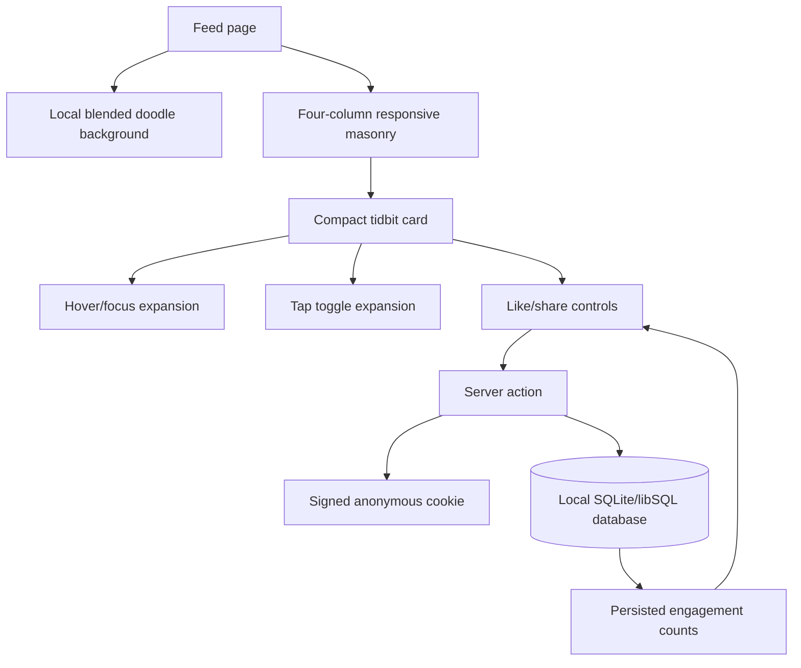

# Goal Capsule

Make the Tidbits feed feel lighter, denser, and more playful without sacrificing readability or changing the trivia bodies. The feed will use a softly blended doodle background based on the four user-selected previews, render four masonry columns on desktop, show compact cards that expand for reading, clean malformed or overlong headers, and make liking work reliably against the local database.

## Product Contract

### Summary

This plan extends the existing Tidbits trivia website and its current database/import contract. It is a focused polish pass across the global visual layer, feed/card behavior, imported header data, and engagement runtime.

### Problem Frame

The current feed has a plain cream background, three desktop masonry columns, cards that are always fully expanded, inconsistent imported headers, and a like path that appears broken in real use despite isolated component tests. These issues reduce scanability and make the feed feel less like a living trivia wall.

### Requirements

- R1. Replace the plain page background with one optimized, seamlessly repeating composite asset built from the selected doodle directions: options 1, 2, 5, and 8. The treatment must remain light enough that card text and controls are always readable.
- R2. Keep the background asset local to the repository and render it without visible tile seams, harsh contrast, or layout-jank on initial load.
- R3. Render four masonry columns at desktop widths. Preserve responsive readability with a tablet breakpoint and a single-column mobile layout; the implementation should use the existing masonry abstraction rather than introduce a second layout system.
- R4. Render each card in a compact truncated state by default. On desktop, hover and keyboard focus should expand the card smoothly so the complete tidbit can be read. On mobile, tapping the card toggles expanded/truncated state.
- R5. Card expansion must not steal or trigger engagement actions. Tapping or clicking like/share must remain an action on the control, not a card-toggle gesture; keyboard users must have an equivalent accessible interaction.
- R6. Remove trailing `*` header markers and shorten every header to a maximum of 5–6 words. Do not summarize, paraphrase, fact-check, or otherwise alter any tidbit body.
- R7. Apply header cleanup reproducibly to the prepared 120-record dataset, update the database safely, preserve category/body/source traceability, and verify that full-text search remains synchronized after the header updates.
- R8. Repair the like flow based on a real browser-to-server-to-database reproduction. A successful like must update the visible count and persist to the local database; duplicate likes from the same anonymous identity must remain prevented.
- R9. Make engagement failures observable to the user with a recoverable error state. Optimistic UI may be retained, but it must reconcile with the server result and must not silently hide configuration or action failures.
- R10. Retain the existing anonymous signed-cookie and transactional uniqueness model unless runtime evidence proves a narrowly scoped defect in that path.

### Acceptance Examples

- AE1. At a desktop viewport, four masonry columns are visible and cards remain readable without horizontal overflow.
- AE2. A desktop card begins compact; hovering or focusing it expands it with a smooth transition. Moving focus away returns it to compact presentation where appropriate.
- AE3. On a mobile viewport, tapping the card body expands it; tapping again collapses it. Tapping like or share does not toggle the card.
- AE4. The page background visibly combines the visual language of selected options 1, 2, 5, and 8 as a single quiet, repeatable layer behind the feed.
- AE5. No displayed header ends with the stray `*` marker, and no cleaned header exceeds the agreed 5–6 word limit. The corresponding body text is byte-for-byte unchanged.
- AE6. Clicking like in a real local browser session changes the count, sets the anonymous identity cookie when needed, persists the increment, and does not create a second increment on repeated clicks from the same identity.
- AE7. A missing or invalid local secret produces a clear actionable failure during the like flow rather than an unexplained no-op or silent rollback.
- AE8. Existing search, category filtering, pagination/infinite loading, sharing, admin access, and import behavior continue to work after the polish pass.

### Scope Boundaries

In scope: the feed background, masonry breakpoint configuration, card presentation and interaction, imported header cleanup, local database update/reconciliation, and the like runtime path.

Out of scope: rewriting tidbit bodies, adding new trivia, changing the Turso/Vercel deployment setup, redesigning authentication, changing the anonymous engagement product rules, or adding per-tidbit illustrations.

### Dependencies

- The four selected preview images must be available to the implementation step as source material for the final composite background.
- The local development database and required local environment secrets must be available for like-flow verification.
- The existing prepared 120-record JSONL artifact remains the source of truth for the current trivia set; raw source content must not be overwritten.

## Planning Contract

### Key Technical Decisions

- KTD1. Produce one optimized composite doodle wallpaper from options 1, 2, 5, and 8 and use it as a single CSS background layer (session-settled: user-directed — chosen over four independently stacked backgrounds, which would make contrast and rendering behavior harder to control).
- KTD2. Clean headers only: remove trailing markers and edit headers down to 5–6 words while preserving every body exactly (session-settled: user-directed — chosen over summarizing or rewriting the trivia content).
- KTD3. Use a compact card state with desktop hover/focus expansion and mobile tap-to-toggle expansion (session-settled: user-directed — chosen over permanently expanded cards and a separate detail page).
- KTD4. Set the desktop masonry target to four columns and retain responsive tablet/mobile breakpoints. The tablet column count is an implementation detail to validate visually, with three columns as the default starting point because it fits the current responsive progression.
- KTD5. Treat “like not working” as a runtime integration defect until proven otherwise. Reproduce through the real page and database, then make the smallest fix that preserves the signed anonymous cookie and transactional uniqueness guarantees.

### High-Level Technical Design

### Assumptions

- “Header max 5–6 words” means every final header must be at most six whitespace-delimited words, with punctuation retained only where it remains natural.
- A compact card may use line clamping or a fixed content window, but the full body must remain available in the expanded state and in an accessible text representation.
- Desktop expansion will be implemented with CSS hover/focus styling plus state where needed; mobile will use explicit client state because touch devices do not have reliable hover.
- Existing card, feed, and engagement tests can be extended rather than replaced.
- The final composite image can be generated or assembled during implementation from the user-approved preview directions; the plan does not authorize changing the approved visual direction.

### Implementation Sequence

#### U1. Create and integrate the blended doodle background

Files and areas: `public/` background assets, `app/globals.css`, and the existing layout/page shell.

Work:

1. Create a single low-contrast composite from options 1, 2, 5, and 8, balancing the four motifs so none competes with text.
2. Optimize the asset for repeated use and copy it into a stable repository path under `public/`.
3. Replace the current plain page background while retaining the existing clay card surface as the primary readability boundary.
4. Add a fallback color and reduced-motion-safe behavior; verify the background does not affect content flow or produce a flash of unreadable content.

Verification: inspect the page at desktop, tablet, and mobile widths; confirm no visible seams at repeated edges and confirm contrast around headings, body text, chips, and engagement controls.

#### U2. Implement four-column compact/expandable feed cards

Files and areas: `components/MasonryFeed.tsx`, `components/TidbitCard.tsx`, `app/globals.css`, and their tests.

Work:

1. Change the desktop masonry breakpoint to four columns and choose tablet/mobile values based on rendered readability.
2. Add compact card styles with a controlled body clamp/window, preserving the complete body in the DOM or accessible expansion path.
3. Add smooth desktop hover/focus expansion and explicit mobile tap toggling.
4. Ensure expansion does not cause clipped controls, broken masonry positioning, or accidental action clicks.
5. Add accessible state and semantics: keyboard focus behavior, a clear expanded state for mobile, usable focus rings, and touch targets that remain large enough after truncation.
6. Extend component tests for four-column configuration, compact rendering, desktop focus behavior, mobile toggling, and action isolation.

Verification: run unit tests and exercise the feed in a real browser at the three responsive ranges, including keyboard-only navigation and a touch/emulated-mobile interaction.

#### U3. Clean headers and reconcile the imported database content

Files and areas: the prepared trivia artifact under `data/staging/`, the existing import/DB scripts, and new focused cleanup/audit tests or scripts.

Work:

1. Build a deterministic header-cleanup step that removes trailing `*` markers and applies the approved 5–6-word header edits.
2. Keep each body unchanged; add a preservation check that compares the pre-cleanup and post-cleanup body values for every record.
3. Emit an audit report containing record count, changed headers, rejected overlong headers, duplicate/source-hash decisions, and body-preservation results.
4. Update rows through the existing safe import/reconciliation path or an atomic migration. Recompute any source hash that intentionally includes the header, and preserve stable identity/category fields.
5. Verify the FTS index/triggers after updates by searching for terms from both changed headers and unchanged bodies.
6. Keep the raw WhatsApp/source text untouched and make the cleanup reproducible for future imports.

Verification: assert 120 records remain, zero trailing markers remain, all headers meet the word limit, all bodies match their pre-cleanup values exactly, no unintended duplicate records are introduced, and search returns updated header text plus existing body terms.

#### U4. Diagnose and fix the like flow end to end

Files and areas: `components/EngagementButtons.tsx`, `app/actions/engagement.ts`, `lib/anon-id.ts`, `lib/auth/crypto.ts`, DB queries/tests, and local environment/test fixtures as required.

Work:

1. Reproduce the failure through the running local page, capturing browser-visible behavior, server-action errors, response/cookie behavior, and the database count before and after a click.
2. Verify local `COOKIE_SECRET` handling, anonymous cookie creation/signing, action invocation, transaction result, and client reconciliation before changing code.
3. Fix the narrowest proven defect. Keep one-like-per-anonymous-identity semantics and make missing configuration explicit and actionable.
4. Ensure the optimistic button cannot create duplicate requests through rapid repeated clicks and that a failed request restores state with visible feedback.
5. Add an integration-level test that exercises the real action/cookie/database boundary, plus a browser smoke check for the visible count.

Verification: fresh anonymous session, successful like, repeat like, second tidbit like, reload persistence, invalid/missing secret failure, and concurrent/rapid-click behavior.

#### U5. Run cross-feature regression and visual verification

Files and areas: existing test suite, lint/build configuration, and the local running app.

Work:

1. Run focused card, masonry, header-cleanup, FTS, and engagement tests.
2. Run the complete test suite, lint, and production build.
3. Browser-check search, category filters, infinite loading/keyset pagination, sharing, likes, admin/import behavior, responsive layouts, and keyboard/mobile interactions.
4. Review the final diff for accidental body edits, generated-file churn, secrets, or changes outside the stated scope.

## System-Wide Impact

The background changes global styling and asset loading. Masonry and card behavior change the rendered height and interaction model of every feed item. Header cleanup changes searchable title text and any source hashes derived from title/body content, so it must be treated as a data migration with an auditable before/after result. The like fix crosses client state, server actions, cookie signing, and the database; its regression coverage must therefore go beyond mocked component calls.

## Risks and Dependencies

- A composite background that is visually attractive in isolation may reduce text contrast when placed behind cards. Validate with real feed density and keep the card surface opaque enough to remain the reading layer.
- CSS expansion can create hover flicker or overlap neighboring masonry items. Use stable transitions and verify with cards of varied body lengths.
- Touch and hover event handling can accidentally turn an engagement click into a card toggle. Stop propagation or use a dedicated card-body interaction boundary and test both paths.
- Header shortening can create collisions or lose useful context. The audit must list collisions and require a deterministic resolution without touching bodies.
- Changing a title-derived source hash can make an otherwise identical record appear new to an importer. Reconciliation must define the identity key and prove idempotency after cleanup.
- Local like failures may be environment-related rather than application logic. The fix is incomplete until the real browser and database path is demonstrated.

## Verification Contract

The implementation is complete only when all of the following are true:

- Focused tests cover the new four-column and card interaction behavior.
- Header cleanup tests prove exact body preservation and the required header constraints.
- Database/FTS verification proves the cleaned content is searchable and the import is idempotent.
- Engagement integration tests prove cookie, server action, transaction, and duplicate protection behavior.
- The full test suite, lint, and production build pass.
- A real local browser session verifies the background, responsive masonry, hover/focus expansion, mobile tap expansion, search/filter behavior, and working like/share controls.

## Definition of Done

- The user-selected options 1, 2, 5, and 8 are represented in one seamless, light repository asset.
- Desktop shows four masonry columns; tablet/mobile remain readable and usable.
- Cards are compact by default and expand through the correct desktop/mobile interaction.
- All 120 headers satisfy the cleanup rules, while every body remains unchanged.
- Likes visibly work, persist locally, and remain deduplicated per anonymous identity.
- Existing core feed, search, filter, share, admin, import, and security behavior remains green.
- The final diff and verification evidence are ready for implementation handoff.

## Sources / Research

- Existing implementation inspected: `app/globals.css`, `components/TidbitCard.tsx`, `components/MasonryFeed.tsx`, `components/EngagementButtons.tsx`, `app/actions/engagement.ts`, `lib/anon-id.ts`, `lib/auth/crypto.ts`, and `lib/db/queries.ts`.
- Existing product/import contracts: `docs/plans/2026-07-25-001-feat-tidbits-trivia-website-plan.md` and `docs/plans/2026-07-25-002-feat-import-whatsapp-trivia-content-plan.md`.
- Local content audit: 120 records; the current artifact includes trailing-star headers and headers longer than six words, requiring a reproducible cleanup pass.
- Visual direction: eight local imagegen previews were shown to the user; options 1, 2, 5, and 8 were selected for the blended background.
- External web research was not needed for this plan because the requested changes are grounded in the current repository, local content artifact, and user-approved visual references.
