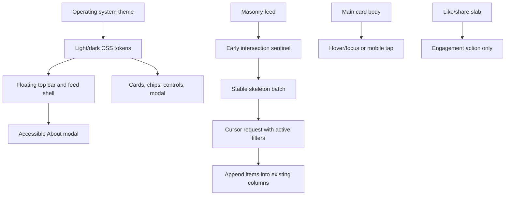

## Goal Capsule

Make the existing Tidbits feed wider, calmer to scroll, and easier to interact with while preserving its current database, content, engagement, search, and filter contracts. The implementation should keep three desktop columns, make every card reliably collapsible, isolate expansion from engagement controls, preload the next feed batch with subtle skeletons, and add a system-following light/dark presentation with a floating top bar and accessible About modal.

Authority order: the current repository implementation and this plan's Product Contract govern implementation; the prior visual-polish plan is historical context; the user's settled choices in this session govern unresolved UX decisions. No trivia body text, database schema, deployment configuration, or existing engagement rule is to be changed.

Stop condition: stop and surface a blocker if the current masonry library cannot support stable placeholders or if the system-theme requirement conflicts with an existing runtime constraint. Do not invent a new feed layout or manual theme preference without user direction.

## Product Contract

### Summary

This is a focused follow-up to the existing feed polish. It addresses content width, responsive masonry behavior, universal card truncation, progressive loading, engagement usability, filter contrast, navigation chrome, and system-driven theme legibility.

### Problem Frame

The current feed uses four desktop columns even though the desired reading experience is three wider columns. A small number of long cards appear effectively uncollapsed, the masonry sentinel can reveal loading unevenly, and hover expansion covers the engagement slab. The current light palette and filter chips are also too low-contrast for comfortable reading. The next pass must improve these behaviors without changing the underlying tidbits or engagement semantics.

### Requirements

- R1. Use three masonry columns at desktop widths, two at tablet widths, and one on mobile. Reduce the page's left and right content margins by approximately 50% relative to the current feed shell while keeping cards within a readable maximum width and avoiding horizontal overflow.
- R2. Every tidbit card must begin in a consistently truncated state, including long records such as “America’s Pickup Truck Boom.” Truncation must be controlled by the card body viewport rather than by the body’s intrinsic length.
- R3. Desktop pointer hover and keyboard focus may expand the main card body smoothly; mobile touch must toggle expansion by tapping the main body. The engagement slab must never expand or collapse the card.
- R4. Like and share remain immediately reachable while a card is expanded. Clicking, tapping, or keyboard-activating either engagement control must perform only that action and must not trigger card expansion or collapse.
- R5. A truncated card must visibly communicate that more content exists. Desktop uses the smaller, bold affordance `··· Hover to read more`; mobile uses `··· Tap to read more`. The affordance disappears or changes appropriately when the body is expanded.
- R6. When the feed approaches the end of the loaded batch, fetch the next cursor early enough that the user does not encounter a blank or one-column loading gap. Show subtle skeleton cards that reserve the next batch's masonry space and preserve the existing column structure until real cards arrive.
- R7. Keep loading guarded against duplicate requests, retain loaded content if a request fails, and provide a visible retry state. Filter and search parameters must be carried into every prefetched page.
- R8. Make category filter chips, search controls, card text, engagement controls, status messages, and focus indicators clearly legible in both system light and system dark modes. Dark mode must use the same doodle composition as light mode with a separately generated dark/night palette asset.
- R9. Add a floating top bar containing the Tidbits title, an About option, and an informational theme icon that communicates the current system-following light/dark presentation. The theme icon must not create a manual override or persistence contract.
- R10. About opens an accessible modal/popover without navigating away from the feed. It must support keyboard focus, Escape to close, outside-click dismissal where compatible, and readable content in both themes.
- R11. Preserve existing search, category URL synchronization, keyset pagination, anonymous like/share deduplication, admin behavior, header cleanup, and the exact trivia bodies.

### Acceptance Examples

- AE1. At desktop width, three wider masonry columns are visible with substantially smaller outer gutters than the current page; at tablet width two columns are visible; at mobile width one column is visible.
- AE2. A very long card, including “America’s Pickup Truck Boom,” has the same compact body window as other cards and exposes the full body only through the intended expansion interaction.
- AE3. Hovering the main body expands a card, while moving over the engagement slab does not change its expansion state. Like and share remain clickable without moving the pointer outside the card.
- AE4. A desktop collapsed body ends with `··· Hover to read more`; a mobile collapsed body ends with `··· Tap to read more`; expanded cards do not falsely advertise truncation.
- AE5. Scrolling toward the loaded batch boundary displays subtle skeletons in the same three/two/one-column structure, then replaces them with the next items without a visible one-column flash or duplicate cards.
- AE6. A failed next-page request leaves existing items in place and exposes a retry action; a retry carries the active category/search parameters and does not issue concurrent requests.
- AE7. With the operating system set to dark mode, the night doodle background, cards, chips, search field, text, modal, controls, and status messages remain readable. Switching the OS theme updates the page presentation without a stored manual preference.
- AE8. The floating bar remains visible and usable at desktop, tablet, and mobile widths. About opens and closes accessibly without losing scroll position or filter state.

### Scope Boundaries

In scope: feed shell width, three/two/one masonry breakpoints, card collapse/expansion boundaries, read-more affordance, early loading and skeletons, filter/control contrast, system-theme tokens, light/dark background assets, floating top bar, and About modal.

Out of scope: new trivia content, body/header cleanup, database schema changes, engagement product-rule changes, manual theme preference storage, deployment, analytics, a new masonry dependency, or a separate detail page for tidbits.

### Dependencies

- The existing `react-masonry-css` abstraction remains the layout foundation unless implementation evidence proves it cannot maintain stable skeleton columns.
- The four user-approved doodle directions (options 1, 2, 5, and 8) remain the composition source for both light and dark assets.
- The local Next.js 16 runtime and existing CSS variable design system remain available.

## Planning Contract

### Key Technical Decisions

- KTD1. Use a three-column desktop / two-column tablet / one-column mobile breakpoint contract (session-settled: user chose option 1). This gives desktop cards the requested width while preventing tablet and mobile cards from becoming unreadably narrow.
- KTD2. Enforce collapse with a fixed CSS body viewport/max-height and overflow clipping, independent of body length. This prevents long records from bypassing truncation and makes the behavior deterministic across cards.
- KTD3. Separate the card's expandable body region from the engagement slab. Pointer hover/focus styling attaches to the body interaction region, while action controls live in a non-expanding sibling region. Mobile click handling is scoped to the body region rather than filtered after bubbling.
- KTD4. Keep early IntersectionObserver loading, but use a generous root margin and a skeleton batch sized to the next request. Maintain the masonry column wrapper while loading so placeholders occupy the same structural columns as incoming cards.
- KTD5. Use system media preference as the sole theme authority (session-settled: user chose option 3, then clarified that the top-bar icon is informational). Do not use localStorage, cookies, or a manual theme override.
- KTD6. Generate a second background asset using the same doodle composition and a darker/night palette (session-settled: user chose option 1). Select assets through CSS system-theme media rules and keep the background quiet behind opaque card surfaces.
- KTD7. Use a lightweight accessible About modal/popover (session-settled: user chose option 1) instead of a route change, preserving the feed's URL, scroll position, and filter state.
- KTD8. Render responsive read-more copy rather than claiming hover behavior on touch. Keep the affordance visually secondary but bold enough to be noticed in the compact window.

### High-Level Technical Design

### Assumptions

- “Reduce margins by 50%” is interpreted relative to the current `px-4` / `sm:px-8` shell and current `max-w-5xl`, not as a literal viewport-wide feed. The implementation should choose a wider max-width and smaller responsive gutters while preserving a safe mobile gutter.
- Skeletons may be visual placeholders rather than exact copies of the eventual cards; their required contract is stable column occupancy, quiet animation, theme-aware contrast, and no interaction.
- Hover expansion should remain available on fine pointers, while keyboard focus must expose the same complete body without requiring a pointer.
- The theme icon can use a sun/moon/system glyph or inline icon, but its accessible label must explain the presentation follows the device theme rather than promising a manual switch.
- The About copy can be concise product/about text derived from the existing Tidbits description; no new external content or account information is needed.

## Implementation Units

### Implementation Sequence

Implement U1 first because it establishes the responsive shell, shared theme tokens, top bar, and modal surface. Implement U2 next so card geometry and action boundaries are stable before loading placeholders are introduced. Implement U3 against the settled column structure, then U4's asset generation/integration can validate both theme surfaces. Finish with U5's focused and cross-browser regression pass.

### U1. Widen the feed and establish the responsive theme shell

- **Goal:** Reshape the page shell to three/two/one columns, reduce outer gutters, add the floating top bar, and establish system-driven light/dark tokens and contrast rules.
- **Requirements:** R1, R8, R9, R10.
- **Files:** `app/page.tsx`, `app/layout.tsx`, `app/globals.css`, `components/ThemeIndicator.tsx` (new if useful), `components/AboutModal.tsx` (new), `components/CategoryChips.tsx`, `components/SearchBar.tsx`, and focused component tests.
- **Patterns:** Preserve the current server-rendered page data flow and client/server boundary. Use CSS `prefers-color-scheme` variables for theme selection; keep the modal client-side and focus-managed. Keep filter links URL-synced.
- **Test scenarios:** Assert the top bar exposes Tidbits, About, and an accessible system-theme indicator; About opens, closes by Escape, and does not change the URL; filter links retain existing query parameters; theme tokens expose readable light/dark surfaces and controls; shell classes provide the agreed responsive width/gutter contract.
- **Verification:** Inspect light and dark system settings at desktop, tablet, and mobile widths, including keyboard focus and modal dismissal.

### U2. Make card truncation universal and isolate engagement actions

- **Goal:** Make every card reliably compact, add the responsive read-more affordance, and ensure only the main body controls expansion.
- **Requirements:** R2, R3, R4, R5, R8.
- **Files:** `components/TidbitCard.tsx`, `components/EngagementButtons.tsx`, `app/globals.css`, `components/TidbitCard.test.tsx`, and `components/EngagementButtons.test.tsx`.
- **Patterns:** Give the body and affordance a dedicated interaction wrapper; keep the engagement slab as a sibling with explicit non-expanding semantics. Preserve the current accessible expanded-state announcement and touch target sizes. Use reduced-motion rules for body transitions and any card hover lift.
- **Test scenarios:** A long body and a short body both start compact; the America’s Pickup Truck Boom-shaped long record cannot leak through; desktop pointer/focus expands through the body region; mobile body activation toggles; action clicks and key activation leave expansion unchanged; collapsed/expanded affordance copy is correct for the active input modality; keyboard focus remains visible.
- **Verification:** Browser-test a long card, hover the body and engagement slab separately, activate like/share without pointer escape, then repeat with emulated mobile touch and keyboard navigation.

### U3. Stabilize progressive masonry loading

- **Goal:** Preload the next page before the user reaches the end and render themed skeleton cards without a one-column flash or duplicate request.
- **Requirements:** R1, R6, R7, R11.
- **Files:** `components/MasonryFeed.tsx`, `components/MasonryFeed.test.tsx`, `app/globals.css`, and a new skeleton component/test if the implementation keeps placeholder markup separate.
- **Patterns:** Preserve cursor/keyset pagination and active category/search query construction. Guard request state with a ref or equivalent stable in-flight check; use an early `rootMargin`; render placeholders through the same masonry child structure or stable column wrappers; remove placeholders atomically when the response arrives.
- **Test scenarios:** The sentinel triggers an early request; only one request is in flight; skeletons appear in the expected responsive column count; successful responses replace placeholders and append without duplicate IDs; active filters are sent with the cursor; failed requests preserve current items and expose retry; retry clears the error and does not exceed `RENDER_CAP`.
- **Verification:** Scroll rapidly through the local feed at desktop, tablet, and mobile widths while throttling the network; confirm the feed remains structurally stable and the next batch appears before the previous batch is exhausted.

### U4. Generate and integrate the night doodle background

- **Goal:** Add a dark/night version of the selected doodle composition and integrate it with the system-theme stylesheet without increasing visual noise.
- **Requirements:** R8, R11.
- **Files:** `public/backgrounds/tidbits-doodle-wallpaper.png`, `public/backgrounds/tidbits-doodle-wallpaper-dark.png` (new), `app/globals.css`, and any local image-generation source/reference files that are already part of the repository workflow.
- **Patterns:** Reuse the light composition language from options 1, 2, 5, and 8, shift to a low-luminance night palette, and use CSS media selection rather than runtime image state. Keep fallback colors defined before the image layer.
- **Test scenarios:** Both assets resolve from the public path; light and dark media rules select the corresponding asset; text, chip, card, input, modal, and action colors remain legible against each theme; reduced-motion users receive no unnecessary background animation.
- **Verification:** Visually inspect seamless tiling and contrast in both system themes at all responsive widths; check for console/network asset errors.

### U5. Run cross-feature regression and accessibility verification

- **Goal:** Prove the layout, interactions, loading, filters, themes, and existing feed behavior work together.
- **Requirements:** R1–R11.
- **Files:** Existing test suite, `docs/plans/2026-07-25-004-feat-tidbits-feed-layout-loading-theme-plan.md`, and no production data files unless implementation discovers a required fixture adjustment.
- **Patterns:** Extend existing Vitest coverage rather than replacing it. Use the already-running local app for browser verification and preserve the separate local database smoke workflow.
- **Test scenarios:** Full suite remains green; search/category URL behavior works from the floating shell; About opens over a filtered feed; likes/share work inside expanded and compact cards; system theme changes update all surfaces; loading and retries preserve content; no horizontal overflow or console errors at 1440px, tablet, and 390px widths.
- **Verification:** Run the repository's test, lint, and production-build gates, then perform a real browser pass covering the acceptance examples and inspect the final diff for scope creep.

## System-Wide Impact

The shell and CSS variables affect every public page surface, including the admin route's shared layout. Card interaction changes event boundaries and rendered heights across the feed. Progressive loading changes client state and request timing but must not change the server pagination contract. Theme selection affects all text, controls, status messages, modal surfaces, and generated background assets. No database or content migration is required for this follow-up.

## Risks and Dependencies

- A wider shell can make cards visually dense on intermediate widths; the 3/2/1 breakpoint contract and browser checks must validate readable line lengths.
- CSS hover rules attached too high in the DOM can still expand when the pointer enters the action slab; the body/action sibling boundary is the mitigation.
- Skeletons inserted directly into a third-party masonry child list can alter round-robin distribution; preserve stable child structure and test column counts during loading.
- Early prefetch can issue unnecessary requests on short feeds; stop at a null cursor, render cap, or active error state and retain the manual retry path.
- System theme changes can leave hard-coded light colors in inputs, chips, toasts, or modal content; audit all shared color classes and inline accent blends.
- A dark image that is too contrasty will recreate the current reading fatigue in another form; keep the doodle layer low contrast and the card surfaces as the reading plane.

## Verification Contract

| Gate | Coverage | Done signal |
| --- | --- | --- |
| Focused component tests | U1–U3 | Top bar/modal, card boundaries, read-more copy, skeletons, request guards, and retries are asserted. |
| Full tests | U1–U5 | `npm test` passes. |
| Static quality | U1–U5 | `npm run lint` passes. |
| Production build | U1–U5 | `npm run build` passes. |
| Browser layout pass | U1–U5 | 1440px, tablet, and 390px show 3/2/1 columns, reduced gutters, no overflow, and stable loading. |
| Interaction/accessibility pass | U1–U2, U5 | Keyboard focus, Escape modal close, body-only expansion, action isolation, touch toggle, readable labels, and reduced motion work. |
| Theme pass | U1, U4, U5 | System light/dark switches all surfaces and background asset with no unreadable text or console/network errors. |

## Definition of Done

- Desktop uses three wider masonry columns, tablet uses two, and mobile uses one, with reduced outer margins and no horizontal overflow.
- Every card, including long outliers, starts collapsed and shows the correct desktop/mobile read-more affordance.
- Only the main body expands; the engagement slab remains stable and like/share are directly usable in compact and expanded states.
- Early loading displays subtle theme-aware skeletons in stable masonry columns, appends the next page without duplicates or a one-column flash, and retains a working retry state.
- The floating top bar, system-theme indicator, and accessible About modal work at all responsive sizes without changing URL/filter state unexpectedly.
- Light and dark system themes cover the background, cards, filters, search, modal, status text, focus rings, and engagement controls with clear contrast.
- Existing feed, search, filter, pagination, share, like, admin, import, and content contracts remain intact.
- Focused tests, full tests, lint, build, and real-browser verification pass; no unrelated files or secrets are included in the diff.

## Sources / Research

- Current implementation inspected: `app/page.tsx`, `app/layout.tsx`, `app/globals.css`, `components/MasonryFeed.tsx`, `components/TidbitCard.tsx`, `components/EngagementButtons.tsx`, `components/CategoryChips.tsx`, and `components/SearchBar.tsx`.
- Current focused tests inspected: `components/MasonryFeed.test.tsx`, `components/TidbitCard.test.tsx`, `components/EngagementButtons.test.tsx`, and `components/CategoryChips.test.tsx`.
- Prior plan carried forward: `docs/plans/2026-07-25-003-feat-tidbits-feed-visual-polish-plan.md`.
- User decisions captured in this session: 3/2/1 responsive columns; system-following theme with informational icon; accessible About modal; subtle skeleton cards; responsive Hover/Tap wording; same doodle composition with separate dark palette.
- Visual direction: the previously approved doodle options 1, 2, 5, and 8 remain the source composition for both wallpaper assets.
- External web research was not needed because the work is grounded in the local implementation, the existing Next.js/CSS patterns, and user-approved visual references.
