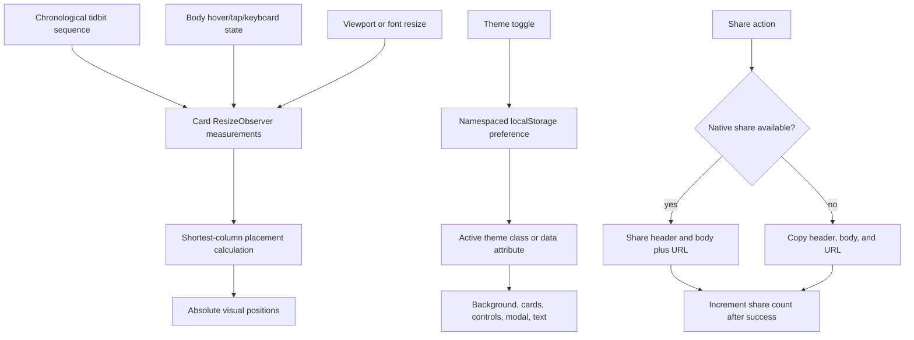

## Goal Capsule

Replace the current round-robin column feed with a genuinely packed shortest-column masonry wall, refresh each card's visual hierarchy around category, likes, header, body, and share, make the theme control functional with persistence, ensure the read-more hint disappears in every expanded visual state, and copy the complete header plus body when sharing through the clipboard fallback.

This is a follow-up to the completed responsive/theme polish. The current database, trivia bodies, category filters, keyset pagination, anonymous like rules, and About modal remain authoritative. The attached screenshot is a visual reference for hierarchy and spacing only; its social profiles, avatars, external links, and content are not product requirements.

## Product Contract

### Summary

The feed should feel like a deliberately arranged masonry wall rather than three synchronized-looking columns. Cards should be easier to scan: category context and likes are visible first, the header leads into the fact, and sharing is available without competing with the reading surface. The theme icon must work as a real light/dark switch, and sharing must produce useful text when the native share sheet is unavailable.

### Problem Frame

The current `react-masonry-css` implementation distributes cards round-robin and explicitly does not sort by card height, so tall and short cards do not pack into the shortest available column. The current card starts with a standalone category chip, places engagement below the body, and leaves the read-more hint mounted while hover CSS expands the body. The theme indicator is informational by design and therefore cannot respond to clicks. The clipboard fallback copies only the page URL, which loses the trivia content the user wants to share.

### Requirements

- R1. Render a true shortest-column masonry layout at the existing responsive widths: three desktop columns, two tablet columns, and one mobile column. Each incoming card must be placed into the currently shortest column so variable-height cards pack without avoidable row-like gaps.
- R2. Keep the chronological feed order stable in the DOM and accessible reading order even when visual placement uses shortest-column packing. Do not use experimental native CSS masonry, CSS columns, or a column-major DOM that reverses the feed order.
- R3. Preserve variable card heights after expansion and collapse. Expanded content may push later cards down, and the layout must recompute positions without clipping, overlap, or a full-page jump that loses the user's scroll context.
- R4. Redesign the card hierarchy around the reference: a metadata row with a small category emoji/icon and category name on the left, Like with its count on the right, the header next, the body below, and a bottom action row containing Share.
- R5. Use a deterministic category icon mapping for the existing categories: Animals, Food, History, Science, Space, and Random. Icons must have accessible text or be marked decorative when the category name already supplies the meaning.
- R6. Keep cards collapsed by default. The read-more hint appears only while the card is visibly collapsed, uses `Hover to read more` on fine pointers and `Tap to read more` on touch, and is absent as soon as the card expands through click, keyboard, or hover.
- R7. Keep engagement controls outside the card expansion trigger. Like remains available in the top metadata row; Share remains available in the bottom action row; neither action may toggle the reading state.
- R8. Make the theme control a functional light/dark toggle. Clicking it switches the presentation immediately, the choice persists across reloads, and the initial presentation uses the stored choice or the system preference when no choice exists.
- R9. Keep all theme surfaces legible: background artwork, cards, category metadata, filter chips, search input, top bar, About modal, read-more hint, action row, toast, focus rings, and loading/error states must respond to the active theme.
- R10. Native sharing keeps the existing share-sheet behavior but sends the complete header and body as the share text, with the current page URL as the URL field. Clipboard fallback copies the complete header and body, with the URL included as a useful trailing reference.
- R11. Clipboard success and failure must be visible to the user. A failed clipboard write must not increment the share count; a successful native share or clipboard copy may increment it once per completed share action under the existing server contract.
- R12. Preserve search/filter URL behavior, infinite loading, skeleton stability, like persistence/deduplication, About behavior, and the exact trivia content.

### Acceptance Examples

- AE1. At desktop width, cards with different body lengths visibly occupy the shortest available column instead of forming row-like vertical bands; changing a card from collapsed to expanded reflows later cards without overlap.
- AE2. The DOM and keyboard traversal still encounter tidbits in feed order even though their visual positions are packed into different columns.
- AE3. A card's top row shows its category icon/name and Like count, followed by the header and body; Share appears in a separate bottom action row.
- AE4. A collapsed card shows one read-more hint. Hovering or activating its body expands it and removes the hint immediately; moving away does not leave the hint in the expanded state.
- AE5. Clicking the theme control changes light to dark or dark to light immediately, updates the icon/accessible label, and restores the selected theme after a reload.
- AE6. With native sharing unavailable, clicking Share places the exact header and full body into the clipboard, includes the page URL as a trailing reference, shows a success toast, and increments the share count. Clipboard failure shows an error and does not increment the count.
- AE7. With native sharing available, the share payload contains the full header/body text and current URL, and cancelling the native sheet does not increment the share count.
- AE8. Existing filters, search, likes, skeleton loading, mobile tap expansion, keyboard expansion, and responsive 3/2/1 layout continue to work in both themes.

### Scope Boundaries

In scope: masonry placement, card visual hierarchy, category icon mapping, expansion hint behavior, persistent theme toggle, active-theme styling, and share payload/clipboard fallback.

Out of scope: new database tables, changes to trivia bodies or headers, user accounts, social profile/author content from the reference image, avatars, external “View on X” links, new categories, server-side share deduplication, deployment, and native CSS masonry syntax.

### Dependencies

- The existing `Tidbit` data shape supplies category, header, body, like count, and share count; no server schema change is needed.
- The existing `react-masonry-css` dependency can be removed or left unused after the custom placement decision; the implementation must not retain two competing active layout systems.
- Theme persistence must be client-only and must avoid reading `localStorage` during server rendering.
- Clipboard writes remain subject to secure-context and user-gesture browser requirements; the UI must retain a graceful failure path.

## Planning Contract

### Key Technical Decisions

- KTD1. Replace round-robin `react-masonry-css` placement with a supported client-side shortest-column layout that keeps one chronological DOM sequence and positions cards visually using measured column offsets (session-settled: user-directed — chosen over strict row packing because the user wants true masonry while preserving accessible feed order). The current library documents that height sorting is not supported, and native CSS masonry remains experimental in current browser guidance.
- KTD2. Use `ResizeObserver` plus resize/breakpoint recalculation to remeasure cards after expansion, collapse, font changes, and viewport changes. Recompute only layout geometry and preserve the scroll position anchor where possible.
- KTD3. Keep the card body as the only expansion surface and derive hint visibility from the same expanded state plus the fine-pointer hover state. Do not leave the hint merely mounted and rely on clipping; the visual expanded state must explicitly hide it.
- KTD4. Use a small local category-to-emoji map in the presentation layer rather than adding an icon dependency. The category text remains the accessible source of meaning.
- KTD5. Persist the theme choice under a namespaced local-storage key, initialize from that key or `prefers-color-scheme`, and apply the theme before or during hydration in a way that minimizes a flash of the wrong palette. A manual choice overrides later system changes.
- KTD6. Treat the share payload as two related representations: `ShareData` uses `title`, full `text`, and `url`; clipboard uses a readable plain-text document containing header, blank line, body, and a trailing URL. This follows the Web Share data model and Clipboard API's user-gesture/secure-context constraints.
- KTD7. Use the reference's hierarchy, not its social-media domain: metadata first, reading content second, secondary action last. Keep card surface, spacing, type scale, border, and accent treatment in the existing Tidbits design system.

### High-Level Technical Design

### Assumptions

- “True masonry” means shortest-column visual packing with variable card heights, not experimental CSS Grid Level 3 syntax.
- The chronological DOM order will be the source order, while visual positions may not read row-by-row from left to right. The plan prioritizes accessibility and feed order over visual reading order.
- The category icon mapping is presentation-only and does not alter category data or URLs.
- The exact storage key name and layout helper names are implementation details; the preference must be namespaced to Tidbits and safely ignore malformed stored values.
- The native share sheet may ignore some fields on a particular platform; the payload still supplies the complete text and URL according to the Web Share contract.

### Implementation Sequence

Implement U1 first because it defines the geometry and source-order contract. Implement U2 against that layout so card measurement observes the final card hierarchy and expansion states. Implement U3 after the visual state contract so theme persistence styles every surface consistently. Implement U4 last for share payloads and final regression because it crosses browser APIs, server counting, and user-visible feedback.

## Implementation Units

### U1. Replace round-robin columns with true shortest-column masonry

- **Goal:** Pack variable-height cards into the shortest available column while preserving one chronological DOM sequence and responsive 3/2/1 breakpoints.
- **Requirements:** R1, R2, R3, R12.
- **Dependencies:** None.
- **Files:** `components/MasonryFeed.tsx`, `components/MasonryFeed.test.tsx`, `app/globals.css`, and any focused layout helper introduced under `components/`.
- **Approach:**
  1. Replace the active round-robin rendering path with one source-ordered list whose visual placement is calculated from measured card heights and the active column count.
  2. Use `ResizeObserver` and viewport breakpoint changes to recompute offsets when cards expand/collapse or widths change.
  3. Keep the feed container's measured height equal to the lowest column so the sentinel and skeletons remain below the visual wall.
  4. Keep skeletons in the same placement model and prevent duplicate measurement/reflow loops.
- **Execution note:** Characterize current feed order and loading behavior before changing the layout; then add a failing placement test for a deliberately uneven set of card heights.
- **Patterns to follow:** Preserve `RENDER_CAP`, cursor requests, active filter query construction, loading guard, retry state, skeleton states, and the existing 3/2/1 breakpoints.
- **Test scenarios:**
  - Three cards with heights 300, 100, and 100 assign the next card to the currently shortest column.
  - The rendered DOM sequence remains item 1, item 2, item 3, item 4 even when visual positions differ.
  - Changing the active breakpoint recalculates column count and removes horizontal overflow.
  - Expanding a measured card recomputes later offsets and container height without duplicate cards or overlap.
  - A loading skeleton batch participates in layout and the sentinel remains after the lowest column.
  - A failed page request preserves the existing placement and retry behavior.
- **Verification:** Browser inspection at 1440px, tablet, and 390px confirms visibly packed variable-height columns, stable scrolling, correct source order, and no overlap during expansion/loading.

### U2. Redesign card hierarchy and expansion affordance

- **Goal:** Match the screenshot-inspired information hierarchy while keeping the Tidbits card readable, compact, responsive, and action-safe.
- **Requirements:** R4, R5, R6, R7, R12.
- **Dependencies:** U1.
- **Files:** `components/TidbitCard.tsx`, `components/TidbitCard.test.tsx`, `components/EngagementButtons.tsx`, `components/CategoryChips.tsx` only if shared icon/color patterns need extraction, and `app/globals.css`.
- **Approach:**
  1. Add a presentation-only category emoji map and render icon/name metadata in the card header row.
  2. Move Like/count into the right side of that row and move Share into a bottom action row.
  3. Keep the header/body expansion wrapper separate from both action regions.
  4. Make hint rendering and CSS visibility depend on collapsed state; remove it immediately for click, keyboard, hover, and touch expansion.
  5. Preserve full body text in the accessible tree and maintain visible focus/expanded semantics.
- **Patterns to follow:** Reuse the existing `accentStyle`, `formatCompact`, engagement callbacks, card surface variables, reduced-motion rule, and mobile pointer media query.
- **Test scenarios:**
  - Each supported category renders its expected emoji and visible category name; an unknown category uses a safe fallback icon.
  - Like is in the metadata row, Share is in the bottom action row, and either control leaves expansion unchanged.
  - A collapsed desktop card shows the hover hint; hover/focus expansion removes it; leaving hover does not reintroduce it while the card remains expanded by state.
  - A mobile tap changes the hint from visible to absent and exposes the full body; a second tap collapses it and restores the tap hint.
  - Keyboard Enter/Space follows the same hint and expansion transitions as pointer interaction.
  - Long and short bodies both retain a consistent collapsed window and variable expanded height.
- **Verification:** Compare the local feed against the supplied reference for hierarchy, spacing, action prominence, readability, and variable card height at desktop and mobile sizes.

### U3. Make theme switching functional and persistent

- **Goal:** Turn the top-bar theme indicator into an accessible light/dark toggle that persists the user's choice and updates every visual surface.
- **Requirements:** R8, R9, R12.
- **Dependencies:** U2.
- **Files:** `components/TopBar.tsx`, `components/TopBar.test.tsx`, `app/layout.tsx` if an anti-flash initialization hook is needed, `app/globals.css`, and any small theme helper introduced under `components/` or `lib/`.
- **Approach:**
  1. Add explicit light/dark theme state with a namespaced local-storage preference and system-theme fallback for first visit.
  2. Apply the active theme through a root class or data attribute that CSS can target without changing server data flow.
  3. Make the button's icon, label, pressed state, and focus treatment communicate the current mode and next action.
  4. Audit all shared surfaces for hard-coded light colors, including active chips, card hover shadows, search field, modal, toast, status text, and both wallpaper assets.
  5. Handle storage unavailability or malformed values by falling back safely to the system preference.
- **Patterns to follow:** Keep `app/page.tsx` server-rendered and keep browser-only state in a focused client boundary, as required by the current Next.js App Router component model.
- **Test scenarios:**
  - With no stored preference, the initial mode follows the mocked system preference.
  - Clicking the toggle changes the root theme, icon label, and `aria-pressed` state immediately.
  - Reload initialization restores a stored light or dark choice without corrupting the page when storage is unavailable.
  - A stored invalid value falls back to the system preference.
  - Cards, chips, search, modal, action row, skeletons, focus rings, and background asset remain theme-aware in both modes.
  - About modal opening/closing and URL-synced filters remain unaffected by theme changes.
- **Verification:** Browser-toggle light/dark at desktop, tablet, and mobile; reload each mode; inspect contrast and console output; confirm the selected mode remains after navigation.

### U4. Share complete tidbit content through native share and clipboard

- **Goal:** Make Share useful in every supported browser by sending or copying the header and full body while preserving the current share-count contract.
- **Requirements:** R10, R11, R12.
- **Dependencies:** U2.
- **Files:** `components/EngagementButtons.tsx`, `components/EngagementButtons.test.tsx`, and `lib/db/engagement.test.ts` only if server-count behavior needs additional regression coverage.
- **Approach:**
  1. Build one deterministic plain-text payload from header, body, and current URL.
  2. Pass the header/body payload as `ShareData.text` and the current URL as `ShareData.url` to the native share sheet.
  3. When native share is unavailable, write the same readable payload to `navigator.clipboard.writeText` from the click gesture.
  4. Surface distinct success and failure feedback and increment the server share count only after the user-visible share/copy succeeds.
  5. Preserve cancellation semantics for native sharing and avoid counting a cancelled or failed action.
- **Execution note:** Start with a failing component test asserting exact clipboard text before changing the implementation, then add a browser smoke check against the local page.
- **Patterns to follow:** Reuse the current server action, optimistic count reconciliation only after successful completion, toast styling, and existing share-count tests.
- **Test scenarios:**
  - Clipboard fallback receives exactly the header, blank line, body, and trailing URL in the documented order.
  - Native share receives full header/body text and current URL, and successful completion increments the visible count.
  - Native share cancellation leaves the count unchanged and does not show a false success toast.
  - Clipboard rejection shows an actionable error and leaves the count unchanged.
  - Repeated completed share actions continue to follow the existing non-deduplicated share contract.
  - Header/body text containing quotes, emoji, newlines, or long content is copied without truncation or accidental HTML.
- **Verification:** Test clipboard paste contents in a real browser, exercise native share where available, confirm error/cancel behavior, and verify the persisted share count remains consistent.

## System-Wide Impact

The masonry change affects DOM positioning, measurement, scroll height, loading sentinels, keyboard order, and card expansion reflow. The card redesign changes the visual location but not the server contract of like/share actions. Theme persistence introduces a client preference that affects the root document and every shared surface, including the admin route if it uses the root layout. Share payload changes affect only browser-visible text and the timing of the existing share-count increment; no database schema or deduplication behavior changes.

## Risks and Dependencies

- Absolute-positioned masonry can become fragile if measurement and expansion updates race; `ResizeObserver` cleanup, a single layout scheduler, and explicit browser tests are required.
- A shortest-column layout can preserve DOM order but produce a different visual scan order; this is an intentional trade-off captured in KTD1 and R2.
- Persisted theme state can cause a light flash before hydration; initialize the root theme as early as the App Router boundary permits and verify first paint in both modes.
- Emoji rendering differs across operating systems; keep the category name visible, use compact icons, and do not make the emoji the only semantic label.
- Clipboard APIs require secure contexts and user activation. Local HTTP may work in the configured browser, but failure must remain a supported user-visible path.
- Expanded cards invalidate prior heights; stale measurements can create overlap. Recompute from current DOM measurements and test rapid expand/collapse plus resize.

## Verification Contract

| Gate | Coverage | Done signal |
| --- | --- | --- |
| Focused component tests | U1–U4 | Masonry placement/order, card hierarchy/hint, theme persistence, and exact share payload tests pass. |
| Full tests | U1–U4 | Existing suite remains green with no content/database regressions. |
| Static quality | U1–U4 | Lint and TypeScript/build checks pass. |
| Masonry browser pass | U1–U2 | Desktop, tablet, and mobile show packed variable-height cards with no overlap, gaps from row alignment, or horizontal overflow. |
| Theme browser pass | U3 | Toggle, reload persistence, system fallback, modal, filters, text, controls, and backgrounds are legible in both modes. |
| Share browser pass | U4 | Clipboard contains complete header/body text; native share contains full text and URL; failure/cancel states do not increment counts. |
| Accessibility pass | U1–U4 | Chronological DOM order, keyboard expansion, button labels, category names, focus rings, modal behavior, and reduced-motion behavior remain usable. |

## Definition of Done

- The feed is shortest-column masonry with variable card heights and stable chronological DOM order at 3/2/1 responsive breakpoints.
- Cards follow the new hierarchy: category icon/name and Like/count at the top, header/body in the reading area, Share in the bottom action row.
- The read-more hint appears only in the collapsed visual state and disappears immediately when a card expands.
- The theme control switches light/dark, persists the choice, and updates all surfaces and background assets.
- Share sends and copies the complete header and body, includes the URL as a useful reference, and handles cancellation/failure without false counts.
- Existing search, filters, likes, pagination/loading, About modal, content, and database contracts remain intact.
- Focused tests, full tests, lint, build, browser verification, and accessibility checks pass with no console errors or unrelated changes.

## Sources / Research

- Current implementation inspected: `components/MasonryFeed.tsx`, `components/TidbitCard.tsx`, `components/EngagementButtons.tsx`, `components/TopBar.tsx`, `components/AboutModal.tsx`, `app/globals.css`, and their tests.
- Existing contract carried forward: `docs/plans/2026-07-25-004-feat-tidbits-feed-layout-loading-theme-plan.md`.
- The `react-masonry-css` package documentation states that it supports responsive columns but does not sort items by height; this is the basis for replacing the current round-robin placement rather than tuning its breakpoints. [react-masonry-css documentation](https://www.npmjs.com/package/react-masonry-css)
- Native CSS masonry remains an evolving/experimental layout path, so it is explicitly excluded from this browser-compatible implementation. [Chrome for Developers: alternative masonry proposal](https://developer.chrome.com/blog/masonry?hl=en) and [WebKit: CSS Grid Level 3 masonry discussion](https://webkit.org/blog/15269/help-us-invent-masonry-layouts-for-css-grid-level-3/)
- Clipboard research confirms `navigator.clipboard.writeText()` is promise-based, requires a secure context, and is expected to run from user activation; the plan therefore includes exact-payload tests and a visible failure path. [MDN Clipboard.writeText](https://developer.mozilla.org/en-US/docs/Web/API/Clipboard/writeText) and [web.dev copy text pattern](https://web.dev/patterns/clipboard/copy-text)
- Web Share's `ShareData` supports separate `title`, `text`, and `url` fields, so native sharing can carry the full trivia text without replacing the link. [W3C Web Share specification](https://www.w3.org/TR/web-share/)
- External research was load-bearing for KTD1 and KTD6. No additional research was needed for the category mapping or card hierarchy because those are user-settled visual requirements grounded in the attached reference.
