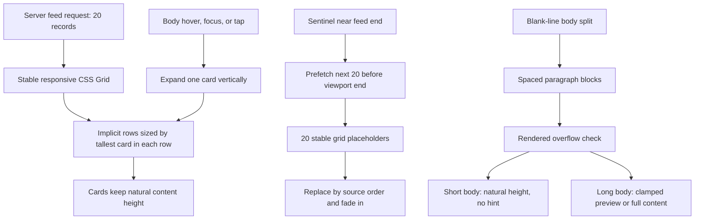

# Tidbits Stable Row Masonry, Loading, and Paragraph Cards - Plan

## Goal Capsule

Replace the current absolute-positioned shortest-column layout with a stable responsive row layout that keeps cards in fixed lanes, loads 20 cards per batch, and makes expansion move only rows below the expanded card. Preserve the working theme, like/share, filters, pagination, and content behavior while making card heights genuinely content-driven and rendering existing blank-line paragraph breaks for easier reading.

This is a corrective follow-up to `docs/plans/2026-07-25-005-feat-tidbits-masonry-card-theme-plan.md`. The new plan supersedes that plan's shortest-column placement decision because the user-confirmed interaction requires stable lanes during expansion.

Stop if implementation would require changing trivia text, headers, database schema, engagement semantics, or the user's confirmed stable-lane behavior.

---

## Product Contract

### Summary

The feed should feel calm and predictable while still avoiding a uniform card wall. The first 20 cards must be available immediately, later cards should prefetch before the user reaches the end, cards must keep their columns while expanding, short content must retain its natural height, and multi-paragraph facts must be readable without rewriting the stored content.

### Problem Frame

The current feed positions cards with absolute transforms using shortest-column packing. When card measurements change during hover expansion or loading, later cards are re-packed and appear to move horizontally or originate from the left corner before their positions settle. The current data request also uses a 24-item default page size, and the card body applies the same collapsed window broadly instead of allowing short bodies to remain at natural height. Bodies already preserve blank-line paragraph breaks in storage, but the card renders each body as one paragraph.

### Requirements

#### Feed loading and placement

- R1. The initial feed and every subsequent feed request must use batches of 20 published tidbits, subject to the result set ending sooner.
- R2. The next batch must begin loading before the user reaches the end of the current content, using an early prefetch window of roughly one to two viewport heights.
- R3. Loading placeholders must occupy the same stable row and column positions as the batch they represent, then transition to real cards without entering from the viewport's left edge or causing horizontal lane movement.
- R4. The feed must use stable responsive lanes: three columns on desktop, two on tablet, and one on mobile.

#### Stable variable-height cards

- R5. Cards must be placed in chronological source order using stable row-based lanes; an expansion changes the height of its row and pushes only rows below it.
- R6. Cards must size to their content. Short bodies must not be forced into the same collapsed height as longer bodies, and cards must not clip or overlap when content changes height.
- R7. Desktop expansion begins from the body through hover or keyboard focus. Like and Share controls never initiate expansion.
- R8. After body-triggered desktop expansion, the card remains expanded while the pointer is anywhere inside that card, including its action controls, and collapses after the pointer leaves the card.
- R9. Mobile expansion uses body tap to toggle between collapsed and expanded states.
- R10. Expansion and collapse use a restrained vertical animation of roughly 250–300ms, with no horizontal transform or lane re-packing.

#### Content readability

- R11. Body text is rendered as separate paragraphs only where the stored content contains blank-line breaks. Single line breaks within a paragraph remain part of that paragraph's text flow.
- R12. Bodies around five or more rendered lines become collapsible; shorter bodies remain fully visible at their natural height and do not show a read-more affordance.
- R13. A collapsed long body shows a line-clamped preview across the beginning of the complete content. Expanded content shows the full paragraph sequence with visible spacing between paragraphs.
- R14. Share and clipboard output preserve the original header, body text, and paragraph breaks exactly; visual paragraph formatting must not rewrite stored content.

#### Existing behavior retained

- R15. Preserve the existing theme toggle and persisted preference, category filters, URL-synced search, likes, shares, About modal, keyset cursor behavior, render cap, retry state, and accessible chronological DOM order.
- R16. Preserve the existing category metadata, Like/share hierarchy, category icons, theme-aware surfaces, and complete share payload from the preceding plan.

### Acceptance Examples

- AE1. On a fresh homepage load with at least 20 published records, 20 cards render before the first scroll-triggered fetch; the next request contains the cursor for the 21st record and returns the next batch of 20.
- AE2. While the next batch is loading, placeholders occupy stable row/column slots and never visibly animate from the left edge; real cards fade into those slots without horizontal lane changes.
- AE3. At desktop, tablet, and mobile widths, cards remain in their assigned lanes. Expanding a card changes only its row height and moves later rows vertically.
- AE4. Short and long bodies produce visibly different collapsed card heights. A short body has no read-more hint; a long body has a readable clamped preview and expands to the complete content.
- AE5. A multi-paragraph body displays distinct paragraphs with spacing when expanded. A single line break inside a source paragraph does not create an additional visual paragraph.
- AE6. Hovering the body expands a desktop card, moving to Like or Share keeps it open, and leaving the card collapses it. The action controls never trigger expansion on their own.
- AE7. On mobile, tapping the body expands and collapses the card without changing its column or affecting neighboring columns.
- AE8. Copying or sharing a multi-paragraph tidbit preserves its original header, body, blank lines, and trailing URL behavior.

### Scope Boundaries

In scope: feed batch size, prefetch timing, stable row-based layout, loading placeholders and transitions, natural variable card heights, responsive feed width, body paragraph rendering, line-aware collapsibility, expansion interaction, and regression coverage for retained behavior.

Out of scope: new database tables or migrations, changing stored trivia text or headers, rewriting paragraph content during import, new categories or icons, virtualization, native experimental CSS masonry syntax, social profiles or author metadata from the external showcase, avatars, external content links, deployment, and a new engagement contract.

### Dependencies

- The current `Tidbit` body string remains the source of truth and already contains preserved blank-line breaks for imported multiline content.
- The existing keyset cursor API can support a page-size change without changing cursor encoding.
- Stable row layout depends on removing the current absolute-positioning assumptions from the feed container and card wrapper styles.
- Collapsibility depends on measuring rendered body overflow at the active card width; the implementation must update that decision after resize and font/layout changes.

---

## Planning Contract

### Key Technical Decisions

- KTD1. Use a stable auto-placed CSS Grid with natural implicit row sizing instead of shortest-column absolute placement (session-settled: user-directed — chosen over shortest-column packing: expanding a card must push only rows below it and never move cards between lanes). CSS Grid's default row placement preserves source order, and auto-sized implicit rows grow to contain their tallest item; this matches the requested interaction. [MDN: auto-placement in grid layout](https://developer.mozilla.org/en-US/docs/Web/CSS/Guides/Grid_layout/Auto-placement)
- KTD2. Treat a row as a visual lane group, not as equal-height cards. Grid rows may be as tall as their tallest card, but each card remains content-sized and aligned to the row start, so short cards retain a shorter visible surface instead of being stretched.
- KTD3. Use the existing feed's responsive breakpoints and a narrower desktop feed container of roughly 75rem while keeping tablet and mobile widths fluid (session-settled: user-directed — chosen over fixed padding at all sizes: the user wants larger desktop side margins without wasting mobile space).
- KTD4. Keep the initial and later pagination batch size at 20 (session-settled: user-directed — chosen over an initial-only change: consistent pagination is easier to predict and test).
- KTD5. Reserve one loading placeholder per expected incoming item and let the same grid auto-placement determine its final row and column. Real cards replace placeholders in source order with a restrained opacity transition; no transform-from-origin animation is used.
- KTD6. Determine whether a body needs collapsing from rendered overflow against the compact preview threshold, rather than from raw character count. This adapts to responsive width, font metrics, and paragraph structure. A body that fits remains fully visible.
- KTD7. Split body display content on blank-line boundaries only and render each segment as a separate paragraph (session-settled: user-directed — chosen over treating every line break as a paragraph: it preserves the original content structure). The clipboard/native share path continues to use the original unsplit body string (session-settled: user-directed — chosen over copying rendered markup: sharing must preserve source content exactly).
- KTD8. Keep desktop expansion state at card scope: body entry activates expansion, card-level pointer exit collapses it, and action controls are excluded from activation but remain inside the expanded pointer region. Mobile uses explicit body activation instead of hover.
- KTD9. Use the existing loading sentinel with an early root margin equivalent to roughly one to two viewport heights. Do not fetch multiple pages on mount; the server-rendered first 20 cards remain the initial payload.

### High-Level Technical Design

The visual layout intentionally trades shortest-column density for stable lanes. This is the only way to satisfy both “variable card heights” and “expansion pushes rows below without changing lanes” without reintroducing horizontal repositioning.

### Assumptions

- “True masonry” in this follow-up means a variable-height, row-stable masonry-like wall rather than shortest-column packing; the explicit interaction requirement takes precedence over maximum column density.
- The first server response is the initial 20-card payload for both unfiltered and filtered/search views; a result set may contain fewer than 20 records.
- Skeleton count follows the requested incoming batch size, even though a later response may contain fewer records at end of feed.
- The exact overflow measurement helper and CSS class names remain implementation details as long as behavior is line-aware and responsive.
- The `react-masonry-css` package and shortest-column helper are removed if no remaining code uses them, avoiding two competing layout systems.

### Implementation Sequence

Implement U1 first so the data and loading contract is stable before layout work. Implement U2 next to replace absolute positioning and remove the obsolete shortest-column path. Implement U3 after stable rows exist because card expansion and paragraph measurement must be tested inside the final layout. Implement U4 last for desktop width polish and full regression across retained theme, engagement, filter, and accessibility behavior.

---

## Implementation Units

### U1. Set 20-card pagination and anticipatory loading

- **Goal:** Make the first payload 20 cards and prefetch later 20-card batches before the user reaches the end.
- **Requirements:** R1, R2, R3, R15.
- **Dependencies:** None.
- **Files:** `lib/db/queries.ts`, `lib/db/feed.test.ts`, `components/MasonryFeed.tsx`, `components/MasonryFeed.test.tsx`.
- **Approach:**
  1. Change the shared feed page default from 24 to 20 so server-rendered pages and API cursor requests use the same batch contract.
  2. Keep the existing cursor, filter, search, render cap, retry, and loading guard behavior.
  3. Adjust the intersection prefetch window to approximately one to two viewport heights and keep it mounted after the initial batch.
  4. Represent the pending next batch with 20 stable placeholder entries until the response resolves, then replace only the placeholder content.
- **Patterns to follow:** Preserve `getFeedPage` keyset pagination, `MasonryFeed`'s `loadingRef`, existing retry message, and database page-size tests.
- **Test scenarios:**
  - Default `getFeedPage` returns at most 20 records and supplies a cursor when a 21st record exists.
  - A second request using the returned cursor begins after the first 20 records without duplication.
  - Category and search filters still pass through the cursor request while using the 20-record default.
  - The feed does not fetch on mount more than once and starts one next-page request when the early sentinel intersects.
  - Loading renders 20 placeholders, then removes them when the request resolves with the returned records.
  - Failed prefetch leaves existing cards visible and exposes the existing retry path without corrupting the cursor.
- **Verification:** Focused feed-query and feed-component tests prove the 20-card contract, cursor continuity, prefetch guard, skeleton lifecycle, and failure behavior.

### U2. Replace absolute shortest-column positioning with stable row lanes

- **Goal:** Eliminate left-corner entry and horizontal lane movement by using source-ordered responsive grid rows with natural variable track heights.
- **Requirements:** R3, R4, R5, R6, R15.
- **Dependencies:** U1.
- **Files:** `components/MasonryFeed.tsx`, `components/MasonryFeed.test.tsx`, `app/globals.css`, `lib/masonry.ts`, `lib/masonry.test.ts`, `package.json`, `package-lock.json`.
- **Approach:**
  1. Replace absolute wrappers, transforms, layout-height state, and card measurement loops with one source-ordered grid container.
  2. Keep responsive 3/2/1 columns, source order, stable skeleton positions, and grid row gaps through CSS rather than a custom packing helper.
  3. Align cards to the start of each grid area so short cards keep their natural surface height even when a neighboring card makes the row taller.
  4. Remove the obsolete shortest-column helper/tests and the unused `react-masonry-css` dependency if the final tree has no references.
  5. Keep the loading sentinel after the grid and ensure row expansion changes document flow instead of using transforms.
- **Patterns to follow:** Use the existing `BREAKPOINTS`, `RENDER_CAP`, skeleton component, and page-level `main` container. Follow the browser-supported implicit-row behavior documented by MDN rather than experimental masonry syntax.
- **Test scenarios:**
  - Four source-ordered cards render as one grid sequence with responsive three, two, and one-column styles.
  - Cards with deliberately different content heights retain different visible heights while occupying stable lane positions.
  - Expanding a card changes the height of its row and moves later rows down without changing the columns of any existing card.
  - Loading placeholders appear in source-order row slots and are replaced without a left-to-right transform or duplicate nodes.
  - The grid and sentinel maintain usable document height after loading, expansion, collapse, filter remount, and end-of-feed states.
  - No obsolete absolute-placement classes, transforms, packing helper references, or active masonry package imports remain.
- **Verification:** Browser checks at desktop, tablet, and 390px widths confirm no horizontal lane movement, no overlap, no left-corner loading motion, stable scrolling, and content-driven card surfaces.

### U3. Add paragraph-aware content and conditional expansion

- **Goal:** Render readable paragraph blocks and only collapse bodies that actually exceed the compact preview threshold.
- **Requirements:** R6–R14, R16.
- **Dependencies:** U2.
- **Files:** `components/TidbitCard.tsx`, `components/TidbitCard.test.tsx`, `app/globals.css`.
- **Approach:**
  1. Split the display body at blank-line boundaries after normalizing line endings; render each segment as a paragraph with responsive vertical spacing.
  2. Keep single line breaks within each segment as normal text flow and never mutate the `Tidbit.body` value passed to engagement/share logic.
  3. Measure rendered body overflow against the compact preview threshold. Short bodies render fully without `data-expanded` behavior or read-more hint; long bodies receive the collapsed preview.
  4. Use a line clamp or equivalent overflow treatment across the beginning of the paragraph sequence in the collapsed long state, with a readable hint layered at the end of the preview.
  5. Expand from body hover/focus on fine pointers and body tap/keyboard activation on touch; keep the expanded state active while the pointer remains within the card, including actions.
  6. Animate only the vertical content reveal and preserve the existing accessible role, `aria-expanded`, keyboard activation, action isolation, and reduced-motion behavior.
- **Patterns to follow:** Preserve `TidbitCard`'s `accentStyle`, category icon/name row, engagement action placement, focus ring, `formatCompact`, and `EngagementButtons` props.
- **Test scenarios:**
  - A body with two blank-line-separated segments renders two paragraph elements with spacing and retains both segments in order.
  - A body containing only single line breaks renders as one paragraph without creating extra paragraph gaps.
  - A short body below the rendered overflow threshold is fully visible, has natural height, and has no read-more hint or expansion transition.
  - A long multi-paragraph body shows a clamped preview and hint when collapsed, then shows every paragraph with spacing when expanded.
  - Desktop body hover expands a long card; moving to Like or Share keeps it open; leaving the card collapses it and restores the hint.
  - Mobile body tap expands and collapses a long card without changing sibling card lanes.
  - Like and Share activation never toggles expansion, and keyboard Enter/Space follows the same body-only contract.
  - The raw body passed to sharing remains unchanged, including blank lines, quotes, emoji, and single line breaks.
- **Verification:** Component tests and browser inspection confirm paragraph spacing, short-card natural height, long-card preview/full-content states, action safety, keyboard behavior, mobile tap behavior, and reduced-motion fallback.

### U4. Narrow the desktop feed and regression-test the retained UI

- **Goal:** Give cards the requested desktop side margins and verify the preceding theme, hierarchy, engagement, filter, and accessibility work remains intact after the layout correction.
- **Requirements:** R4, R15, R16.
- **Dependencies:** U2, U3.
- **Files:** `app/page.tsx`, `app/globals.css`, `components/MasonryFeed.test.tsx`, `components/TidbitCard.test.tsx`, `components/TopBar.test.tsx`, `components/EngagementButtons.test.tsx`.
- **Approach:**
  1. Reduce the desktop feed container from the current roughly 92rem bound to roughly 75rem while keeping mobile and tablet widths fluid.
  2. Preserve the top bar's existing width independently unless browser review shows it causes the card margin change to be misleading.
  3. Re-run retained interaction tests and add regression assertions for theme switching, likes, complete sharing, filters, keyboard order, and mobile layout after the new grid is active.
  4. Review the final CSS for stale absolute-layout rules, forced equal-height declarations, hard-coded light surfaces, and transitions that can move lanes horizontally.
- **Patterns to follow:** Keep the existing claymorphism variables, wallpaper themes, `main` responsive container, URL-synced filter behavior, and accessible button labels.
- **Test scenarios:**
  - Desktop feed cards render inside the narrower bound with visible but balanced left/right margins.
  - Tablet and mobile feeds remain fluid without horizontal overflow or excessive side padding.
  - Theme toggle persists across reload and remains legible with the corrected grid and paragraph cards.
  - Existing category/search filtering remounts the feed cleanly with 20-card pagination.
  - Like and Share preserve their existing server behavior and complete share payload after card expansion changes.
  - Keyboard traversal follows chronological DOM order and reaches card body, Like, and Share controls without lane-dependent reordering.
- **Verification:** Full test suite, lint, TypeScript/build, desktop/tablet/mobile browser review, and console inspection pass with no unrelated changes.

---

## System-Wide Impact

The page-size change affects the server-rendered homepage and filtered/search API responses but not cursor encoding or database schema. Replacing absolute placement changes the layout's document-flow behavior, loading skeleton positions, expansion reflow, and responsive width calculations. Paragraph rendering changes only presentation; imported body strings, FTS content, share payloads, and database values remain unchanged. The desktop width adjustment affects feed readability but not the top bar, admin route, or theme persistence contract unless browser review identifies an inherited global selector.

---

## Risks and Dependencies

- CSS Grid's stable rows intentionally leave some vertical whitespace under shorter cards when a neighboring card is taller; that is the trade-off required to prevent horizontal lane movement.
- Browser line counts vary with width, font loading, and emoji metrics; overflow detection must be measured after layout and rerun after resize rather than using a fixed character cutoff.
- Splitting on blank lines can expose empty segments if source text contains repeated separators; normalization must filter empty display segments without mutating the original share string.
- Twenty placeholders increase the temporary DOM size during a fetch; they are removed when the response settles, and the existing render cap still limits retained cards.
- Changing the shared page size can affect tests and any import/admin assumptions that call `getFeedPage`; query tests must cover default and explicit page sizes.
- Removing `react-masonry-css` is safe only after confirming no remaining import or stylesheet dependency references it.

---

## Sources and Research

- Prior implementation and decisions: `docs/plans/2026-07-25-005-feat-tidbits-masonry-card-theme-plan.md`.
- Current implementation inspected: `components/MasonryFeed.tsx`, `components/TidbitCard.tsx`, `lib/db/queries.ts`, `app/page.tsx`, `app/globals.css`, and their tests.
- The OpenClaw showcase uses repeated community cards with compact category/identity metadata, an engagement count, a readable headline/body, and a secondary external action. This plan borrows the scan-friendly hierarchy and varied content rhythm only; it does not import social profiles, authors, avatars, or external links into Tidbits. [OpenClaw community showcase](https://openclaw.ai/showcase)
- CSS Grid auto-placement places children in source order and implicit auto-sized rows grow to contain their content, supporting stable lanes and vertical row pushing. [MDN: auto-placement in grid layout](https://developer.mozilla.org/en-US/docs/Web/CSS/Guides/Grid_layout/Auto-placement)
- Multiline line clamping has broad legacy support through the specified WebKit-compatible combination, but browser compatibility should be validated in the actual target browsers. [MDN: `line-clamp`](https://developer.mozilla.org/en-US/docs/Web/CSS/Reference/Properties/line-clamp)

---

## Verification Contract

| Gate | Coverage | Done signal |
| --- | --- | --- |
| Focused query/feed tests | U1 | Default and cursor pagination use 20-item batches; prefetch and placeholder lifecycle are covered. |
| Focused layout tests | U2 | Stable source order, responsive lanes, no absolute placement, and row expansion behavior are covered. |
| Focused card tests | U3 | Paragraph splitting, short-body natural height, long-body clamp, action isolation, and pointer/tap semantics pass. |
| Full tests | U1–U4 | Existing suite remains green with no database, engagement, theme, filter, or accessibility regressions. |
| Static quality | U1–U4 | Lint, TypeScript, and production build pass. |
| Browser layout pass | U1–U4 | 20 initial cards, early prefetch, stable skeletons, 3/2/1 lanes, narrower desktop feed, variable heights, and no console errors are verified. |
| Interaction pass | U3–U4 | Desktop hover/action behavior, mobile tap behavior, paragraph readability, theme persistence, like, share, filters, and keyboard order are verified. |

---

## Definition of Done

- The homepage and later feed requests use 20-card batches with early prefetch and stable loading placeholders.
- Cards render in stable 3/2/1 row lanes without absolute transforms or horizontal re-packing.
- Card heights are content-driven: short bodies remain fully visible and long bodies use conditional clamping.
- Expanding a card moves only rows below it; Like and Share remain usable without triggering collapse.
- Body text respects blank-line paragraphs, displays spacing when expanded, and preserves the exact stored text for sharing.
- Desktop cards are visibly narrower through a roughly 75rem feed bound, while mobile and tablet remain fluid.
- Existing theme, filters, search, likes, shares, About modal, cursor pagination, render cap, and accessibility behavior remain intact.
- Focused tests, full tests, lint, build, browser verification, and console inspection pass.
- No stale shortest-column helper, absolute-layout transform, competing masonry dependency, or forced equal-height card rule remains active.

