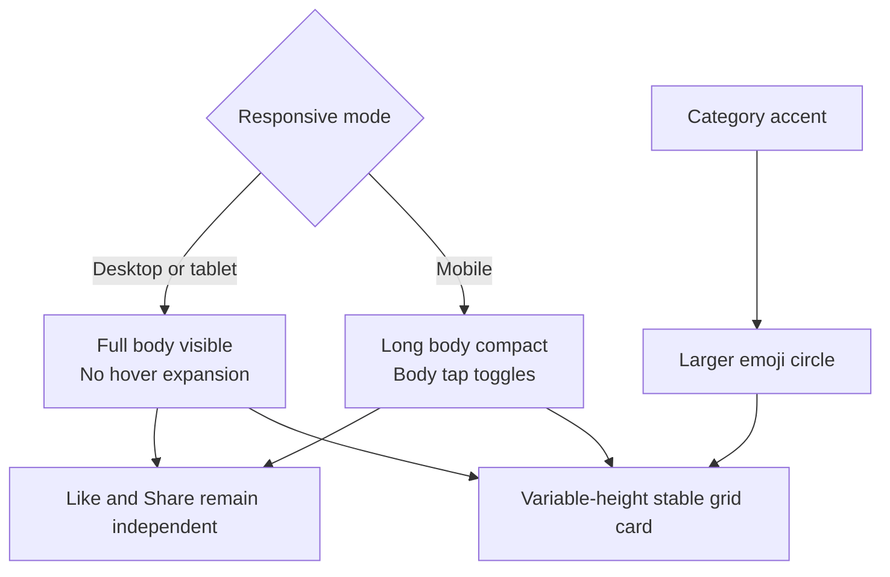

# Tidbits Responsive Card and Filter Visual Polish - Plan

## Goal Capsule

Make the Tidbits feed feel immediately readable on the web while preserving the calmer mobile interaction: desktop and tablet cards are fully expanded with no hover-to-expand behavior, while long mobile cards remain tap-expandable. Improve light-mode filter contrast and turn each category emoji into a larger, visible circular badge without disturbing the stable variable-height grid.

The user's requested behavior is the authority for this follow-up. Existing theme, filtering, likes, shares, paragraph rendering, stable grid lanes, and source content remain authoritative unless this plan explicitly changes them.

Stop if implementation would require changing trivia text, headers, database schema, engagement semantics, cursor pagination, or the stable row-lane layout.

## Product Contract

### Summary

The web feed should show the complete trivia at a glance instead of making every card feel collapsed. Mobile should retain a compact, tap-driven reading pattern for longer facts. Filter controls must be legible in light mode, and category identity should be more visually prominent through a friendly emoji badge.

### Problem Frame

The current card body still carries desktop hover-expansion logic and a collapsed/read-more treatment inherited from the previous responsive card work. This conflicts with the user's new preference that web cards be expanded by default and never expand on hover. The category chips use light accent mixes that reduce text contrast in light mode, while the category emoji is currently a small inline glyph rather than a distinct visual marker.

### Requirements

#### Card behavior

- R1. On desktop and tablet web layouts, every card body is expanded by default and displays its complete content without requiring hover.
- R2. Desktop and tablet pointer hover must not expand, collapse, or otherwise change the card body state, and no hover read-more affordance should be shown.
- R3. On the existing mobile layout, long bodies remain compact until the user taps the card body, then tap again collapses them; short bodies retain their natural full height and are not forcibly clipped.
- R4. Mobile card activation remains limited to the body. Like, Share, and other controls never toggle expansion.
- R5. Existing paragraph spacing, raw body/share content, keyboard accessibility, reduced-motion behavior, and stable row lanes remain intact.

#### Filter readability

- R6. Light-mode category filters use a darker, higher-contrast treatment for inactive and active states, including readable text, border, and hover/focus styling.
- R7. Dark mode remains legible and does not inherit a light-mode text choice that becomes low contrast.
- R8. Existing filter URLs, active-state semantics, search-term preservation, and category accent identity remain unchanged.

#### Category badge and layout

- R9. Each card's category emoji is visibly larger and centered inside a circular badge with a filled color derived from that category's accent.
- R10. The badge fill must support emoji visibility in light and dark themes and must not obscure or clip the emoji.
- R11. The existing stable responsive grid remains the layout mechanism: cards keep variable natural heights, source order, and stable lanes while the new badge and expanded desktop content change card surfaces.
- R12. A fixed back-to-top button is available at the lower-right of the viewport after the user scrolls down and returns the user to the top when activated.
- R13. The back-to-top control is keyboard accessible, has an explicit accessible label, and respects the existing reduced-motion preference.
- R14. The Share control visibly combines a share icon, the word “Share,” and the current share count.
- R15. Hover and focus states make the Share control clearly actionable with a clickable pointer cursor and a clear visual affordance, without changing its existing clipboard/native-share behavior.

### Acceptance Examples

- AE1. On desktop, a long tidbit is fully visible immediately after page load; moving the pointer over the body, Like, or Share does not change its expanded state, and no read-more hint appears.
- AE2. On a mobile-width layout, a long tidbit starts compact, a body tap reveals the full content, and a second body tap restores the compact state; a short tidbit remains naturally sized.
- AE3. Activating Like or Share on mobile does not toggle the card body, and keyboard activation still reaches the body and actions in chronological DOM order.
- AE4. In light mode, inactive and active filter chips have readable text and clear boundaries against the wallpaper; hover and focus states remain readable.
- AE5. Switching to dark mode keeps filter labels, borders, and active states readable.
- AE6. Every category card shows a larger emoji inside a filled circular badge, with the emoji clearly visible and the card's variable-height grid behavior preserved.
- AE7. After scrolling down, an up-arrow control appears in the lower-right corner; activating it scrolls the page to the top and does not alter feed state.
- AE8. The Share control shows its icon, “Share” label, and count; hovering or focusing it visibly communicates that it can be clicked, and activating it preserves the existing complete share payload.

### Scope Boundaries

In scope: responsive expansion state, removal of desktop hover expansion, mobile tap behavior, filter chip contrast, category emoji badge styling, a back-to-top control, Share control affordance and labeling, and regression/browser verification for the affected interactions and retained layout.

Out of scope: database or content changes, new icons or icon packages, new categories, new masonry algorithms, shortest-column packing, virtualization, engagement API changes, theme persistence changes, filter URL changes, deployment, and redesign of the top bar or About modal.

## Planning Contract

### Key Technical Decisions

- KTD1. Use responsive behavior aligned with the existing mobile layout boundary: web/tablet cards are rendered expanded and non-interactive for hover, while mobile retains body-only tap toggling for bodies that need a compact preview (session-settled: user-directed — chosen over hover expansion on all viewports: the user wants complete web cards and click expansion only on mobile).
- KTD2. Preserve the previous natural-height rule for short mobile bodies rather than forcing every mobile card into a collapsed height (session-settled: user-directed — chosen over collapsing every card: short facts should not look artificially clipped or gain a needless affordance).
- KTD3. Improve chip contrast with theme-aware foreground and border choices over the current pastel-only text mix, while retaining each category's accent as a supporting fill/border cue (session-settled: user-directed — chosen over the existing light pastel treatment: the user cannot reliably read the current light-mode filters).
- KTD4. Build the emoji marker with CSS and the existing category accent variable rather than adding an icon dependency. A translucent or mixed accent fill provides color without placing an opaque layer over the emoji.
- KTD5. Keep the stable CSS Grid row layout unchanged. The visual badge and expanded web bodies should alter natural card surfaces only; they must not reintroduce absolute placement, horizontal transforms, or equal-height forcing.
- KTD6. Show the back-to-top control only after meaningful downward scrolling instead of keeping it permanently visible. This keeps the landing view uncluttered while preserving an obvious recovery action for long feeds.
- KTD7. Use the native clickable pointer plus a strong hover/focus treatment for Share instead of a custom cursor image. The visible Share label and count provide a persistent affordance, while the native pointer is more reliable and accessible across browsers.

### High-Level Technical Design

The implementation should keep the card's display body and engagement/share payload separate. Responsive state may control only the visual interaction surface; the original header and body strings continue to flow unchanged to engagement actions.

### Assumptions

- “Web” includes desktop and tablet layouts; “mobile” means the existing narrow mobile breakpoint used by the feed.
- The current stable grid already satisfies the requested masonry-like variable-height structure, so this follow-up styles the card surfaces without changing lane placement.
- The exact contrast-mix percentages and badge dimensions can be tuned during implementation against the existing light and dark wallpapers, provided the readable state requirements remain true.
- Browser/runtime verification is required for theme and responsive media behavior because component tests alone cannot prove rendered contrast or actual viewport mode.

### Implementation Sequence

Implement the responsive card state first, then the filter contrast treatment, then the category badge polish, then the back-to-top control, then the Share affordance and cross-surface regression review. Keep the work limited to existing components, CSS variables, and their tests; do not add a new design-system dependency.

## Implementation Units

### U1. Make web cards expanded and mobile cards tap-expandable

- **Goal:** Align card behavior with the new web/mobile interaction contract.
- **Requirements:** R1–R5.
- **Dependencies:** None.
- **Files:** `components/TidbitCard.tsx`, `components/TidbitCard.test.tsx`, `app/globals.css`.
- **Approach:**
  1. Remove desktop hover-driven expansion and the desktop read-more presentation.
  2. Render desktop and tablet bodies fully expanded by default.
  3. Retain mobile body-only tap toggling for long content and preserve the natural-height treatment for short content.
  4. Keep Like/Share event isolation, paragraph rendering, accessible state attributes, raw share payloads, and reduced-motion rules intact.
- **Execution note:** Add or update behavior tests before changing the event and responsive-state logic; verify both media modes rather than relying on the desktop default.
- **Patterns to follow:** Existing `TidbitCard` body/action separation, current paragraph renderer, current card-level accent styling, and the stable-grid constraints from the preceding plan.
- **Test scenarios:**
  - A long card rendered in a desktop media mode is expanded on first render, has no read-more hint, and remains expanded after pointer enter/leave events.
  - A long card rendered in the mobile media mode starts compact, expands after a body tap, and collapses after a second body tap.
  - A short mobile body remains fully visible, has natural height, and has no expansion hint or forced collapsed state.
  - Like and Share clicks and keyboard activations do not toggle a mobile card body.
  - Paragraph order, blank-line spacing, keyboard activation, and the exact header/body values passed to engagement actions remain unchanged.
- **Verification:** Component tests cover both responsive modes and browser inspection confirms no desktop hover movement, no missing content, and no lane changes during mobile expansion.

### U2. Increase filter chip contrast across themes

- **Goal:** Make category filters readable in light mode while keeping dark mode and filter behavior intact.
- **Requirements:** R6–R8.
- **Dependencies:** None.
- **Files:** `components/CategoryChips.tsx`, `components/CategoryChips.test.tsx`, `app/globals.css`.
- **Approach:**
  1. Retain the existing accent variable and URL/active-state markup.
  2. Replace the low-contrast light-mode text/background mix with a stronger theme-aware treatment for inactive, active, hover, and focus states.
  3. Ensure the active chip remains visually distinct without relying on white text over pale accent colors.
- **Patterns to follow:** Existing `.chip`, `data-active`, `accentStyle`, `hrefFor`, and `CategoryChips` URL-preservation tests.
- **Test scenarios:**
  - The All and category chips preserve their current links, active attributes, labels, and accent variables after styling changes.
  - Active and inactive chips expose distinct classes or style hooks that browser verification can inspect in light and dark themes.
  - Focus-visible and hover states retain readable text rather than reverting to the low-contrast light treatment.
- **Verification:** Browser inspection at light and dark themes confirms filter labels and boundaries are readable against the wallpaper at desktop and mobile widths.

### U3. Add circular category emoji badges

- **Goal:** Give each card a prominent, colorful category marker while preserving the existing hierarchy and variable-height card rhythm.
- **Requirements:** R9–R11.
- **Dependencies:** U1.
- **Files:** `components/TidbitCard.tsx`, `components/TidbitCard.test.tsx`, `app/globals.css`.
- **Approach:**
  1. Separate the category emoji from the category name with a dedicated badge hook.
  2. Size and center the emoji in a circular badge whose fill is derived from the card/category accent.
  3. Use theme-aware mixing and sufficient padding so the emoji remains visible without clipping or being covered by the fill.
  4. Keep the category name, Like/Share controls, header, paragraph body, and source-ordered grid placement in their existing semantic order.
- **Patterns to follow:** `CATEGORY_ICONS`, inline `accentStyle`, `.tidbit-category-meta`, `.card-shell`, and the existing card hierarchy.
- **Test scenarios:**
  - A card for each known category renders its emoji inside the badge hook and keeps the category name visible.
  - Unknown category slugs continue to render the fallback emoji without breaking the circular badge.
  - The badge remains present in both light and dark theme markup and does not remove the accessible category text.
  - Cards with different body lengths retain natural variable heights and stable grid wrappers after the badge is added.
- **Verification:** Browser inspection confirms the emoji is visibly larger, centered, and readable inside the filled circle, with no card overlap or forced equal-height surfaces.

### U4. Add an accessible back-to-top control

- **Goal:** Give users a clear way to return to the top of a long trivia feed from the lower-right viewport edge.
- **Requirements:** R12–R13.
- **Dependencies:** U1–U3.
- **Files:** `components/BackToTopButton.tsx`, `components/BackToTopButton.test.tsx`, `app/page.tsx`, `app/globals.css`.
- **Approach:**
  1. Add a client-side control that observes scroll position and appears only after the user has moved down the page.
  2. Anchor it to the lower-right with spacing that remains usable on narrow screens and does not cover card actions.
  3. Use an up-arrow visual with an accessible name and focus-visible treatment.
  4. Return to the document top with smooth scrolling when motion is allowed and an instant fallback when reduced motion is preferred.
- **Patterns to follow:** Existing client components, `theme-toggle`, `top-bar-link`, CSS custom properties, focus rings, and reduced-motion rules.
- **Test scenarios:**
  - The control is absent or hidden at the top of the page and becomes available after a scroll event beyond the visibility threshold.
  - Activating the control requests a scroll to the document top and does not remount or alter feed cards, filters, or engagement state.
  - The control has an accessible label, is keyboard focusable, and responds to keyboard activation.
  - Reduced-motion preference selects an instant scroll behavior rather than smooth animation.
  - The control remains positioned within the viewport at desktop and 390px mobile widths without covering the primary card action area.
- **Verification:** Browser inspection confirms the control appears only after scrolling, is readable in both themes, reaches the top reliably, and respects reduced motion.

### U5. Make Share visibly actionable

- **Goal:** Make the existing Share action immediately understandable and discoverable without changing what it shares or how it counts.
- **Requirements:** R14–R15.
- **Dependencies:** U1–U4.
- **Files:** `components/EngagementButtons.tsx`, `components/EngagementButtons.test.tsx`, `app/globals.css`.
- **Approach:**
  1. Keep the existing Share button and handler, but render the share icon, visible “Share” label, and formatted count together.
  2. Add a native clickable pointer cursor and a theme-aware hover/focus treatment that is distinct from the Like control.
  3. Preserve the existing accessible button name, native Web Share/clipboard fallback, complete header/body/URL payload, and server-side count update.
- **Patterns to follow:** Existing `EngagementButtons` state/actions, `formatCompact`, `.share-action`, `.engagement-toast`, accessible button labels, and the current share tests.
- **Test scenarios:**
  - The Share button renders its icon, visible “Share” text, and compact count while retaining its accessible label.
  - Clicking Share still invokes the native-share or clipboard path and preserves the complete header, body, paragraph breaks, and URL payload.
  - A successful share still updates the count, and repeated shares retain the existing counting behavior.
  - Hover and keyboard focus expose a visible affordance and clickable cursor hook without toggling card expansion.
  - Light and dark themes keep the Share label, icon, count, border, and focus state readable.
- **Verification:** Browser inspection confirms the Share control reads as an action at a glance, responds visibly to pointer hover and keyboard focus, and continues to share the unchanged content payload.

## System-Wide Impact

This is a presentation-only change across the feed's card, filter, navigation, and engagement surfaces. It changes responsive card interaction, CSS color treatment, viewport navigation, and Share labeling/affordance but does not change database values, feed pagination, filter URLs, engagement request semantics, share serialization, theme persistence, or grid ordering. Desktop may display more body content immediately, so the initial page can be visually taller; mobile retains the compact reading path for long bodies.

## Risks and Dependencies

- Responsive mode detection can produce hydration or resize edge cases; the implementation must preserve server/client consistency and update behavior when the viewport mode changes.
- Contrast that looks correct against the base surface may weaken over the repeated doodle wallpaper; browser review must inspect the actual page background rather than isolated chip markup.
- Emoji glyph dimensions vary by platform; the badge needs padding and line-height that prevent clipping across macOS and mobile browsers.
- Removing desktop hover handlers must not accidentally remove keyboard access or mobile tap behavior.
- A fixed navigation control can obscure card content or sit behind the sticky top bar; placement, stacking, and safe-area spacing must be checked at narrow widths.
- Adding a visible Share label increases the action row width; the layout must remain readable without pushing counts off-card or causing horizontal overflow on narrow cards.

## Sources and Research

- `components/TidbitCard.tsx` and `components/TidbitCard.test.tsx` establish the current body/action separation, paragraph rendering, category icon map, and expansion tests.
- `components/CategoryChips.tsx`, `components/CategoryChips.test.tsx`, and `.chip` styles in `app/globals.css` establish the current filter URL and active-state contract.
- `lib/design/palette.ts` is the category accent source used by both cards and chips.
- `docs/plans/2026-07-25-006-fix-stable-row-masonry-loading-paragraph-cards-plan.md` establishes the retained stable-lane, natural-height, paragraph, engagement, and theme constraints.
- No external research was required because the requested changes extend recently implemented local patterns and do not introduce a new dependency or external contract.

## Verification Contract

| Gate | Coverage | Done signal |
| --- | --- | --- |
| Component tests | U1–U3 | Responsive card behavior, action isolation, paragraph retention, filter semantics, and badge rendering pass. |
| Full test suite | All retained behavior | Existing engagement, feed, search, theme, filter, and accessibility tests remain green. |
| Lint and build | TypeScript/CSS integration | Lint is clean and the production build completes without type or compile errors. |
| Browser review | Light/dark, desktop/tablet/mobile | Web cards are expanded with no hover behavior; mobile long cards tap-toggle; chips, Share controls, emoji circles, and the back-to-top control are readable and usable; cards do not overlap or change lanes. |

## Definition of Done

- Desktop and tablet cards are fully expanded on load and do not expand or collapse on hover.
- Mobile long cards remain body-tap expandable, while short cards remain naturally full-height.
- Like and Share controls remain independent of card expansion, and existing share content is unchanged.
- Light-mode filter chips have clearly readable text and boundaries; dark mode remains legible.
- Category emojis are larger, centered, and enclosed in filled circular badges without clipping.
- The back-to-top button appears after scrolling, returns the user to the top, remains accessible, and respects reduced motion.
- The Share control visibly includes its icon, label, and count, provides a clear hover/focus affordance, and preserves the existing complete share payload and count behavior.
- Stable source order, variable card heights, responsive lanes, theme behavior, filters, likes, shares, paragraphs, and pagination remain intact.
- All planned tests, lint, build, and browser checks pass.
- No abandoned experimental code, obsolete hover rules, or redundant styling paths remain.
