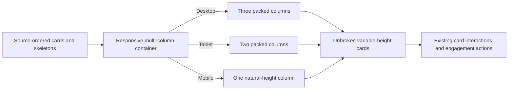

# True Masonry Card Stacking - Plan

## Goal Capsule

Replace the current row-based CSS Grid feed with a genuine gap-free masonry presentation in which cards keep their natural heights and later cards rise into the space below shorter cards.

The current user request supersedes the earlier stable-row placement decision in `docs/plans/2026-07-25-006-fix-stable-row-masonry-loading-paragraph-cards-plan.md`: visual density and shortest-column stacking now take priority over row stability.

Stop if the implementation changes trivia content, database behavior, pagination semantics, engagement behavior, theme persistence, or the desktop-expanded/mobile-tap card contract.

---

## Product Contract

### Summary

The feed should look like a real masonry wall: cards with different heights should stack continuously in their columns instead of inheriting the height of the tallest card in a shared row.

### Problem Frame

`.masonry-grid` currently uses normal CSS Grid rows. Every row is sized by its tallest card, so shorter neighboring cards leave visible blank space underneath them. The screenshot shows this row-track behavior rather than true masonry stacking.

### Requirements

#### Masonry placement

- R1. Cards with different content heights must stack vertically without blank row-sized gaps beneath shorter cards.
- R2. The feed must retain three columns on desktop, two on tablet, and one on mobile using the existing responsive breakpoints.
- R3. Each card must remain an unbroken layout item; its category row, header, paragraph content, and Share action must not split across columns.
- R4. The DOM must retain chronological source order even when the visual layout flows through columns.
- R5. The intended horizontal and vertical column gaps must remain consistent without adding extra space below shorter cards.

#### Feed and interaction preservation

- R6. The initial 20-card payload, cursor pagination, anticipatory loading, retry state, render cap, and filter/search remount behavior must remain unchanged.
- R7. Loading placeholders must use the same masonry flow and must not animate from the left edge or use horizontal placement transforms.
- R8. Desktop and tablet cards remain expanded by default without hover expansion; long mobile cards remain body-tap expandable and short mobile cards remain naturally sized.
- R9. Like, Share, theme, filter, paragraph, keyboard, back-to-top, and PostHog behavior must remain unchanged.

### Acceptance Examples

- AE1. At desktop width, a short card below a tall card is followed by the next card in that column at the normal masonry gap rather than at the bottom of the tall card's row.
- AE2. At tablet and mobile widths, the feed reduces to two and one column respectively without clipping, overlap, or forced equal card heights.
- AE3. A card with a long paragraph body remains a single unbroken card while the next card starts below it in the same visual column.
- AE4. When the next batch loads, skeletons join the same packed column flow and real cards replace them without left-corner entry or horizontal lane transforms.
- AE5. Desktop pointer movement does not change card expansion; mobile body taps still expand and collapse long cards without changing the one-column flow.
- AE6. The chronological card sequence remains present in the DOM, and Like/Share controls remain independently keyboard and pointer accessible.

### Scope Boundaries

In scope: replacing the row-track layout mechanism, masonry-specific card wrapper styling, responsive column counts, loading-placeholder flow, layout regression tests, and browser verification of dense stacking.

Out of scope: changing trivia text or headers, changing database schema or queries, changing page-size/cursor rules, adding a new masonry dependency, experimental native CSS masonry syntax, shortest-column JavaScript measurement, a new card interaction model, or a redesign of card contents.

### Dependencies

- The current feed already renders cards and loading placeholders as one source-ordered list, so the layout can change without changing feed data flow.
- The card shell already owns its internal two-dimensional header/action layout; the masonry container must treat each shell as an indivisible block.
- The existing CSS Grid implementation and its row-gap behavior are the source of the bug and must not remain as the active fallback.

---

## Planning Contract

### Key Technical Decisions

- KTD1. Use CSS multi-column layout with `break-inside: avoid` for production masonry stacking (session-settled: user-directed — chosen over the existing row-based CSS Grid: the user explicitly wants cards to stack according to their individual heights and eliminate row gaps). Multi-column layout is broadly supported and lets the browser pack complete cards without row tracks.
- KTD2. Do not use native CSS `grid-lanes`/experimental masonry syntax. MDN marks that feature as limited availability, and unsupported browsers fall back to ordinary grid behavior that would recreate the reported gaps. [MDN masonry layout](https://developer.mozilla.org/en-US/docs/Web/CSS/Guides/Grid_layout/Masonry_layout)
- KTD3. Keep the existing single source-ordered card stream instead of adding a JavaScript shortest-column packer. This avoids absolute positioning, measurement loops, horizontal transforms, and a second layout state that could interfere with loading or mobile expansion.
- KTD4. Use the current visual breakpoints and retain a single column on mobile. CSS multi-column's `break-inside` behavior keeps each card intact while `column-count` controls the responsive density. [MDN multi-column layout](https://developer.mozilla.org/en-US/docs/Web/CSS/Guides/Multicol_layout)

### High-Level Technical Design

The container controls only column flow. Card components continue to own content measurement, responsive expansion, category styling, engagement actions, and accessibility. The wrapper prevents a card from fragmenting while the browser fills the next available column.

### Assumptions

- “True masonry” means dense multi-column stacking with no row-baseline gaps, matching the attached visual reference; it does not require shortest-column JavaScript placement or experimental native masonry syntax.
- Visual column flow may rebalance when the browser changes viewport width or when new content is appended; this is an expected consequence of dense masonry and is preferable to the visible row gaps in the current layout.
- The existing source order remains authoritative for the DOM and keyboard sequence even though visual reading proceeds down one column before the next.
- The current opacity-only card entrance animation remains acceptable because it does not create the reported left-corner motion.

### Implementation Sequence

Implement the masonry container and indivisible card wrappers first. Then verify that loading placeholders and appended pages use the same flow. Finish with responsive interaction and browser regression checks so the new layout does not disturb the already-settled card behavior.

### Sources & Research

- The current `components/MasonryFeed.tsx` renders a single list inside `.masonry-grid`, while `app/globals.css` defines that container as normal CSS Grid with `align-items: start` and a shared `gap`; this directly explains the screenshot's row-sized blank areas.
- MDN documents CSS multi-column layout and `break-inside: avoid` as the supported way to keep cards intact across columns. [Handling content breaks](https://developer.mozilla.org/en-US/docs/Web/CSS/Guides/Multicol_layout/Handling_content_breaks)
- MDN documents native CSS masonry as experimental and not Baseline, so it is not suitable as the only production layout mechanism. [Masonry layout](https://developer.mozilla.org/en-US/docs/Web/CSS/Guides/Grid_layout/Masonry_layout)
- The earlier stable-row plan is historical context for the superseded decision; the current user request is authoritative for the new dense-stacking behavior.

---

## Implementation Units

### U1. Replace row tracks with packed columns

- **Goal:** Make cards stack continuously according to their natural heights at each responsive column count.
- **Requirements:** R1–R5.
- **Dependencies:** None.
- **Files:** `components/MasonryFeed.tsx`, `components/MasonryFeed.test.tsx`, `app/globals.css`.
- **Approach:**
  1. Keep the existing source-ordered item stream and feed state, but change the active container from row-based grid placement to responsive multi-column flow.
  2. Mark each card and skeleton wrapper as an indivisible column item and use the existing visual gap as the only separation between adjacent items.
  3. Preserve three, two, and one visual columns at the existing desktop, tablet, and mobile breakpoints.
  4. Remove or neutralize active row-track declarations, equal-height assumptions, and any layout styles that reintroduce blank space below shorter items.
- **Patterns to follow:** Existing `.masonry-grid`, `.masonry-grid-item`, `BREAKPOINTS`, `RENDER_CAP`, `SkeletonCard`, and the current source-order map in `MasonryFeed`.
- **Test scenarios:**
  - The feed renders all cards and skeletons in chronological DOM order without inline absolute positions or transforms.
  - A deliberately short card and a deliberately tall card retain different natural heights and use a masonry-specific wrapper hook that prevents column fragmentation.
  - The responsive layout exposes the existing three-, two-, and one-column breakpoints without changing the feed's item data or order.
  - Card and skeleton wrappers remain complete layout items and do not split their internal content across columns.
- **Verification:** The CSS and component tests establish the layout contract, and browser inspection proves that the next card rises into the space beneath a shorter neighbor instead of waiting for a shared row track.

### U2. Preserve loading and appended-card flow

- **Goal:** Ensure initial cards, loading placeholders, and later pages all participate in the same packed masonry flow.
- **Requirements:** R6–R7.
- **Dependencies:** U1.
- **Files:** `components/MasonryFeed.tsx`, `components/MasonryFeed.test.tsx`.
- **Approach:**
  1. Preserve the initial 20-card server payload and existing cursor request behavior.
  2. Keep the early intersection observer, loading guard, retry state, render cap, and PostHog feed-load capture unchanged unless the new layout requires only a class or wrapper adjustment.
  3. Render loading skeletons through the same masonry item wrapper so they occupy normal packed positions and fade in without directional movement.
  4. Keep the sentinel after the masonry container so appended content does not create a second layout region.
- **Patterns to follow:** Existing `loadingRef`, `sentinelRef`, `loadMore`, `SKELETON_COUNT`, retry button, and `feed_loaded_more` capture.
- **Test scenarios:**
  - The initial render shows the supplied first page without an extra fetch caused by the layout change.
  - A successful next-page response appends cards after the existing items without duplicates and keeps the sentinel below the masonry content.
  - Loading renders the expected skeleton set inside the same masonry container and removes it after resolution.
  - A failed request leaves existing cards in place and preserves the retry path.
  - Reaching the render cap or end of cursor data still shows the existing end state without an empty masonry column or orphaned sentinel region.
- **Verification:** Existing feed tests cover cursor/loading behavior, while browser scrolling confirms that appended cards pack into columns and never animate from the viewport's left edge.

### U3. Regression-check responsive card interactions

- **Goal:** Prove that true masonry does not regress the current card, engagement, theme, filter, or accessibility behavior.
- **Requirements:** R8–R9.
- **Dependencies:** U1, U2.
- **Files:** `components/TidbitCard.test.tsx`, `components/EngagementButtons.test.tsx`, `components/CategoryChips.test.tsx`, `components/BackToTopButton.test.tsx`, `app/globals.css`.
- **Approach:**
  1. Retain desktop/tablet full-content cards and mobile body-only expansion without adding layout-specific expansion handlers.
  2. Confirm Like and Share controls remain outside the card-body activation surface and keep their existing payload and analytics behavior.
  3. Confirm paragraph spacing, filter contrast, theme styling, category badges, back-to-top positioning, and reduced-motion rules remain intact inside the new column container.
  4. Add only regression assertions that are needed because the container changes from grid rows to columns; defer unrelated visual cleanup.
- **Patterns to follow:** Current responsive media tests, action isolation tests, CSS theme variables, and existing browser verification workflow.
- **Test scenarios:**
  - Desktop long cards are expanded by default and pointer movement does not toggle their body.
  - Mobile long cards toggle only from body activation, while short cards remain naturally sized.
  - Like and Share still work without toggling card state, and Share retains its complete header/body payload.
  - Light and dark filters, category badges, and the back-to-top control remain readable and keyboard accessible.
  - Reduced-motion behavior still suppresses transitions, and the DOM sequence remains keyboard-navigable after column layout is applied.
- **Verification:** Focused component tests pass, then browser checks at desktop, tablet, and 390px widths confirm dense stacking, no overlap, no clipped card content, and no interaction regressions.

---

## System-Wide Impact

This is a presentation-layer change to the feed container and item wrappers. It changes visual placement and the relationship between DOM order and on-screen columns, but it does not change feed queries, cursor semantics, card content, engagement actions, authentication, analytics events, or database state. The main accessibility consideration is preserving the existing chronological DOM and keyboard order while cards visually flow through columns.

## Risks and Dependencies

- CSS multi-column layout may rebalance columns when viewport width changes or new items arrive; browser verification must confirm that this is acceptable and does not create overlap or clipped content.
- Visual order will flow down columns before moving to the next column, which differs from the previous row-major grid. DOM order remains chronological and keyboard navigation must remain usable.
- A card taller than the available viewport or column fragmentainer must remain visible rather than clipped; `break-inside: avoid` and overflow inspection are required.
- Native CSS masonry remains a future option only after browser support is broad enough to avoid a production fallback mismatch.

---

## Verification Contract

| Gate | Coverage | Done signal |
| --- | --- | --- |
| Focused component tests | Masonry feed, card interactions, engagement, filters, back-to-top | All affected test files pass with no changed behavior outside the plan. |
| Full test suite | Existing unit and integration coverage | `npm test` passes. |
| Static quality | TypeScript/Next lint and whitespace validation | `npm run lint` and `git diff --check` pass. |
| Production build | Next.js compilation and route generation | `npm run build` passes. |
| Browser layout pass | 1440px desktop, tablet breakpoint, and 390px mobile; light and dark themes; initial load, scroll loading, card interaction | Cards pack by natural height with only intended column gaps, no row-sized blank spaces, no clipping, no overlap, and no left-corner loading motion. |

## Definition of Done

- The active feed layout is true dense masonry rather than normal CSS Grid rows.
- Three desktop, two tablet, and one mobile columns render without shared row-height gaps.
- Cards and skeletons remain intact, naturally sized, source-ordered in the DOM, and free of horizontal placement transforms.
- Initial loading, cursor pagination, filtering, search, retries, and the render cap remain correct.
- Desktop expanded cards, mobile tap expansion, Like/Share, themes, filters, badges, back-to-top, analytics, keyboard behavior, and reduced motion remain correct.
- Focused tests, the full test suite, lint, diff checks, production build, and browser verification all pass.
- No experimental masonry-only CSS or new masonry dependency is required for the production path.
