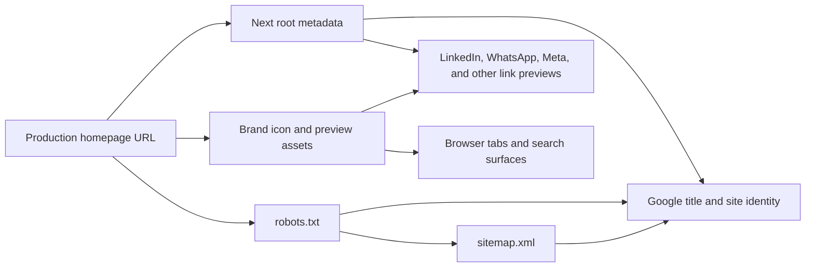

# Tidbits Brand, Link Previews, and Sitemap - Plan

## Goal Capsule

- **Objective:** Give Tidbits a recognizable hand-doodle brand mark and make the public site legible to browser tabs, search results, social link-preview crawlers, and search-engine discovery systems.
- **Authority hierarchy:** The user's confirmed scope governs the product outcome; this plan's Key Technical Decisions govern the implementation shape; current Next.js 16 App Router conventions and the existing Tidbits implementation govern details not otherwise specified.
- **Stop conditions:** Do not add individual public tidbit routes, change stored trivia content, alter database or engagement behavior, or claim that any search engine or social network guarantees a particular preview rendering.
- **Execution profile:** Standard implementation plan with asset generation, server-rendered metadata, crawler-facing routes, deployment configuration, and browser/external verification.

---

## Product Contract

### Summary

Plan and implement a cohesive Tidbits wordmark plus compact favicon mark, then expose stable canonical, Open Graph, Twitter-card, structured-data, robots, and sitemap signals for the public homepage. The resulting setup will be ready for Google, LinkedIn, WhatsApp, Meta, and other consumers that read standard web metadata, while keeping the current single-feed product shape.

### Problem Frame

The current site has a basic title and description and an existing generic favicon, but it does not yet define a complete public identity or crawler contract. It has no explicit production URL, Open Graph image contract, canonical URL, structured site identity, robots route, or sitemap route. That leaves browser surfaces and link previews dependent on defaults, and it gives Google less explicit information about the preferred site name and canonical page.

The site currently has one public feed route, an admin route, and an API route. It does not have individual URLs for each tidbit, so this plan optimizes the site's public homepage and discovery surface rather than inventing a detail-page architecture.

### Requirements

- R1. Create a cartoonish, doodlish hand-caricature brand identity that visibly includes the Tidbits name in wordmark-sized contexts and has a recognizable compact mark for small contexts.
- R2. Replace the current generic favicon with the new brand identity for browser tabs, browser search/address surfaces, Google Search favicon eligibility, and mobile home-screen icon contexts.
- R3. Define one explicit production site URL used as the base for canonical URLs, Open Graph URLs, preview-image URLs, JSON-LD URLs, robots output, and sitemap output; local development may use a localhost fallback.
- R4. Publish server-rendered page metadata with a concise Tidbits title, description, canonical URL, site name, locale, and large-image preview settings.
- R5. Publish standard Open Graph metadata and a stable 1200×630 branded preview image for the homepage, plus Twitter-compatible card metadata using the same preview asset.
- R6. Publish truthful `WebSite` structured data for the homepage so Google can better understand the Tidbits site name and URL. Do not add fabricated organization, author, rating, or content claims.
- R7. Publish a root sitemap containing only canonical public URLs that should appear in search results. Do not include admin, API, search-query, or category-query variants as canonical sitemap entries.
- R8. Publish crawler rules that expose the sitemap and keep the admin surface out of routine crawling while preserving access to the public homepage and brand assets.
- R9. Document the Vercel environment variable, deployment, crawler-validation, cache-refresh, and Google Search Console steps required after the code is deployed.
- R10. Verify the metadata and crawler surfaces from the built application, not only from unit tests, and record that external platforms may cache or override previews.

### Scope Boundaries

In scope:

- New wordmark, compact icon, favicon, Apple-touch icon, and social preview artwork using one consistent visual system.
- Next.js metadata, canonical URL, Open Graph, Twitter card, and JSON-LD site identity for the public homepage.
- `robots.txt`, `sitemap.xml`, and noindex treatment for the admin route where appropriate.
- A production site URL environment contract and beginner-friendly deployment/verification documentation.
- Unit, route-contract, build, and live-browser checks for the new public surfaces.

#### Deferred to Follow-Up Work

- Individual `/tidbits/<slug>` or `/tidbits/<id>` pages with per-tidbit titles, canonical URLs, and per-tidbit Open Graph images.
- Dynamic per-tidbit preview generation, image sitemaps, RSS/Atom feeds, and social publishing APIs.
- Automated Google Search Console, LinkedIn, or Meta API submission and cache invalidation.
- Search/filter-specific SEO landing pages or a content-indexing strategy for query parameters.

Outside this feature's identity:

- Changing trivia text, headers, categories, database schema, Turso data, likes, shares, PostHog events, masonry layout, or theme behavior.
- Adding user accounts, author profiles, ratings, reviews, or claims about the facts themselves.

### Dependencies

- A stable public production hostname must be selected and supplied as `NEXT_PUBLIC_SITE_URL` in Vercel Production.
- The current Next.js 16 App Router metadata conventions remain available; the repository already uses the root `app/layout.tsx` Server Component for metadata.
- The brand and preview artwork must be available as publicly served static assets without authentication or crawler blocking.

---

## Planning Contract

### Key Technical Decisions

- KTD1. **Use two coordinated brand asset forms.** Create a readable Tidbits wordmark for the site header and social artwork, and derive a square compact mark for favicon-sized surfaces. This honors the requested name while preserving legibility at the tiny sizes used by tabs and search results.
- KTD2. **Use Next.js file-based metadata conventions.** Prefer `app` metadata files for icons, preview images, sitemap, and robots, with the root layout's Metadata API for shared title and social fields. This lets Next.js emit the correct head tags and route responses for the existing App Router instead of maintaining hand-written head markup.
- KTD3. **Use one static homepage preview image.** The site has no individual tidbit URLs, so a stable branded 1200×630 image is more reliable and less expensive than introducing dynamic per-content image generation. The same image can serve Open Graph and Twitter-compatible metadata.
- KTD4. **Make the production URL explicit and fail-safe.** `NEXT_PUBLIC_SITE_URL` is the source for absolute public URLs. Local development may fall back to `http://localhost:3000`; production should fail validation when the variable is missing or malformed rather than shipping localhost or a transient preview hostname in canonical and social tags.
- KTD5. **Keep the sitemap canonical and small.** Include the public homepage only until individual content routes exist. Search and category query variants remain application navigation states, not separate canonical documents, so they are excluded from the sitemap.
- KTD6. **Use only truthful structured data.** Add `WebSite` JSON-LD for the Tidbits name and homepage URL. Use the favicon and Open Graph artwork for brand recognition; do not manufacture Organization, author, rating, or rich-result properties that the product cannot substantiate.
- KTD7. **Treat external preview rendering as probabilistic.** Correct metadata and public assets are the implementation contract; Google, LinkedIn, WhatsApp, Meta, and other crawlers may cache, crop, delay, or override previews. Verification therefore includes each platform's inspection or fresh-URL workflow and documents the expected cache delay.

### High-Level Technical Design

The root metadata layer will derive all absolute URLs from the configured production origin. The icon and preview assets will be stable, public, and independently requestable. The crawler layer will expose the sitemap while keeping non-public routes out of the normal crawl path. The homepage will contain JSON-LD that describes only the site itself.

### Assumptions

- The final public URL is a single HTTPS origin, with no requirement to make Vercel preview deployments canonical.
- The current public product remains a single feed page; social sharing of individual facts continues to use the existing share behavior until detail routes are explicitly requested.
- The visual design can be finalized as a static asset set during implementation using the requested hand-doodle direction; no runtime image-generation dependency is required.
- The six existing categories and 120 imported tidbits remain unchanged.

### Sequencing

1. Establish the brand asset set and integrate the wordmark/compact mark into the existing visual shell.
2. Add the production URL helper, shared metadata, preview image, and truthful JSON-LD.
3. Add robots and sitemap routes plus admin noindex treatment.
4. Add operator documentation and run local/build/live/external validation before deployment handoff.

---

## Implementation Units

### U1. Create and integrate the Tidbits brand asset system

**Goal:** Replace the generic favicon and expose a cohesive wordmark/compact mark across the website and browser-facing icon surfaces.

**Requirements:** R1, R2.

**Dependencies:** None.

**Files:**

- `public/brand/tidbits-wordmark.svg`
- `app/icon.svg`
- `app/favicon.ico`
- `app/apple-icon.png`
- `components/BrandMark.tsx`
- `components/BrandMark.test.tsx`
- `components/TopBar.tsx`
- `components/TopBar.test.tsx`

**Approach:**

1. Create one hand-doodle visual language with the Tidbits wordmark as the source brand expression.
2. Create a square compact mark that remains recognizable without relying on tiny wordmark text.
3. Replace the existing generic favicon with matching artwork and add the modern Next.js icon and Apple icon variants.
4. Render the wordmark through a small reusable brand component in the existing top-bar surface while preserving the accessible text name.

**Patterns to follow:** Preserve the existing `TopBar` client behavior, `next/font` typography, CSS custom-property theme system, and rounded claymorphism visual language. Keep the brand component presentational and independent of database or analytics state.

**Test scenarios:**

- **Happy path:** Rendering the brand component exposes the Tidbits name as accessible text and references the intended wordmark asset.
- **Responsive behavior:** The compact mark remains visible without clipping at the narrow mobile breakpoint, while the wordmark does not force horizontal overflow.
- **Asset contract:** Browser verification receives square icon assets and the replacement favicon from public production URLs with successful responses and stable dimensions.
- **Theme behavior:** The wordmark and compact mark remain legible in both existing light and dark themes without changing the theme state.

**Verification:** Confirm the visual asset set is consistent, the old generic favicon is no longer served, the top bar remains keyboard-accessible, and the app has no horizontal overflow at mobile width.

### U2. Add canonical, Open Graph, Twitter, and site-identity metadata

**Goal:** Give the public homepage a complete server-rendered identity for search and link-preview consumers.

**Requirements:** R3, R4, R5, R6, R10.

**Dependencies:** U1.

**Files:**

- `app/layout.tsx`
- `app/page.tsx`
- `app/opengraph-image.png`
- `app/twitter-image.png`
- `lib/seo/site-url.ts`
- `lib/seo/site-url.test.ts`
- `components/SiteStructuredData.tsx`
- `components/SiteStructuredData.test.tsx`
- `.env.local.example`

**Approach:**

1. Centralize production-origin parsing and local fallback behavior so every public URL uses the same origin.
2. Expand root metadata with a concise title, description, site name, canonical URL, locale, Open Graph website fields, image dimensions/alt text, and a large-image Twitter card.
3. Use one stable 1200×630 brand preview image for both Open Graph and Twitter-compatible metadata.
4. Add `WebSite` JSON-LD to the server-rendered homepage with the Tidbits name, canonical URL, and only truthful site-level fields.
5. Add `NEXT_PUBLIC_SITE_URL` to the environment example and document that Vercel Production must contain the real HTTPS domain.

**Execution note:** Prefer contract-first tests for URL normalization and structured-data output, then verify the final generated HTML head from a production-like server because unit tests alone cannot prove crawler-visible metadata.

**Patterns to follow:** Use the repository's existing root Server Component metadata export and Next.js 16 Metadata API. Do not add client-side metadata mutation or expose database content through JSON-LD.

**Test scenarios:**

- **Happy path:** A valid HTTPS site URL produces one canonical homepage URL and absolute Open Graph, Twitter, JSON-LD, and preview-image URLs.
- **Local fallback:** Development without the production URL uses the documented localhost origin without leaking it into a production build.
- **Invalid configuration:** A malformed production URL is rejected by the SEO URL helper rather than silently producing broken metadata.
- **Structured data:** The homepage JSON-LD contains a `WebSite` entity with the Tidbits name and canonical URL, and does not include unsupported ratings, authors, or fabricated organization claims.
- **Metadata regression:** The generated page head contains the canonical link, Open Graph title/description/image/url, Twitter card fields, and no duplicate conflicting canonical origins.
- **Preview image:** The Open Graph and Twitter image routes/assets are publicly accessible and use the intended 1200×630 dimensions and descriptive alternative text.

**Verification:** Inspect the server-rendered HTML and asset responses at the production-like URL, then run the deployed URL through LinkedIn Post Inspector, Meta Sharing Debugger, and a fresh WhatsApp share. Record that cache refresh may be required after asset changes.

### U3. Publish robots and canonical sitemap surfaces

**Goal:** Give crawlers a discoverable sitemap and safe crawl rules that match the site's one-page public information architecture.

**Requirements:** R7, R8, R10.

**Dependencies:** U2.

**Files:**

- `app/sitemap.ts`
- `app/robots.ts`
- `app/admin/page.tsx`
- `app/sitemap.test.ts`
- `app/robots.test.ts`

**Approach:**

1. Generate a root sitemap through the Next.js `MetadataRoute.Sitemap` convention using the configured absolute production URL.
2. Include only the public homepage as the current canonical URL; do not emit search or category query variants, admin, or API routes.
3. Generate robots rules that allow the public site and brand assets, disallow the admin and API surfaces, and point crawlers to the absolute sitemap URL.
4. Add route-level noindex metadata to the admin page so a previously discovered admin URL is not treated as a public search result merely because it is disallowed from crawling.

**Patterns to follow:** Use Next.js cached metadata route conventions, preserve the existing admin authentication behavior, and avoid using `robots.txt` as a substitute for canonicalization or access control.

**Test scenarios:**

- **Sitemap happy path:** The sitemap returns the absolute canonical homepage URL with no query string and no non-public routes.
- **Robots happy path:** The robots output contains the public sitemap URL and rules for the admin/API surfaces without blocking the public homepage or brand assets.
- **Configuration boundary:** Sitemap and robots output use the same normalized production origin as the page metadata.
- **Admin protection:** The admin route emits noindex metadata while its existing password protection remains unchanged.
- **Format contract:** The built responses are valid XML/text metadata routes and contain no localhost origin when production configuration is present.

**Verification:** Open `/sitemap.xml` and `/robots.txt` from the built app, validate the XML, confirm the URLs are absolute, and submit the sitemap in Google Search Console after the production domain is live.

### U4. Document production setup and external preview verification

**Goal:** Make the feature operable by a beginner after deployment and preserve the known platform limitations around crawling and preview caches.

**Requirements:** R3, R9, R10.

**Dependencies:** U1, U2, U3.

**Files:**

- `README.md`
- `.env.local.example`
- `docs/seo-sharing.md`

**Approach:**

1. Document the production URL variable and the requirement that it match the final public HTTPS hostname.
2. Document the Vercel deploy/redeploy step after setting the variable.
3. Document browser-source checks for title, canonical, Open Graph, Twitter, JSON-LD, favicon, preview image, robots, and sitemap responses.
4. Document Google Search Console property verification, sitemap submission, URL inspection/request indexing, and the fact that indexing and favicon display are not immediate guarantees.
5. Document LinkedIn Post Inspector refresh, Meta Sharing Debugger refresh, and a fresh WhatsApp share as preview checks; call out that already-cached previews may remain stale.

**Test expectation:** none -- this unit is documentation and operational guidance; its executable behavior is covered by U2/U3 and the final browser/external verification pass.

**Verification:** A beginner can follow the documented steps without guessing the production URL variable, which values belong in Vercel Production, where to submit the sitemap, or why a social preview may need cache refresh.

---

## System-Wide Impact

- **Public HTML:** The root layout and homepage gain canonical, social, and structured-data signals that are visible to crawlers and link-preview fetchers.
- **Static assets:** New public icon and preview assets become part of the deployed artifact and must remain fetchable without authentication.
- **Crawler surface:** `robots.txt` and `sitemap.xml` become public contracts. They must remain aligned with the canonical production hostname.
- **Admin/privacy:** Admin remains password-protected and is explicitly kept out of the public sitemap and search presentation. No user data, database rows, secrets, or analytics identifiers enter JSON-LD or preview metadata.
- **Deployment:** Vercel Production must receive `NEXT_PUBLIC_SITE_URL`; changing the production hostname later requires updating metadata, sitemap, robots, and external caches together.
- **Data layer:** Turso schema, imported trivia, filters, engagement counters, and PostHog instrumentation are unchanged.

---

## Risks and Dependencies

- **Wrong production origin:** A missing or incorrect site URL produces broken canonical and preview links. Mitigation: centralize parsing, fail production validation, and make the Vercel value explicit in the setup guide.
- **Crawler cannot fetch assets:** Authentication, robots rules, invalid HTTPS, or deployment rewrites can make previews fall back to text-only cards. Mitigation: request each asset directly from the deployed origin and check the generated head from a public request.
- **Tiny icon loses the wordmark:** Text that looks good in a header may be unreadable in a 32–48px favicon. Mitigation: keep a separate compact mark while retaining the full wordmark for header and preview artwork.
- **Preview cache staleness:** LinkedIn and other platforms may show an older image after metadata changes. Mitigation: document the platform refresh tools and test with a new URL or cache refresh after deployment.
- **Search expectations exceed current routes:** A root sitemap cannot make every database tidbit independently searchable. Mitigation: state that per-tidbit routes and per-content previews are deferred follow-up work.
- **Over-claiming structured data:** Unsupported claims can create confusing or ineligible search markup. Mitigation: keep JSON-LD to truthful `WebSite` identity fields and validate the emitted JSON.

---

## Sources & Research

- [Next.js Metadata API](https://nextjs.org/docs/app/api-reference/file-conventions/metadata) — file-based metadata conventions and caching behavior.
- [Next.js favicon, icon, and Apple icon conventions](https://nextjs.org/docs/app/api-reference/file-conventions/metadata/app-icons) — supported locations, formats, and generated head tags.
- [Next.js sitemap convention](https://nextjs.org/docs/app/api-reference/file-conventions/metadata/sitemap) — `MetadataRoute.Sitemap`, absolute URL examples, and split-sitemap limits.
- [Next.js Metadata and OG images guide](https://nextjs.org/docs/app/getting-started/metadata-and-og-images) — server metadata and static/dynamic preview asset conventions.
- [Open Graph protocol](https://ogp.me/) — title, description, image, URL, and image-alt contract used by social consumers.
- [LinkedIn website sharing requirements](https://www.linkedin.com/help/linkedin/answer/a521928) — Open Graph fields required for accurate LinkedIn previews.
- [LinkedIn URL troubleshooting](https://www.linkedin.com/help/linkedin/answer/a525063) — OGP reliance and stale-preview refresh behavior.
- [Google favicon guidance](https://developers.google.com/search/docs/appearance/favicon-in-search) — square, stable, crawlable favicon guidance and non-guaranteed display.
- [Google site names](https://developers.google.com/search/docs/appearance/site-names) — `WebSite` structured data and consistent site-name signals.
- [Google structured-data introduction](https://developers.google.com/search/docs/appearance/structured-data/intro-structured-data) — JSON-LD recommendation and search-understanding purpose.
- [Google sitemap guidance](https://developers.google.com/search/docs/crawling-indexing/sitemaps/build-sitemap) — absolute canonical URLs, robots reference, and the fact that submission is a hint rather than an indexing guarantee.
- [Google canonical URL guidance](https://developers.google.com/search/docs/crawling-indexing/consolidate-duplicate-urls) — canonical, sitemap, and robots roles.
- [Google robots.txt guidance](https://developers.google.com/search/docs/crawling-indexing/robots/intro) — crawler control is not access control or a guaranteed removal mechanism.

External research was load-bearing: it selected standard Open Graph fields, Next.js file conventions, square/stable favicon constraints, truthful `WebSite` structured data, absolute sitemap URLs, and the cache/guarantee limitations that shape verification and documentation.

---

## Verification Contract

| Area | Verification | Done signal |
|---|---|---|
| Unit tests | `npm test` | Existing tests and new SEO/asset/route tests pass. |
| Lint | `npm run lint` | No lint errors or metadata/accessibility warnings. |
| Production build | `npm run build` with a valid production site URL | Build completes and metadata routes are emitted. |
| HTML metadata | Inspect the built homepage source/head | Canonical, title, description, Open Graph, Twitter, and JSON-LD values use the production origin. |
| Brand assets | Request favicon, icon, Apple icon, and preview image URLs | All assets are public, stable, correct type, and visually consistent. |
| Crawler routes | Request `/robots.txt` and `/sitemap.xml` | Robots references the sitemap; sitemap contains only canonical public URLs. |
| Responsive UI | Check desktop, tablet, and 390px mobile views | Wordmark/mark does not clip, overflow, or reduce existing controls' usability. |
| External previews | Use Google Search Console URL Inspection, LinkedIn Post Inspector, Meta Sharing Debugger, and a fresh WhatsApp share | Each consumer can retrieve the page metadata/image or reports a platform-specific cache limitation rather than an application failure. |

---

## Definition of Done

- The new hand-doodle Tidbits wordmark and compact mark are visually consistent and integrated into the site without changing feed behavior.
- The generic favicon is replaced by the new stable brand icon, with matching browser and mobile icon variants.
- Production metadata has one canonical HTTPS origin, complete Open Graph/Twitter fields, a stable branded preview image, and truthful `WebSite` JSON-LD.
- `/robots.txt` and `/sitemap.xml` are publicly reachable, valid, absolute-URL based, and exclude non-public/query surfaces from canonical discovery.
- The admin route remains protected and is not presented as public search content.
- `.env.local.example`, `README.md`, and the SEO-sharing guide explain the production URL setup and platform verification steps in beginner-friendly language.
- Tests, lint, build, source inspection, asset requests, and external preview checks pass or have a documented platform-cache limitation.
- No trivia content, database schema, engagement rule, analytics event, or existing responsive interaction is changed.

