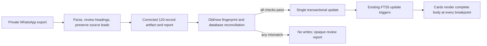

# Restore Lossless Trivia Content and Headings

## Goal Capsule

- **Objective:** Make every retained Tidbits card display complete source content and use a heading that accurately describes that card's content, using the supplied WhatsApp export as the editorial authority.
- **Authority hierarchy:** The user's raw export is authoritative for retained text; a reviewed heading manifest may improve display labels but must not delete source facts; the user's confirmed choice to show complete cards on every breakpoint governs the UI behavior.
- **Current evidence:** The live database has 120 source-hashed rows with no current header/body mismatches against the existing preparation output, while the card UI intentionally clips long mobile bodies to five lines and caps expanded bodies at a fixed height.
- **Stop conditions:** Stop before database writes if the source count, source-to-row mapping, content-preservation invariant, heading review, category/fingerprint set, privacy scan, or FTS reconciliation fails.
- **Tail ownership:** The implementer owns private source staging, dry-run reconciliation, database verification, and browser checks before publishing corrected rows.

---

## Product Contract

### Summary

Tidbits currently contains the expected 120 retained trivia records, but the experience can hide substantial portions of long cards and some headings are vague or misleading. The correction must make the full historical text readable and make each heading a faithful, recognizable label for its own story, including the Nvidia tattoo and ketchup examples.

### Problem Frame

The preparation pipeline already removes WhatsApp envelopes, preserves paragraph breaks, assigns categories, and fingerprints persisted header/body values. However, editorial heading rewrites can replace a source lead without proving that the lead's factual content remains visible, and the current client card uses a five-line mobile preview plus a `60rem` expanded ceiling. The current reconciliation script matches rows by body and writes directly, so it is not sufficient for a migration that changes both headings and preserved body content.

### Requirements

#### Complete source content

- R1. Every retained record must represent the complete selected WhatsApp message after only approved envelope cleanup and line-ending normalization; no sentence, paragraph, punctuation, emoji, or factual lead may be summarized, silently dropped, or replaced by filler.
- R2. When a concise editorial heading differs from the source's first content line, the source lead must remain visibly represented in the stored body so the joined heading/body content still contains the complete normalized source message.
- R3. Every card must render the complete stored body on initial load at desktop, tablet, and mobile widths with no line clamp, fixed-height ceiling, overflow hiding, fade, or read-more-only path.

#### Heading quality

- R4. Each retained record must have a reviewed heading that identifies the main subject, event, company, person, product, or surprising relationship in its body.
- R5. Generic headings such as “Interesting…”, “This is wild..”, or “Something you didn’t know..” must be replaced when the body supports a specific heading; headings must not introduce facts absent from the body.
- R6. The heading review must cover all retained records, not only the Nvidia tattoo and ketchup examples, and must produce a deterministic manifest that fails review when a retained source reference has no approved heading.

#### Safe reconciliation

- R7. The corrected prepared artifact must preserve the expected source reconciliation of 170 messages, 125 substantive candidates, one Meghalaya exclusion, 124 trivia blocks, four duplicate copies removed, and 120 retained records.
- R8. Existing database rows must be reconciled one-to-one from the previous approved source fingerprint to the corrected fingerprint inside a transaction; missing, extra, ambiguous, duplicate, unpublished, category-mismatched, or unexpected rows must block publication.
- R9. After reconciliation, each corrected row must retain its category, have a unique source fingerprint, remain searchable through the existing FTS5 triggers, and have no accidental changes to likes, shares, creation timestamps, or publication intent.

#### Privacy and scope

- R10. The raw export, staging JSONL, audit reports, and any database snapshots remain private and ignored; logs expose only counts and opaque source references.
- R11. This correction does not fact-check, modernize, grammar-correct, summarize, add new trivia, change categories, alter feed pagination, or redesign engagement behavior.

### Acceptance Examples

- AE1. Given the Nvidia source message, the card heading clearly identifies Jensen Huang's Nvidia tattoo and the complete source lead plus follow-on company-origin paragraph remain readable in the card body.
- AE2. Given the ketchup source message, the card heading identifies the fish-sauce-to-ketchup history and all source paragraphs, including the Heinz conclusion, are visible without tapping or scrolling inside the card.
- AE3. Given any retained record with an editorial heading rewrite, the normalized source message can be found intact in the stored heading/body representation and the source fingerprint recomputes from the final persisted values.
- AE4. Given a retained record with a generic or misleading old heading, the reviewed manifest supplies a specific body-supported heading and no retained record remains unmapped.
- AE5. Given an old database row and a corrected prepared row with the same source reference, reconciliation updates only the intended content/fingerprint fields and leaves category, engagement counts, timestamps, and publication state unchanged.
- AE6. Given a malformed, incomplete, duplicated, privacy-flagged, or source-count-drifting artifact, the audit blocks all writes and identifies the issue using opaque references.
- AE7. Given the corrected database, a distinctive term from each representative body is returned by the existing FTS5-backed feed query and the row count remains exactly 120.

### Scope Boundaries

**In scope**

- Auditing all 120 retained records against the private WhatsApp export.
- Reviewing and storing deterministic, body-supported headings, including Nvidia, ketchup, the McDonald's asteroid story, and other vague or mismatched cards found by the audit.
- Preserving source leads displaced by editorial headings.
- Safely reconciling corrected rows in the existing local/Turso database.
- Removing all card-level body clipping and obsolete expand/read-more semantics.
- Updating focused tests and the analytics documentation that describes the removed expansion event.

**Deferred to Follow-Up Work**

- Fact-checking, citations, grammar correction, or editorial rewriting beyond heading selection.
- Adding per-tidbit pages, a new content-management workflow, or a richer editorial review UI.
- Changing the category taxonomy, database schema beyond fields strictly required by the existing fingerprint contract, feed queries, pagination, masonry placement, themes, likes, shares, or PostHog event taxonomy beyond documenting the removed event.

**Outside this product's identity**

- Publishing unrelated WhatsApp chat, documents, links, media placeholders, travel recommendations, employment material, or private identifiers.
- Treating a shortened preview, generated summary, or hidden accessible text as an acceptable substitute for visible complete content.

### Dependencies

- The user-supplied WhatsApp export must be available to the implementation environment and staged privately as `data/raw/_chat.txt` or passed as an input path.
- The current approved artifact or a private snapshot of its source-reference-to-fingerprint mapping must be captured before changing preparation rules.
- The existing seeded categories, `source_hash` uniqueness, and FTS5 triggers must remain available in the target database.

---

## Planning Contract

### Key Technical Decisions

- KTD1. **Show complete card bodies by default everywhere** (session-settled: user-directed — chosen over an optional collapse/expand preview because hidden text was the reported defect). Remove the compact preview, read-more hint, fixed expanded ceiling, and body-toggle analytics rather than preserving an interaction that still hides content.
- KTD2. **Use an explicit reviewed heading manifest over open-ended runtime generation.** Every retained source reference receives a deterministic heading in the preparation code, with tests for known examples and a completeness assertion for the full retained set. This keeps headings reproducible, reviewable, and body-bound.
- KTD3. **Preserve source leads when headings change.** A rewritten display heading is metadata, not a replacement for source content; when it differs from the normalized first content line, the full source lead remains in the body before the remaining paragraphs. The final fingerprint covers the actual persisted header/body pair.
- KTD4. **Reconcile by old-to-new source identity, not body equality alone.** Capture the old approved fingerprint mapping, validate the corrected artifact completely, then update only rows matched by their old source fingerprint in one transaction. This handles deliberate body preservation changes and fails closed on missing or ambiguous matches.
- KTD5. **Retain the existing server/client boundary.** The homepage continues to fetch Tidbits in Server Components while the card remains a Client Component only where required by existing engagement controls; removing expansion state reduces client behavior without moving database access into the client graph. This follows the installed Next.js 16 App Router guidance in `node_modules/next/dist/docs/01-app/01-getting-started/05-server-and-client-components.md` and `node_modules/next/dist/docs/01-app/03-api-reference/01-directives/use-client.md`.

### High-Level Technical Design

The content path has two distinct invariants: source completeness is checked before persistence, and final database state is checked after persistence. The UI does not infer completeness from a measurement or an expansion state; it renders the persisted paragraph sequence without a clipping boundary.

### Assumptions

- The existing 120-row database is the intended target; the read-only audit found all 120 current source hashes and no current body/header mismatch against the old preparation output.
- The source export's message envelope, leading trivia marker, CRLF differences, and edited-message suffix remain structural noise that may be removed; visible story text does not.
- A concise heading may differ from the source lead only when the complete source lead remains in the visible body and the heading is supported by that body.
- Existing likes, shares, categories, timestamps, and publication state are immutable during this correction.

### Sequencing

1. Snapshot the current approved source mapping and audit the raw export and target database without writes.
2. Extend preparation and tests with the complete heading manifest and source-lead preservation invariant.
3. Generate and review the corrected private artifact, then run fail-closed old/new reconciliation preflight.
4. Apply the transactional content update and verify row, fingerprint, category, engagement, publication, and FTS invariants.
5. Remove UI clipping and obsolete expansion behavior, then verify complete content at all responsive widths.

### Risk Analysis and Mitigation

- **Source-lead loss:** A heading rewrite could discard factual detail from the original first line. Mitigation: require the source-lead preservation assertion and test Nvidia and other rewritten records end to end.
- **Wrong-row update:** A body-based match could update the wrong row or fail after body changes. Mitigation: match the old source fingerprint to one row, compare the source reference manifest, and abort on missing, duplicate, extra, or ambiguous identities.
- **Partial remote migration:** A network or constraint failure could leave mixed content. Mitigation: use a single write transaction, preflight every record, and verify the final exact fingerprint set before publication.
- **Persistent visual clipping:** Removing the mobile clamp but retaining a fixed expanded height or ancestor overflow could still hide long records. Mitigation: remove all content-height ceilings in the card path and inspect the longest records at mobile and desktop widths.
- **Accessibility regression:** Making the body non-interactive changes the current `role="button"` and `aria-expanded` surface. Mitigation: retain semantic `article`/`h2` structure, keep engagement controls independently keyboard accessible, and test full body text without a faux button wrapper.
- **Private source leakage:** Raw export or generated artifacts could enter the public repository. Mitigation: preserve ignore rules, keep logs opaque, and verify tracked-file state before handoff.

### System-Wide Impact

- **Content lifecycle:** Preparation, private artifact review, database reconciliation, and public rendering become one traceable source-to-screen contract. The existing admin-created rows remain outside the imported source set and must not be rewritten.
- **Database and search:** Header/body updates fire the existing FTS5 update triggers and change search text and share text for corrected records, while categories, engagement counters, timestamps, and publication state remain stable.
- **Client behavior and analytics:** Cards become simpler Client Components because they no longer measure or toggle body expansion. The old expansion event becomes inactive and its project documentation must stop describing it as an emitted event; likes, shares, feed loading, and search analytics remain in scope for regression checks.
- **Operations and privacy:** The correction requires a private old-artifact snapshot, a dry-run target audit, a transactional update, and a post-update audit. None of those artifacts may enter the public repository or logs.

### Sources and Research

- `data/raw/_chat.txt` — private user-supplied WhatsApp export; authoritative source for the retained message text.
- `docs/plans/2026-07-25-002-feat-import-whatsapp-trivia-content-plan.md` — prior import contract for 120 records, source hashes, privacy boundaries, FTS verification, and atomic import behavior.
- `scripts/prepare-whatsapp-trivia.ts` — current parser, heading rewrite map, source fingerprint, category classification, and 170-to-120 reconciliation logic.
- `scripts/import-tidbits.ts` and `scripts/reconcile-tidbit-headers.ts` — current JSONL validation/import path and weaker body-only header reconciliation that this plan hardens.
- `components/TidbitCard.tsx` and `app/globals.css` — current five-line mobile clamp, `60rem` expanded ceiling, read-more hint, and body-toggle state that cause visible truncation.
- Installed Next.js 16 App Router documentation on Server/Client Components, `use client`, and global CSS — confirms the existing component boundary and stylesheet approach remain valid.
- Current read-only audit — 170/125/124/120 source counts, 120 database rows, 120 source hashes, no duplicate hashes, and no current old-artifact content mismatches.

---

## Implementation Units

### U1. Build the lossless heading and source-content manifest

- **Goal:** Make the preparation output deterministic, semantically headed, and provably complete for every retained source record.
- **Requirements:** R1, R2, R4, R5, R6, R7, R10, R11, AE1, AE2, AE3, AE4, AE6.
- **Dependencies:** None.
- **Files:** `scripts/prepare-whatsapp-trivia.ts`, `scripts/prepare-whatsapp-trivia.test.ts`, `.gitignore`, `data/README.md` if the private-artifact instructions are not already documented.
- **Approach:**
  1. Preserve the current message-boundary and structural-cleanup rules, but separate the normalized complete source content from the display heading and body split.
  2. Expand the reviewed heading manifest to cover all 120 retained source references and reject generic or unmapped headings during preparation.
  3. When a heading differs from the normalized source lead, retain that complete source lead in the body before the remaining source paragraphs.
  4. Recompute the final fingerprint from the exact persisted header/body values and keep the 120-record, duplicate, privacy, and disposition invariants fail-closed.
  5. Keep raw, staging, report, and source snapshots outside tracked repository content.
- **Execution note:** Add characterization assertions against the real export shape before changing the transformation. Treat a count or source-content mismatch as a review failure, not as a prompt to relax the expected count.
- **Patterns to follow:** Existing `parseWhatsAppExport`, `cleanExportMetadata`, `removeLeadingMarkers`, `HEADER_REWRITES`, `fingerprint`, `EXPECTED_COUNTS`, and private artifact ignore rules.
- **Test scenarios:**
  - A message with WhatsApp metadata, a trivia marker, a heading, blank lines, and emoji retains all visible story text and paragraph boundaries after structural cleanup.
  - The Nvidia message receives a body-supported tattoo heading while its full original lead and company-origin paragraph remain present in the persisted representation.
  - The ketchup message receives a fish-sauce-to-ketchup heading and retains the Roman, Chinese, colonial, tomato-paste, and Heinz portions of the source.
  - The McDonald’s/asteroid message does not retain the misleading “Space Franchise” wording unless the reviewed heading explicitly makes the asteroid sponsorship relationship clear.
  - A generic heading candidate such as “Interesting…” fails the manifest completeness/quality assertion until replaced by a specific body-supported heading.
  - Every retained source reference has exactly one approved heading, and every corrected record recomputes its final fingerprint from its stored header/body.
  - The corrected preparation still reconciles the expected 170, 125, 124, and 120 counts and preserves duplicate dispositions and privacy quarantine behavior.
  - Editing a prepared heading or body after report generation causes the artifact or fingerprint-set digest check to fail.
- **Verification:** The prepared private artifact can be reviewed record-by-record, and a machine-checkable audit proves that no retained source reference is unmapped or loses visible source text.

### U2. Harden old-to-new content reconciliation

- **Goal:** Update existing database rows to the corrected header/body/fingerprint values without changing unrelated row state or allowing a partial migration.
- **Requirements:** R8, R9, R10, AE3, AE5, AE6, AE7.
- **Dependencies:** U1.
- **Files:** `scripts/import-tidbits.ts`, `scripts/import-tidbits.test.ts`, `scripts/reconcile-tidbit-headers.ts`, `lib/db/schema.test.ts` if FTS/state assertions need extension.
- **Approach:**
  1. Add a read-only preflight that verifies the corrected artifact/report digests, expected retained count, source-reference uniqueness, category validity, privacy status, duplicate fingerprints, and old-to-new source identity mapping.
  2. Match each existing row through its old approved source fingerprint, require exactly one row per source reference, and compare category, publication state, engagement fields, and timestamp before updating.
  3. Update only header, body, and source fingerprint inside one write transaction; do not use body-only matching and do not insert replacement rows.
  4. Make reruns idempotent: an already-correct row is reported as unchanged, while a missing, extra, conflicting, or unexpected row blocks the operation.
  5. Verify FTS rows and representative distinctive terms after commit before any publication or deployment handoff.
- **Execution note:** Capture the old source-reference-to-fingerprint mapping privately before changing preparation rules. Perform a dry run against the intended target and require an exact 120-row reconciliation before allowing writes.
- **Patterns to follow:** `verifyArtifactReport`, `validateEntries`, `buildImportPlan`, `reconcilePreparedHeaders`, the existing `source_hash` unique index, and the transaction pattern in `lib/db/queries.ts`.
- **Test scenarios:**
  - A corrected heading and body update the row matched by the old source fingerprint while preserving category, `is_published`, like count, share count, and creation timestamp.
  - A corrected row with a changed body still maps to the correct old row without relying on body equality.
  - A missing old fingerprint, duplicate source identity, extra target row, category mismatch, or unexpected null source hash blocks all writes.
  - A malformed or tampered corrected artifact fails digest/fingerprint validation before opening a write transaction.
  - A simulated transaction failure leaves the old header, body, fingerprint, FTS row, and row count unchanged.
  - A second reconciliation run reports zero changes and leaves the corrected database state unchanged.
  - A distinctive term from each representative corrected body remains searchable through the existing FTS5 path after the update.
- **Verification:** The target database contains exactly the approved corrected set, with no new rows and no changes outside the intended content/fingerprint columns.

### U3. Remove hidden card-content behavior

- **Goal:** Render the complete stored body visibly on every breakpoint without an expansion state or fixed content ceiling.
- **Requirements:** R3, R9, R11, AE1, AE2, AE7.
- **Dependencies:** U1, U2.
- **Files:** `components/TidbitCard.tsx`, `components/TidbitCard.test.tsx`, `app/globals.css`, `posthog-setup-report.md`.
- **Approach:**
  1. Keep the existing paragraph splitting on blank-line boundaries and the complete header/body passed to engagement controls.
  2. Remove measurement, `PREVIEW_LINES`, mobile expansion state, read-more hint markup, `role="button"`, `aria-expanded`, and the obsolete `tidbit_expanded` capture from the card body.
  3. Remove max-height, overflow clipping, fade/preview padding, and the `60rem` expanded ceiling from the card stylesheet while preserving natural card height, paragraph spacing, focus behavior for real controls, and responsive layout.
  4. Update the analytics report so it no longer claims an expansion event is active.
- **Patterns to follow:** Existing `article`/`h2` card hierarchy, `EngagementButtons` complete share payload, paragraph rendering, global CSS import in `app/layout.tsx`, and the installed Next.js Client Component guidance.
- **Test scenarios:**
  - A long single-paragraph body renders its complete text in the DOM and has no clamp, overflow, or read-more marker.
  - A long multi-paragraph body renders every paragraph with spacing at desktop, tablet, and mobile test conditions.
  - The Nvidia and ketchup fixture bodies render their final source sentences, not just their first five lines.
  - The card remains an `article` with a semantic `h2`; the heading/body region is not exposed as a faux button.
  - Like and Share remain independently keyboard and pointer accessible and retain the complete header/body payload.
  - No card expansion state, `tidbit_expanded` capture, `data-collapsible`, `data-expanded`, or read-more hint remains active.
- **Verification:** Focused component tests and browser inspection at desktop, tablet, and 390px widths show the full body with no internal clipping or hidden continuation.

### U4. Add the end-to-end content audit and rollout proof

- **Goal:** Leave a repeatable, privacy-safe proof that source, artifact, database, FTS, and rendered cards agree after the correction.
- **Requirements:** R3, R6, R7, R8, R9, R10, AE3–AE7.
- **Dependencies:** U1, U2, U3.
- **Files:** `scripts/audit-tidbit-content.ts`, `scripts/audit-tidbit-content.test.ts`, `scripts/prepare-whatsapp-trivia.test.ts`, `scripts/import-tidbits.test.ts`, `components/TidbitCard.test.tsx`, `README.md` or `data/README.md` only if the operator-facing private-artifact workflow needs documentation.
- **Approach:**
  1. Provide a read-only audit surface that compares source dispositions, corrected artifact records, target rows, source hashes, categories, publication state, engagement preservation, and FTS visibility.
  2. Report only counts and opaque source references for mismatches; never print raw headers, bodies, URLs, tokens, or personal identifiers in failure output.
  3. Verify the longest records and named examples through the same data path used by the homepage, then perform responsive browser checks for complete visible content and no layout overlap.
  4. Confirm the repository does not track raw, staging, report, or snapshot artifacts before handoff.
- **Patterns to follow:** Existing preparation report digests, importer issue reporting, isolated file-backed database helpers, `lib/db/schema.test.ts` FTS checks, and component/browser verification conventions.
- **Test scenarios:**
  - The audit passes for the corrected 120-record artifact and exact target fingerprint set.
  - The audit identifies a missing, extra, duplicate, null-hash, category-mismatched, unpublished, or body-mismatched row without exposing its content.
  - The audit identifies an FTS row missing for a corrected record and prevents a success result.
  - The audit remains idempotent after a second run and reports no content changes.
  - A private-artifact repository check confirms raw source, staging JSONL, reports, and snapshots remain ignored and untracked.
  - Browser verification confirms the Ketchup, Nvidia, and longest records display complete content at desktop, tablet, and 390px widths.
- **Verification:** A single audit report can be attached to the implementation handoff without secrets or personal source text and proves content completeness, safe migration, search visibility, and UI visibility.

---

## Verification Contract

| Gate | Applies to | Done signal |
|---|---|---|
| Preparation and heading tests | U1 | All retained source references are mapped, counts reconcile, source leads are preserved, and known heading fixtures pass. |
| Reconciliation and database tests | U2 | Old-to-new updates are transactional and idempotent; failure paths leave no partial writes; FTS and row-state invariants pass. |
| Card component tests | U3 | Long and multi-paragraph bodies render completely without expansion/clipping semantics, and engagement/accessibility behavior remains intact. |
| Full test suite | U1–U4 | `npm test` passes with no stale expansion assertions. |
| Lint | U1–U4 | `npm run lint` passes. |
| Production build | U3–U4 | `npm run build` passes with the required production URL supplied through the deployment environment. |
| Database audit | U2, U4 | The corrected target has exactly 120 approved rows, unique fingerprints, preserved non-content state, and representative FTS visibility. |
| Browser review | U3, U4 | Desktop, tablet, and 390px views show complete Nvidia, ketchup, and longest-record content with no internal clipping, overlap, or broken controls. |

---

## Definition of Done

- All 120 retained records have reviewed, body-supported headings.
- The complete normalized source content remains visible in the persisted header/body representation, including source leads displaced by heading edits.
- The corrected database migration is dry-run validated, transactional, idempotent, and limited to intended content/fingerprint fields.
- Row count, source fingerprint set, categories, publication state, timestamps, likes, shares, and FTS integrity match the approved preflight expectations.
- Cards render complete bodies at every responsive breakpoint with no hidden preview, fixed-height ceiling, overflow clipping, or read-more-only path.
- Nvidia, ketchup, McDonald’s/asteroid, and the longest cards are explicitly covered by tests and browser checks.
- Raw WhatsApp content and intermediate artifacts remain private and untracked.
- `npm test`, `npm run lint`, and the production build pass, with the production URL configured outside the repository.
