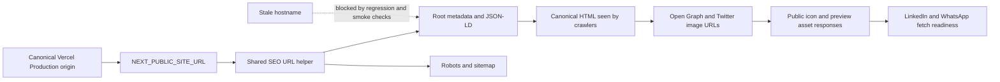

# Fix Social Preview Canonical Origin - Plan

## Goal Capsule

- **Objective:** Make Tidbits link previews resolvable by WhatsApp and LinkedIn by aligning production metadata with the final serving origin, `https://teedbits.vercel.app`.
- **Authority hierarchy:** The user's confirmed canonical-origin choice governs the product outcome; this plan's Key Technical Decisions govern the implementation shape; the existing SEO helper, Next.js App Router conventions, and Vercel deployment behavior govern unstated details.
- **Stop conditions:** Do not redesign the favicon or social artwork, hardcode the stale hostname into application code, add individual content routes, or claim that a third-party platform will refresh its cache immediately.
- **Execution profile:** Standard implementation and deployment-validation plan with an external configuration change.
- **Tail ownership:** The implementer owns repository changes, verification, and the Vercel production configuration handoff; external preview-cache behavior remains documented as a platform limitation.

---

## Product Contract

### Summary

Tidbits already publishes browser icons and a branded Open Graph image, but the production HTML points those metadata URLs at an obsolete Vercel project hostname. That hostname serves Vercel HTML instead of Tidbits assets, so link-preview crawlers cannot retrieve the image. The correction must make the real Tidbits deployment the single canonical origin and prove that every crawler-facing URL resolves from it.

### Problem Frame

The repository's metadata architecture is already appropriate: the root layout derives relative canonical and social paths from `metadataBase`, and the shared SEO URL helper makes `NEXT_PUBLIC_SITE_URL` authoritative in production. The defect is deployment configuration drift. The alias `https://tidbits-nine.vercel.app` redirects to the final serving origin `https://teedbits.vercel.app`, while generated metadata still references `https://tidbits-somsamantray-gmailcoms-projects.vercel.app`. The stale hostname currently returns a Vercel Overview page for asset paths, producing HTML where crawlers expect image content.

### Requirements

- R1. Production metadata must use `https://teedbits.vercel.app` as the final canonical public origin for the homepage, Open Graph URL, Twitter image URL, structured-data URL, robots URL, and sitemap URL.
- R2. The production configuration must not reference the stale `tidbits-somsamantray-gmailcoms-projects.vercel.app` hostname or any Vercel Preview URL.
- R3. The existing browser icon and social preview architecture must remain intact: favicon/icon assets serve browser and search surfaces, while the branded Open Graph image serves WhatsApp, LinkedIn, and other Open Graph consumers.
- R4. The homepage's server-rendered metadata must expose one internally consistent canonical URL and social image origin, with no conflicting absolute hostname in the emitted HTML.
- R5. Public GET requests to the favicon, icon, Apple icon, Open Graph image, robots, and sitemap surfaces must resolve from the final canonical origin with the expected content types, non-empty bodies, and no authentication wall.
- R6. The correction must include repository regression coverage that catches a stale or mismatched production origin before deployment.
- R7. Deployment documentation must identify the exact Production configuration, redeploy requirement, and post-deploy crawler checks.
- R8. Verification must distinguish application failures from third-party cache behavior and report separate `HTTP-ready`, `LinkedIn-verified`, and `WhatsApp-verified` outcomes.

### Acceptance Examples

- AE1. Given a Production deployment configured with the final canonical origin, the homepage's canonical, `og:url`, `og:image`, Twitter image, JSON-LD, robots, and sitemap values all use `https://teedbits.vercel.app`.
- AE2. Given a crawler requests `/opengraph-image.png`, `/favicon.ico`, `/icon.svg`, or `/apple-icon.png` from the canonical origin, the response is the intended public asset type rather than `text/html` from a Vercel account page.
- AE3. Given the stale hostname appears in a generated page or crawler route, the verification gate fails and identifies the unexpected origin instead of treating relative metadata unit tests as sufficient.
- AE4. Given LinkedIn or WhatsApp has cached an older preview, the operator can refresh or re-submit the URL and the result is reported as platform-unverified until corrected visible preview evidence exists.

### Scope Boundaries

**In scope:**

- Correcting and regression-testing the production-origin contract.
- Updating the SEO deployment guide and README production instructions to name the selected origin.
- Adding a repeatable public SEO smoke verification for HTML metadata and crawler-facing asset responses.
- Setting the Vercel Production environment value and redeploying the live project as an operational prerequisite.
- Verifying LinkedIn and WhatsApp readiness through their public preview workflows, while documenting cache limitations.

#### Deferred to Follow-Up Work

- Redesigning or regenerating the favicon, Apple icon, or Open Graph artwork.
- Adding individual tidbit URLs or per-tidbit social images.
- Automating LinkedIn, WhatsApp, Meta, or Google cache invalidation through private platform APIs.
- Attaching a custom domain or changing Vercel project ownership beyond ensuring the selected origin points to the Tidbits project.

**Outside this product's identity:**

- Changing trivia content, categories, database schema, engagement behavior, analytics events, or feed layout.
- Treating favicon display or social-card rendering as an application-controlled guarantee after correct metadata and assets are publicly served.

### Dependencies

- The Vercel project serving `https://teedbits.vercel.app` must be identified and have Production environment settings available to the operator.
- A Production redeploy must occur after changing the origin value because generated metadata is part of the deployment output/runtime contract.
- Public HTTP access to the canonical origin must remain unauthenticated for crawler requests.
- The existing Next.js 16 App Router metadata conventions remain available; current local Next.js guidance confirms that `metadataBase` resolves relative metadata URLs and file-based icons/OG images create crawler-facing tags and routes.

---

## Planning Contract

### Key Technical Decisions

- KTD1. **Use `https://teedbits.vercel.app` as the final canonical origin** *(session-settled: user-directed — chosen over the redirecting `tidbits-nine.vercel.app` alias: live verification showed that `teedbits.vercel.app` is the final serving origin)*. Keep the repository's shared origin helper and relative metadata paths; correct the Production environment rather than scattering absolute URLs through components.
- KTD2. **Treat the defect as configuration drift first.** Preserve the existing favicon, Apple icon, SVG icon, and Open Graph image unless public verification proves an independent asset defect. The observed failure is that metadata points to the wrong host, not that the assets are absent on the real host.
- KTD3. **Use both unit and public HTTP verification.** Metadata unit tests establish the configured-origin contract, while a production-like/public smoke check proves that rendered HTML and asset responses are crawler-visible. Relative metadata assertions alone are insufficient because they passed while the deployed absolute origin was wrong.
- KTD4. **Verify redirects separately from final responses.** The legacy `tidbits-nine.vercel.app` alias must not be used in generated metadata; validation records its redirect chain and requires the final canonical origin to serve the app directly. Unexpected redirects to an account page or another project remain a deployment-domain failure.
- KTD5. **Separate application readiness from platform cache refresh.** The implementation earns `HTTP-ready` only when exact emitted URLs and bodies are correct; LinkedIn and WhatsApp earn separate verified outcomes only when their visible preview evidence is corrected.

### High-Level Technical Design

The repository continues to express relative metadata paths through the shared `metadataBase` origin. Vercel Production supplies the final canonical origin, and a smoke verifier extracts the exact emitted absolute URLs before fetching their bodies. If the old hostname or redirecting alias appears, the gate fails before the deployment is considered ready.

### Assumptions

- `https://teedbits.vercel.app` is the intended final public URL for the current release; `https://tidbits-nine.vercel.app` is treated as a legacy alias and no custom domain should replace the final origin in this work.
- The current Vercel project mapping is correct or can be corrected through Vercel settings without application routing changes.
- No repository rewrite or middleware currently intercepts the icon, preview, robots, or sitemap paths; verification will retain a check for unexpected deployment routing.
- The existing `app/layout.tsx`, `lib/seo/site-url.ts`, and metadata route tests remain the canonical implementation seams.

### Sequencing

1. Strengthen the repository's canonical-origin regression contract and public smoke verifier.
2. Update the README and SEO-sharing guide with the selected Production origin and deployment procedure.
3. Set the Vercel Production environment value, redeploy, and verify the final public deployment and crawler assets.
4. Run LinkedIn and WhatsApp preview refresh checks and record cache behavior separately from application failures.

### System-Wide Impact

- **Public HTML:** Canonical, Open Graph, Twitter, and JSON-LD URLs change from the stale hostname to the live Tidbits origin after redeploy.
- **Crawler routes:** Robots and sitemap output must share the same normalized origin and must not reintroduce the stale hostname.
- **Static assets:** Browser icons and the 1200×630 Open Graph image remain unchanged in content but become reachable through the correct public origin.
- **Deployment operations:** Vercel Production configuration becomes a hard dependency for metadata correctness; a code-only deploy without the correct environment value is insufficient.
- **Third-party consumers:** LinkedIn and WhatsApp may cache old metadata. Their outcomes are recorded independently from HTTP readiness, not used to justify platform-specific application hacks.
- **Privacy/data:** No database, trivia, engagement, analytics, or private configuration data changes.

### Risks and Mitigation

- **Wrong Vercel project:** The selected hostname may point to a different project or redirect elsewhere. Mitigation: confirm the deployment/project mapping and inspect both redirecting and final responses before acceptance.
- **Environment set in the wrong target:** Preview or Development configuration may be changed while Production remains stale. Mitigation: explicitly target Vercel Production, redeploy, and inspect the deployed HTML.
- **Build-time/runtime drift:** The environment may be changed without producing a new deployment. Mitigation: require a redeploy and compare the generated metadata after it completes.
- **Relative metadata regression:** A future change may reintroduce an absolute stale URL or conflicting `metadataBase`. Mitigation: assert resolved absolute URLs and reject unexpected hostname references in smoke verification.
- **Cache mistaken for failure:** A platform may display an old preview after the origin is fixed. Mitigation: use LinkedIn's inspector and a fresh WhatsApp share, but report the platform as unverified until corrected visible evidence exists; direct HTTP checks establish only `HTTP-ready`.
- **False favicon diagnosis:** Social crawlers may not use the favicon for the card image. Mitigation: verify the Open Graph image independently and document the distinct browser-icon versus social-preview contracts.

### Sources & Research

- [Next.js favicon, icon, and Apple icon conventions](https://nextjs.org/docs/app/api-reference/file-conventions/metadata/app-icons) — confirms the App Router file conventions and emitted icon tags.
- [Next.js Open Graph image conventions](https://nextjs.org/docs/app/api-reference/file-conventions/metadata/opengraph-image) — confirms that Open Graph image metadata is the relevant contract for social and messaging previews.
- [Next.js metadata and OG images guide](https://nextjs.org/docs/app/getting-started/metadata-and-og-images) — confirms server-rendered metadata and static preview asset behavior.
- [Open Graph protocol](https://ogp.me/) — defines the standard title, URL, image, and image metadata consumed by social link-preview systems.
- Repository live inspection — `tidbits-nine.vercel.app` redirects to `teedbits.vercel.app`; the final host serves Tidbits HTML and expected asset content types, while the stale project hostname serves Vercel Overview HTML for the same asset paths.
- Existing implementation and deployment guide — `app/layout.tsx`, `lib/seo/site-url.ts`, `README.md`, and `docs/seo-sharing.md` establish the current origin contract and verification surfaces.

External research was load-bearing: it confirmed that the favicon is not the social-preview image contract, validated the existing Next.js file conventions, and shaped the separate metadata, asset, redirect, and cache verification gates.

---

## Implementation Units

### U1. Harden the canonical-origin regression contract

**Goal:** Make repository tests fail when the configured production origin is stale, mismatched, or inconsistent across metadata and crawler surfaces.

**Requirements:** R1, R2, R4, R6.

**Dependencies:** None.

**Files:**

- `app/layout.test.ts`
- `lib/seo/site-url.test.ts`
- `app/robots.test.ts`
- `app/sitemap.test.ts`
- `scripts/verify-public-seo.ts`
- `scripts/verify-public-seo.test.ts`
- `package.json`

**Approach:**

1. Make the settled Production origin the explicit fixture for metadata and URL-resolution tests.
2. Resolve the metadata object into absolute URLs in tests instead of asserting only relative paths.
3. Add a small public-seo verifier that extracts the homepage's exact metadata URLs, checks stale-host/alias absence, follows and records redirects, fetches real response bodies, and validates crawler routes and asset content types.
4. Keep the verifier read-only and parameterized by the public origin so it can validate both the selected deployment and future custom-origin deployments without changing application code.

**Patterns to follow:** Reuse `getSiteUrl`, `getSiteAssetUrl`, the existing metadata route tests, and the repository's TypeScript scripts. Keep production-origin validation in the shared helper; do not duplicate URL parsing or hardcode old-host workarounds.

**Test scenarios:**

- **Happy path:** The canonical production origin resolves the homepage canonical URL, `og:url`, `og:image`, Twitter image, JSON-LD URL, robots sitemap URL, and sitemap location to the same origin.
- **Regression path:** A stale production origin is detected as an unexpected hostname and causes the public-seo verification to fail.
- **Asset path:** The verifier fetches the exact `og:image` and Twitter image URLs emitted in HTML, including generated query strings, and rejects HTML, empty bodies, or unexpected content types.
- **Redirect path:** The verifier records an initial redirect separately from the final response and fails when the final destination is not the selected canonical origin.
- **Configuration edge cases:** Existing HTTPS-only, origin-only, malformed URL, Preview fallback, and asset-resolution helper behaviors remain covered.

**Verification:** Unit tests prove the origin contract, and the verifier can inspect a public deployment without credentials or mutation.

### U2. Align operator documentation with the selected Production origin

**Goal:** Ensure deployment instructions no longer encourage operators to leave the stale hostname in Vercel or mistake a favicon issue for an Open Graph image issue.

**Requirements:** R1, R2, R3, R7, R8.

**Dependencies:** U1.

**Files:**

- `README.md`
- `docs/seo-sharing.md`
- `.env.local.example`

**Approach:**

1. Name `https://teedbits.vercel.app` as the current final Production origin and identify `tidbits-nine.vercel.app` as a legacy redirecting alias.
2. State that the Vercel Production environment value must be changed and redeployed, not merely saved.
3. Distinguish favicon/icon requests from `og:image` requests and explain which surface WhatsApp and LinkedIn use.
4. Add direct checks for the generated hostname, asset content type, robots, sitemap, and stale-host absence.
5. Preserve the warning that third-party preview caches may require inspector refresh or a fresh share.

**Patterns to follow:** Keep the existing beginner-friendly checklist and avoid documenting secrets, account-specific tokens, or private deployment identifiers.

**Test scenarios:**

- **Documentation contract:** A new operator can identify the exact Production origin and the required redeploy step without inferring whether to edit application code.
- **Surface distinction:** The guide separately names browser icons and the Open Graph image as different preview surfaces.
- **Cache explanation:** The guide explains how to distinguish a stale LinkedIn/WhatsApp cache from a failed public asset response.

**Test expectation:** none — this unit changes operator guidance only; executable documentation claims are exercised by U1 and U3.

**Verification:** Documentation examples and instructions contain no stale hostname and match the public verification contract.

### U3. Correct Vercel Production configuration and validate the live deployment

**Goal:** Redeploy the actual Tidbits project with the selected final canonical origin and prove that crawler-facing metadata and assets are publicly correct.

**Requirements:** R1, R2, R4, R5, R8.

**Dependencies:** U1, U2.

**Files:**

- Vercel Production environment configuration for the project serving `https://teedbits.vercel.app` (external operational surface)
- `scripts/verify-public-seo.ts`
- `docs/seo-sharing.md`

**Approach:**

1. Confirm the selected hostname is assigned to the intended Tidbits Vercel project.
2. Set the Production origin to `https://teedbits.vercel.app` and redeploy Production.
3. Extract the exact canonical, `og:image`, and Twitter image URLs from the deployed HTML, then fetch those exact URLs with real GET requests and redirect inspection enabled.
4. Confirm direct responses for the homepage, Open Graph image, favicon, SVG icon, Apple icon, robots, and sitemap.
5. Run LinkedIn Post Inspector and a fresh WhatsApp share; report `LinkedIn-verified` or `WhatsApp-verified` only when the corrected preview is visibly shown, otherwise report the platform as unverified with the bounded refresh procedure.

**Execution note:** This unit is smoke-first and fail-closed. Do not declare the fix complete from a successful Vercel deployment alone; the public origin, generated absolute metadata, and asset response types must be inspected after redeploy.

**Test scenarios:**

- **Production happy path:** The deployed homepage contains only `https://teedbits.vercel.app` in canonical and social metadata.
- **Asset integration:** All named public icon and preview paths return the expected content types without authentication.
- **Crawler integration:** Robots and sitemap use the same canonical origin and do not expose the stale host.
- **Failure path:** If the deployment emits the stale host, redirecting alias, HTML/empty asset body, or off-origin final response, validation stops and identifies the misconfiguration rather than accepting a cache explanation.
- **External cache path:** If exact emitted URLs and bodies pass but a platform shows an old image, the result is `HTTP-ready` but platform-unverified; perform the platform-specific refresh action and record the visible outcome separately.

**Verification:** The live public deployment passes the verifier and direct body checks, with independent `HTTP-ready`, `LinkedIn-verified`, and `WhatsApp-verified` results recorded.

---

## Verification Contract

| Gate | Applies to | Done signal |
|---|---|---|
| Metadata and URL unit tests | U1 | Resolved absolute metadata uses only the selected origin; malformed/stale-origin cases fail. |
| Public SEO verifier tests | U1 | HTML, metadata, redirect, asset-type, robots, and sitemap checks cover the observed failure. |
| Documentation review | U2 | README and SEO guide name the selected origin, redeploy step, surface distinction, and cache limitation without stale-host references. |
| Full test suite | U1–U3 | `npm test` passes with the new origin and verifier coverage. |
| Lint | U1–U3 | `npm run lint` passes. |
| Production build | U1–U3 | `npm run build` passes with `NEXT_PUBLIC_SITE_URL=https://teedbits.vercel.app` supplied outside the repository. |
| Public deployment smoke check | U3 | Canonical HTML and crawler-facing routes contain the final origin; exact emitted asset URLs return non-empty expected bodies and content types. |
| External preview check | U3 | Results are separately recorded as HTTP-ready, LinkedIn-verified, or WhatsApp-verified; cache delay is not treated as visible platform verification. |

---

## Definition of Done

- Production metadata uses `https://teedbits.vercel.app` consistently for canonical, Open Graph, Twitter, JSON-LD, robots, and sitemap URLs.
- The stale project hostname is absent from generated HTML, crawler routes, and operator documentation.
- Favicon/icon assets and the Open Graph image are verified as distinct public surfaces with correct content types.
- Regression tests fail on stale or inconsistent origins instead of passing on relative metadata alone.
- The Vercel Production value is corrected and a new Production deployment is completed.
- The public deployment passes direct HTML, redirect, asset, robots, and sitemap checks without authentication.
- LinkedIn and WhatsApp preview behavior is checked with separate verification outcomes; any remaining delay is documented as platform-unverified rather than misdiagnosed as repository success.
- `npm test`, `npm run lint`, and the production build pass.
- No trivia content, database, engagement, analytics, or feed behavior changes.
