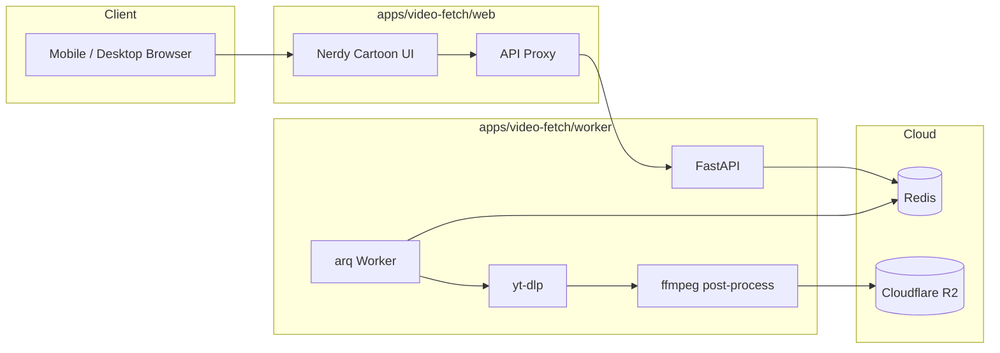
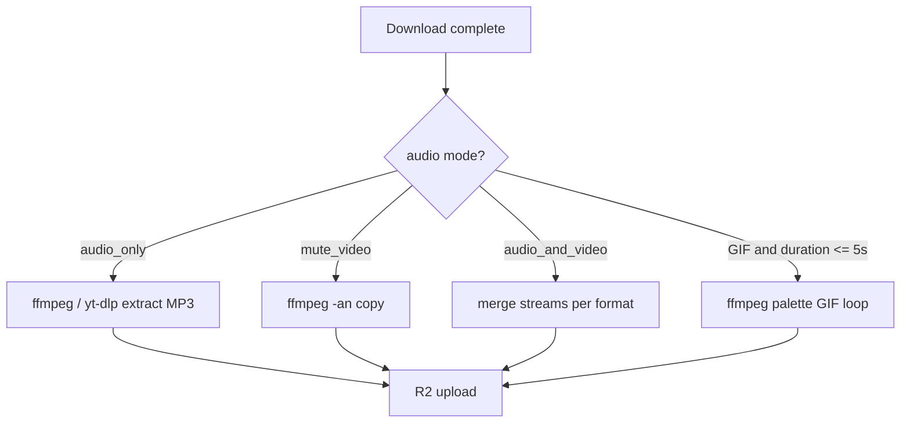

# Personal Video Downloader Webapp - Plan

## Goal Capsule

**Objective:** Ship a cloud-deployed personal web app in `apps/video-fetch/` where you paste batch video URLs, pick audio mode, format, and quality, optionally export short clips as looping GIFs, and download results to desktop or phone — wrapped in a nerdy, cartoonish UI that stays dead simple to operate.

**Authority hierarchy:** This plan's Product Contract defines behavior. Key Technical Decisions override incidental implementation choices. Repo conventions in the parent Orca-Project apply only where this plan does not specify otherwise.

**Stop conditions:** Halt and surface a blocker if a session-settled decision (cloud deploy, no auth, batch v1) is contradicted by platform constraints, or if a platform cannot be made to work without scope change.

**Execution profile:** Greenfield app folder inside the existing repo. Split stack: Next.js UI + Python worker. Not serverless for media processing.

**Tail ownership:** `ce-work` or manual implementation follows Implementation Units in dependency order.

**Product Contract preservation:** unchanged for this revision — adds implementation detail for Instagram, Threads, and Loom cookie/download wiring (R14, R2) without changing product scope.

---

## Product Contract

### Summary

A personal cloud web app accepts batch URLs from fifteen video platforms, lets you choose audio-only / audio+video / mute-video, pick MP3/MP4/WebM/GIF and resolution up to 8K+ with smart fallback, processes downloads asynchronously, and delivers files via presigned links — all through a geeky caricature-styled interface with a mascot-led empty states and progress feedback.

### Problem Frame

Saving videos from many social and stock sites for a personal project means fighting CLI flags, platform quirks, and format trade-offs. A single nerdy-but-friendly UI that handles batch input, audio modes, quality fallback, short-loop GIF export, and mobile downloads removes that friction.

### Requirements

#### Core download flow

- R1. The app accepts one or more video URLs in a single submission, including playlist URLs where the source supports them.
- R2. Supported platforms at launch: YouTube, LinkedIn, Instagram, X (Twitter), Reddit, 9GAG, Facebook, Threads, Vimeo, Snapchat (Spotlight), Loom, Pinterest, Pexels, Unsplash, and Tumblr.
- R3. The user selects an **audio track mode**: Audio only, Audio + Video, or Mute video (video container with no audio track).
- R4. The user selects an **output container**: MP3 (audio-only mode only), MP4, WebM, or GIF (short clips only — see R12).
- R5. For video containers, the user selects a **target quality cap**: 8K+, 4K, 2160p, 1080p, 720p, 480p, or 360p. When the requested cap is unavailable, the worker picks the **best available format at or below** that cap and records what was actually delivered.
- R6. After submission, the app shows per-URL and overall job progress until each item completes or fails with a clear, platform-aware error.
- R7. Completed items expose a download action that works on desktop and mobile browsers.

#### GIF and post-processing

- R12. When the user selects GIF output and the source duration is **5 seconds or less**, the worker produces a **looping GIF** (seamless loop via ffmpeg `loop` filter). Sources longer than 5 seconds disable GIF in the UI with an explanatory tooltip.
- R13. Mute-video mode strips audio after download if the source muxed audio; audio-only mode never includes a video stream.

#### Platform and reliability

- R14. Public URLs work without in-app login; optional platform cookies may be configured via environment for age-restricted or bot-check content.
- R15. When a platform blocks datacenter IPs or requires impersonation, the worker applies yt-dlp mitigations (`curl-cffi`, `--impersonate` where needed) and surfaces actionable failure messages.
- R16. Playlist expansion happens server-side with a configurable batch cap.

#### UI and personal-use posture

- R17. The UI uses a **nerdy / geeky caricature design system**: chunky borders, pastel-or-terminal accent palette, display font with monospace labels, a small mascot character in empty/loading/success/error states, and large tap-friendly controls — inspired by cartoon design systems (one mascot moment per screen, secondary to CTAs) without cluttering the download flow.
- R18. Core controls remain **minimal and obvious**: URL textarea, three audio-mode toggles, format chips, quality dropdown, submit — no advanced panel unless the user expands "Nerd knobs" (optional cookie hint, filename template).
- R19. A brief personal-use / rights disclaimer appears before the first download.

- R20. Downloaded files expire from object storage after 24 hours (configurable).

### Scope Boundaries

**In scope:** Fifteen platforms (best-effort where yt-dlp is thin), batch/playlist jobs, audio modes, quality fallback, GIF for ≤5s clips, async processing, cloud deployment, presigned delivery, nerdy cartoon UI, optional cookies.

**Out of scope:** User accounts or OAuth, public multi-tenant hosting, browser extensions, content discovery/search, manual video editing, guaranteed DRM/login-walled content, monetization.

#### Deferred to Follow-Up Work

- Optional password gate or Cloudflare Access.
- PO Token sidecar for YouTube datacenter reliability.
- ZIP download of an entire batch.
- Custom extractors for Pexels/Unsplash if generic URL handler proves insufficient.
- PWA install prompt polish.

### Success Criteria

- Batch of three YouTube URLs completes with correct audio mode and quality fallback messaging when 4K is requested but only 1080p exists.
- Looping GIF export works for a sub-5s clip.
- Mute-video download plays with no audio track.
- UI reads as nerdy/cartoonish on mobile and desktop (mascot visible in loading state).
- At least one successful metadata fetch and download each from **Instagram** (with worker cookies), **Loom** (no cookies), and **Threads** (with worker cookies when yt-dlp extractor supports the URL).
- At least one successful download from X and Vimeo.
- Pexels/Unsplash documented as best-effort tier in platform docs.

---

## Planning Contract

### Key Technical Decisions

- **KTD1 — Split stack (Next.js UI + Python worker)** `(session-settled: user-directed — chosen over single Next.js API spawning yt-dlp)`

  Next.js in `apps/video-fetch/web` serves UI and proxies API. Python FastAPI in `apps/video-fetch/worker` owns yt-dlp, ffmpeg, and jobs.

- **KTD2 — yt-dlp as the extraction engine**

  Covers most target platforms natively. Install `yt-dlp[default,curl-cffi]`, pin nightly in Docker, auto-update on deploy.

- **KTD3 — Redis job queue with arq**

  Durable async processing for batch and playlist expansion.

- **KTD4 — Object storage with presigned URLs**

  Cloudflare R2; presigned GET with `Content-Disposition: attachment`.

- **KTD5 — Railway deployment** `(session-settled: user-directed — chosen over local-first)`

  Web, worker, and Redis as separate Railway services.

- **KTD6 — No authentication** `(session-settled: user-directed — chosen over password gate)`

  Obscure URL plus rate limiting; user accepts exposure risk.

- **KTD7 — Batch/playlist in v1** `(session-settled: user-directed — chosen over single-URL-only)`

- **KTD8 — Nerdy caricature design system** `(session-settled: user-directed — chosen over minimal neutral UI: user requested geeky cartoon UX)`

  Visual language: cream/ink base (compatible with parent Tidbits palette vocabulary), thick `2px` comic borders, rounded-xl cards, monospace labels for technical fields (`format`, `codec`, `actual_quality`), one mascot SVG set (idle, loading, party, oops) used in empty state, progress panel, and error rows — max one mascot per viewport. Reference parent repo's cartoon patterns (`app/globals.css` pastel accents, doodle backgrounds) but give video-fetch its own mascot and terminal-green accent for "nerd" flavor. No competing illustrations per screen (cartoon design system rule).

- **KTD9 — Quality fallback algorithm**

  Map user cap to max height: 8K+ → 4320, 4K → 2160, 2160p → 2160, 1080p → 1080, 720p → 720, 480p → 480, 360p → 360. yt-dlp format string selects `bv*[height<=N]+ba/b` best at or below N. Response payload includes `requested_quality` and `delivered_quality` so UI can show "Wanted 4K · got 1080p" in a friendly chip.

- **KTD10 — Post-processing pipeline for audio modes and GIF**

  yt-dlp downloads to temp file; ffmpeg post-step applies: mute (`-an`), audio-only extract (`-vn` or `-x`), or GIF (`fps=12,scale=480:-1:flags=lanczos,palettegen` + `paletteuse` + `loop=0` for ≤5s). Duration gate reads metadata from yt-dlp JSON before enqueueing GIF jobs.

- **KTD11 — Centralized yt-dlp cookie injection** `(session-settled: user-directed — chosen over per-call ad-hoc flags)`

  Add `apps/video-fetch/worker/app/cookies.py` with `cookie_args_for_platform(platform: str) -> list[str]`. Resolve `PlatformInfo.cookie_env` to a filesystem path; if the path exists and is readable, prepend `["--cookies", path]` to every yt-dlp invocation (metadata and download). If the env var is unset or the file is missing, return `[]` and let public URLs attempt without cookies. Never log cookie values or write them to job records.

- **KTD12 — Meta platform cookie file shape (Instagram + Threads)**

  Instagram requires a Netscape cookie file with at minimum `sessionid`, `csrftoken`, and `ds_user_id` for `.instagram.com`. Threads uses the same Meta session family — the cookie file should also include entries for `.threads.com` and `.threads.net` when Threads posts are in scope. Prefer a single mounted secret at `YTDLP_COOKIES_INSTAGRAM` for Instagram-only tests and `YTDLP_COOKIES_THREADS` for Threads (may duplicate the same Meta session across domains). Do not accept raw token key/value pairs in API requests — only file paths via env/secrets.

- **KTD13 — Loom needs no cookies; verify plain yt-dlp path**

  Loom public share URLs work with vanilla yt-dlp (validated July 2026). No cookie env for Loom. Failures on Loom are likely missing download pipeline (U3), not authentication.

### Assumptions

- Optional Netscape cookies via secrets for Instagram, YouTube, Facebook, Threads when bot checks appear. User-provided Instagram session validated against reel `DbLoOCRBqqf` — see Appendix cookie validation.
- Threads extractor health depends on yt-dlp version; keep nightly pin and document when `threads.com` URLs fail with `Unsupported URL` or generic 404 until upstream fix or Threads-specific cookie export.
- LinkedIn, Reddit, Snapchat are best-effort on public URLs.
- Pexels and Unsplash may work via yt-dlp generic extractor or direct MP4 URL parsing; if not, document limitation and defer custom extractor.
- Cloud spend (Railway + R2) is acceptable.

### High-Level Technical Design

**Processing branches by audio mode**

### System-Wide Impact

- New isolated `apps/video-fetch/` tree; parent Tidbits untouched.
- Root `.gitignore` should ignore worker temp dirs and download artifacts.

### Risks and Dependencies

| Risk | Mitigation |
|------|------------|
| Instagram/Threads cookie expiry | Document re-export flow; surface "refresh cookies" in errors |
| Threads yt-dlp extractor gaps on threads.com | Pin nightly; fallback error message; track upstream issues |
| Pexels/Unsplash not first-class in yt-dlp | Generic extractor + follow-up custom handler |
| GIF palette step is CPU-heavy | Only allow GIF when duration ≤5s |
| 8K+ rarely available | Fallback UX shows delivered quality |
| No auth on public URL | Rate limit + obscure URL |
| Large batch fills disk | Concurrency 2, max batch 50, delete local after R2 upload |

### Open Questions

- **Threads cookies:** User provided Instagram session only. Threads may need a separate export from `threads.com` while logged in, or duplicated Meta cookies on `.threads.com` / `.threads.net` domains — verify during U9 with user's Threads URL.
- Secret path prefix remains optional in U5.

---

## Implementation Units

### U1. Monorepo scaffold

**Goal:** Create isolated `apps/video-fetch/` layout with dev tooling and shared types.

**Requirements:** R1

**Dependencies:** None

**Files:**
- `apps/video-fetch/README.md`
- `apps/video-fetch/package.json`
- `apps/video-fetch/docker-compose.yml`
- `apps/video-fetch/.env.example`
- `apps/video-fetch/packages/shared-types/src/index.ts`
- `apps/video-fetch/.gitignore`

**Approach:** npm workspaces with `web`, `worker`, `packages/shared-types`. Shared types include `AudioMode`, `OutputFormat`, `QualityCap`, `Platform`, `JobStatus`, `DeliveredQuality`.

**Test scenarios:**
- Happy path: `docker compose config` validates.
- Edge case: `.env.example` lists all compose-referenced variables.

**Verification:** `docker compose up` starts Redis and stub services.

---

### U2. Python worker — metadata, platforms, and format API

**Goal:** Validate URLs across fifteen platforms; return duration, available qualities, and whether GIF is allowed.

**Requirements:** R2, R5, R12, R14, R15

**Dependencies:** U1

**Files:**
- `apps/video-fetch/worker/pyproject.toml`
- `apps/video-fetch/worker/Dockerfile`
- `apps/video-fetch/worker/app/main.py`
- `apps/video-fetch/worker/app/extractors.py`
- `apps/video-fetch/worker/app/platforms.py`
- `apps/video-fetch/worker/tests/test_extractors.py`
- `apps/video-fetch/worker/tests/test_platforms.py`

**Approach:** `platforms.py` maps hostnames to platform enum (all fifteen). `POST /metadata` returns `{ platform, title, duration_seconds, gif_eligible: duration <= 5, qualities_available[], warnings[] }`. Pexels/Unsplash flagged as `tier: experimental`. Cookie paths from env per platform — **wired in U9** via `cookies.py` and passed to `_run_ytdlp`.

**Test scenarios:**
- Happy path: YouTube URL returns qualities including 1080p and `gif_eligible` false for 60s video.
- Happy path: 3s clip returns `gif_eligible: true`.
- Edge case: unknown host → 400 unsupported platform.
- Edge case: LinkedIn URL returns warning about public-only content.
- Error path: Reddit block stderr maps to impersonation guidance.

**Verification:** pytest passes; manual metadata call for public YouTube URL.

---

### U3. Job queue, download pipeline, and quality fallback

**Goal:** Async batch jobs with audio modes, quality caps, and delivered-quality reporting.

**Requirements:** R1, R3, R4, R5, R6, R13, R16, KTD7, KTD9

**Dependencies:** U2

**Files:**
- `apps/video-fetch/worker/app/jobs.py`
- `apps/video-fetch/worker/app/worker_settings.py`
- `apps/video-fetch/worker/app/download.py`
- `apps/video-fetch/worker/app/formats.py`
- `apps/video-fetch/worker/tests/test_jobs.py`
- `apps/video-fetch/worker/tests/test_download.py`
- `apps/video-fetch/worker/tests/test_formats.py`

**Approach:** `POST /jobs` body: `{ urls, audio_mode, output_format, quality_cap }`. `formats.py` builds yt-dlp format strings from KTD9 height map. After download, branch on audio mode. Job items store `requested_quality` and `delivered_quality`. Playlist expansion with `MAX_BATCH_SIZE`. All yt-dlp download subprocess calls use `cookie_args_for_platform()` from U9.

**Test scenarios:**
- Happy path: audio_only + MP3 produces audio file only.
- Happy path: mute_video output has no audio stream (ffprobe assertion in test).
- Happy path: request 4K, mock metadata max 1080p → `delivered_quality: 1080p`.
- Happy path: batch of three URLs → three child jobs.
- Error path: one child fails; parent shows partial success.

**Verification:** pytest covers format strings and job expansion.

---

### U4. Post-processing — looping GIF and ffmpeg helpers

**Goal:** Convert short clips to looping GIFs; shared ffmpeg utilities for mute and extract.

**Requirements:** R12, R13

**Dependencies:** U3

**Files:**
- `apps/video-fetch/worker/app/postprocess.py`
- `apps/video-fetch/worker/tests/test_postprocess.py`

**Approach:** `to_looping_gif(input, output)` uses two-pass palette method for quality. Reject duration >5s with clear error. `strip_audio`, `extract_audio` helpers called from download pipeline.

**Test scenarios:**
- Happy path: 2s sample video → GIF with `loop` metadata (frame count > 1 loop).
- Edge case: 6s video → error "GIF only for videos 5 seconds or shorter".
- Happy path: mute_video removes audio track.

**Verification:** pytest with bundled short test clip fixture.

---

### U5. Object storage, presigned delivery, and cleanup

**Goal:** Upload to R2, presigned URLs, TTL cleanup.

**Requirements:** R7, R20

**Dependencies:** U3, U4

**Files:**
- `apps/video-fetch/worker/app/storage.py`
- `apps/video-fetch/worker/app/cleanup.py`
- `apps/video-fetch/worker/tests/test_storage.py`

**Approach:** Unchanged core from prior draft; content-type per format (image/gif for GIF).

**Test scenarios:**
- Happy path: GIF upload sets `image/gif` content-type.
- Happy path: cleanup removes expired objects.

**Verification:** pytest passes; manual presigned download works.

---

### U6. Nerdy cartoon web UI

**Goal:** Mobile-friendly, geeky caricature interface for the full download flow.

**Requirements:** R1, R3, R4, R5, R6, R17, R18, R19, KTD8

**Dependencies:** U3, U5

**Files:**
- `apps/video-fetch/web/package.json`
- `apps/video-fetch/web/app/globals.css`
- `apps/video-fetch/web/app/layout.tsx`
- `apps/video-fetch/web/app/page.tsx`
- `apps/video-fetch/web/app/api/[...path]/route.ts`
- `apps/video-fetch/web/components/url-input.tsx`
- `apps/video-fetch/web/components/audio-mode-picker.tsx`
- `apps/video-fetch/web/components/format-quality-picker.tsx`
- `apps/video-fetch/web/components/job-progress.tsx`
- `apps/video-fetch/web/components/mascot.tsx`
- `apps/video-fetch/web/components/disclaimer-banner.tsx`
- `apps/video-fetch/web/lib/design-tokens.ts`
- `apps/video-fetch/web/public/mascot/*.svg`
- `apps/video-fetch/web/tests/format-quality-picker.test.tsx`

**Approach:** Single-page layout on doodle or grid-paper background. **Audio mode:** three large segmented buttons (icons: headphone / speaker+screen / muted). **Format:** chip row MP4 | WebM | MP3 | GIF — GIF chip disabled with tooltip when any URL in textarea reports `gif_eligible: false` (debounced metadata preview optional). **Quality:** dropdown 8K+ through 360p; hidden when MP3 selected. **Mascot:** `mascot.tsx` swaps SVG by job state (idle wizard with clipboard, spinning gears loading, confetti success, sad error). Monospace `font-mono` for quality delivered chips. Comic shadow on primary CTA (`box-shadow` offset). Collapsible "Nerd knobs" accordion for advanced hints only.

**Patterns to follow:** Parent Tidbits cartoon borders and pastel accents (`app/globals.css`); do not import Tidbits React components — copy token ideas into `design-tokens.ts`.

**Test scenarios:**
- Happy path: selecting Audio only hides video quality and enables MP3 only.
- Happy path: GIF chip disabled when metadata says duration >5s.
- Happy path: delivered quality chip shows "Got 720p" when fallback occurred.
- Happy path: mascot renders `loading` variant while job in progress.
- Edge case: empty URL list disables submit.

**Verification:** `npm test` passes; manual check on mobile viewport; UI feels nerdy and simple per R17/R18.

---

### U7. Docker and Railway deployment

**Goal:** Production containers and Railway services.

**Requirements:** KTD5, R20

**Dependencies:** U1–U6

**Files:**
- `apps/video-fetch/worker/Dockerfile`
- `apps/video-fetch/web/Dockerfile`
- `apps/video-fetch/railway.toml`
- `apps/video-fetch/scripts/deploy-check.sh`
- `apps/video-fetch/README.md`

**Approach:** Worker image includes ffmpeg, yt-dlp with curl-cffi. Web standalone Next.js build.

**Test expectation:** none — smoke verification only.

**Verification:** Railway deploy; `deploy-check.sh` passes; phone download works.

---

### U8. Platform resilience, tiers, and operator docs

**Goal:** Document all fifteen platforms with reliability tiers; rate limiting; error UX.

**Requirements:** R14, R15, R19

**Dependencies:** U2, U6, U7

**Files:**
- `apps/video-fetch/worker/app/rate_limit.py`
- `apps/video-fetch/worker/app/errors.py`
- `apps/video-fetch/docs/platforms.md`
- `apps/video-fetch/docs/ui-design.md`
- `apps/video-fetch/worker/tests/test_errors.py`

**Approach:** `platforms.md` table: Platform | yt-dlp extractor | Tier (reliable / cookies-recommended / best-effort / experimental) | Notes. Tiers: **Reliable** — YouTube, Vimeo, Loom, 9GAG; **Cookies recommended** — Instagram, Facebook, Threads; **Best-effort** — X, Reddit, LinkedIn, Pinterest, Tumblr, Snapchat Spotlight; **Experimental** — Pexels, Unsplash. `ui-design.md` captures mascot usage rules and nerdy cartoon tokens for future edits.

**Test scenarios:**
- Happy path: each platform enum has a doc row.
- Happy path: rate limit returns 429 in unit test.

**Verification:** docs cover all fifteen platforms; pytest passes.

---

### U9. Instagram, Threads, and Loom — cookie wiring and platform verification

**Goal:** Wire `YTDLP_COOKIES_*` env paths into all yt-dlp calls; verify metadata (and download when U3 lands) for Instagram, Threads, and Loom with real fixture URLs.

**Requirements:** R2, R6, R14, KTD11, KTD12, KTD13

**Dependencies:** U2 (metadata scaffold); U3 for end-to-end download proof

**Files:**
- `apps/video-fetch/worker/app/cookies.py`
- `apps/video-fetch/worker/app/extractors.py`
- `apps/video-fetch/worker/app/download.py` (when U3 creates it)
- `apps/video-fetch/worker/tests/test_cookies.py`
- `apps/video-fetch/worker/tests/test_extractors.py`
- `apps/video-fetch/worker/tests/fixtures/platform_urls.json`
- `apps/video-fetch/worker/scripts/test_platform_urls.py`
- `apps/video-fetch/docs/platforms.md`
- `apps/video-fetch/.env.example`
- `apps/video-fetch/docker-compose.yml` (mount secrets volume for local dev)
- `apps/video-fetch/.gitignore` (ignore `secrets/`)

**Approach:**

1. **`cookies.py`** — `cookie_args_for_platform(platform: str) -> list[str]` looks up `PlatformInfo` by platform id, reads `os.environ[cookie_env]`, returns `["--cookies", path]` only when path exists. Add `cookies_configured(platform) -> bool` for warnings in metadata response.

2. **`extractors.py`** — Change `_run_ytdlp(args, *, platform: str | None = None)` to prepend cookie args when platform is known. Update `fetch_metadata` to pass `info.platform`. Replace generic "may need cookies" warning with `"cookies_required": true` when tier is `cookies_recommended` and file is missing.

3. **Cookie file format (operator docs)** — Document Netscape format. Minimum Instagram cookies:
   - `sessionid` — value is the long colon-separated string (URL-decode `%3A` → `:` if exporting from browser devtools)
   - `csrftoken`
   - `ds_user_id` — numeric user id
   For Threads, duplicate the same three cookies on `.threads.com` and `.threads.net` in the same file or mount separate `YTDLP_COOKIES_THREADS`.

4. **Loom** — No cookie env. Add integration test that public share URL returns metadata without cookies. Confirm download subprocess uses same code path.

5. **Local dev** — `docker-compose.yml` mounts `./secrets:/secrets:ro`; `.env.example` shows `YTDLP_COOKIES_INSTAGRAM=/secrets/instagram.txt`. Never commit `secrets/`.

6. **Fixtures** — Keep user URLs: Instagram reel `DbLoOCRBqqf`, Threads `DayLc-Sj5Xa`, Loom `cc473529992342f1b9e8a90f04ece796`.

**Patterns to follow:** ReClip-style plain yt-dlp subprocess (`averygan/reclip` `app.py`) — no platform-specific extractors in app code; cookies are the only Instagram/Threads differentiator.

**Test scenarios:**
- Happy path: `cookie_args_for_platform("instagram")` returns `["--cookies", path]` when env set and file exists.
- Happy path: missing cookie file returns `[]` without raising.
- Happy path: with test cookie fixture (gitignored or mocked path), Instagram reel metadata returns `title` and `formats` length > 0.
- Happy path: Loom share URL metadata succeeds with no cookie args.
- Edge case: `cookies_recommended` platform without file → metadata response includes `cookies_required: true` and actionable warning.
- Error path: Instagram without cookies → stderr contains empty media / login message; mapped by `errors.py`.
- Integration scenario: `test_platform_urls.py` reports `metadata_pass` for Instagram (cookies env in CI optional via secret) and Loom (always).

**Verification:** `pytest apps/video-fetch/worker/tests/test_cookies.py`; manual `YTDLP_COOKIES_INSTAGRAM=/secrets/instagram.txt` metadata call succeeds for user reel URL.

---

## Verification Contract

From `apps/video-fetch/`:

| Gate | Command / action |
|------|------------------|
| Worker unit tests | `cd worker && pytest` |
| Web unit tests | `cd web && npm test` |
| Worker lint | `cd worker && ruff check .` |
| Web lint | `cd web && npm run lint` |
| Local integration | `docker compose up` → batch download + GIF + mute test |
| Instagram cookies | Mount `secrets/instagram.txt`; metadata for reel `DbLoOCRBqqf` |
| Loom smoke | Metadata for public Loom share without cookies |
| Deploy smoke | `./scripts/deploy-check.sh` |
| UI check | Mobile viewport: mascot + audio mode + quality fallback chip visible |

---

## Definition of Done

**Global**

- [ ] Fifteen platforms listed in `docs/platforms.md` with tier
- [ ] Audio-only, mute, and audio+video modes work end-to-end
- [ ] Quality fallback shows delivered vs requested in UI
- [ ] Looping GIF works for ≤5s clip
- [ ] Nerdy cartoon UI shipped with mascot states
- [ ] Deployed on Railway; phone download works
- [ ] No secrets committed

**Per unit**

| Unit | Done when |
|------|-----------|
| U1 | Compose starts; shared types exported |
| U2 | Metadata returns duration and gif_eligible |
| U3 | Batch job with quality fallback recorded |
| U4 | Looping GIF and mute post-process tested |
| U5 | Presigned download + GIF content-type |
| U6 | Full UI flow on mobile; mascot animates on load |
| U7 | Railway smoke passes |
| U8 | Platform docs + rate limit active |
| U9 | Cookie args injected; Instagram metadata works with secret file; Loom without cookies |

---

## Appendix

### Platform support reference (yt-dlp, July 2026)

| Platform | Extractor | Expected tier |
|----------|-----------|---------------|
| YouTube | youtube | Reliable (cookies for bot check) |
| Vimeo | vimeo | Reliable |
| Loom | loom | Reliable |
| 9GAG | ninegag | Reliable |
| Instagram | instagram | Cookies recommended |
| Facebook | facebook | Cookies recommended |
| Threads | threads | Cookies recommended |
| X | twitter | Best-effort |
| Reddit | reddit | Best-effort |
| LinkedIn | linkedin | Best-effort (public only) |
| Pinterest | pinterest | Best-effort |
| Tumblr | tumblr | Best-effort |
| Snapchat | snapchatspotlight | Best-effort (Spotlight only) |
| Pexels | generic / TBD | Experimental |
| Unsplash | generic / TBD | Experimental |

### UI research sources

- Cartoon design system discipline: one character per screen, secondary to CTAs ([Cartoonstock blog](https://www.cartoonstock.com/blog/cartoon-design-system-best-practices-for-using-cartoons-in-ui-and-product-design/))
- Mascot placement for loading, empty, success, error ([Ziggle placements guide](https://ziggle.art/app-mascot-placements))
- Parent repo Tidbits already uses pastel cartoon styling — video-fetch extends with nerd/terminal accents rather than cloning

### Format and quality reference

| User choice | Worker behavior |
|-------------|-----------------|
| Audio only + MP3 | `yt-dlp -x --audio-format mp3` |
| Audio + Video + MP4 1080p | `bv*[height<=1080][ext=mp4]+ba/b` + merge |
| Mute video + WebM | download then `ffmpeg -an -c:v copy` |
| GIF + ≤5s | palette GIF with loop filter |

Quality caps map to max height per KTD9; delivered quality always ≤ requested cap.

### Cookie validation (July 2026 planning spike)

User-provided Instagram values were tested with yt-dlp `2026.06.09` against reel `https://www.instagram.com/reel/DbLoOCRBqqf/`:

| Field user provided | Maps to cookie | Valid? |
|---------------------|----------------|--------|
| `6671216373%3AElCd3ULNMn1vQE%3A13%3AAYjFmdMVrPlwpPQ09Umzz1tURC9xAVvLDfNU--fjEw` | `sessionid` (URL-decode `%3A` → `:`) | Yes — metadata succeeded |
| `RIpvg4rEMDD5aSjG95LrvHXdHlKTFfrz` | `csrftoken` | Yes |
| `6671216373` | `ds_user_id` | Yes |

**Not fine as-is for the worker:** raw tokens in chat/env vars. **Fine after conversion** to a Netscape file mounted at `YTDLP_COOKIES_INSTAGRAM`. Do not commit the file.

**Threads:** Same Meta session duplicated onto `.threads.com` / `.threads.net` did **not** fix `https://www.threads.com/@sports.beer.jokes/post/DayLc-Sj5Xa` on yt-dlp `2026.06.09` (generic 404 / unsupported). U9 should retry after yt-dlp update and with cookies exported directly from threads.com.

**Loom:** `https://www.loom.com/share/cc473529992342f1b9e8a90f04ece796` metadata succeeded with **no cookies**.
